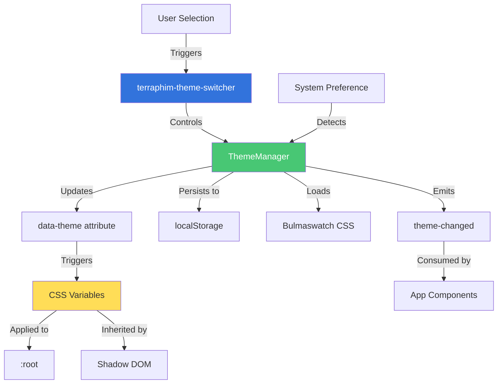
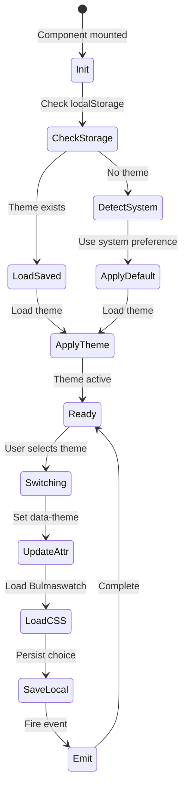

# Phase 2.4: CSS Custom Properties Theme System - Technical Blueprint

**Project:** Terraphim AI Web Components Migration
**Phase:** 2.4 - CSS Theme System
**Architect:** @zestic-frontend-architect
**Date:** 2025-01-31
**Status:** Design Complete - Ready for Implementation

---

## Executive Summary

This blueprint specifies a comprehensive CSS Custom Properties theme system that:
- Replaces Svelte store-based theme management with vanilla Web Component
- Implements CSS custom properties for all theme values
- Maintains compatibility with 30 existing Bulmaswatch themes
- Provides smooth theme transitions with FOUC prevention
- Enables localStorage persistence and system preference detection

**Implementation Approach:** Pure vanilla JavaScript, zero dependencies, no build tools.

---

## Current System Analysis

### Existing Implementation

**Key Files:**
- `desktop/src/lib/ThemeSwitcher.svelte` - Role selector combining theme switching
- `desktop/src/lib/themeManager.ts` - Dynamic CSS stylesheet loading
- `desktop/public/assets/bulmaswatch/` - 30 Bulmaswatch theme directories

**Current Theme Loading:**
```typescript
function applyTheme(name: string) {
  const href = `/assets/bulmaswatch/${name}/bulmaswatch.min.css`;
  const link = document.createElement("link");
  link.rel = "stylesheet";
  link.href = href;
  link.onload = () => { if (current) current.remove(); current = link; };
  document.head.appendChild(link);
}
```

**Available Themes (22 total):**
- **Light:** cerulean, cosmo, default, flatly, journal, litera, lumen, lux, materia, minty, pulse, sandstone, simplex, spacelab, united, yeti
- **Dark:** cyborg, darkly, nuclear, slate, solar, superhero

---

## Architecture Design

### System Architecture Diagram



### Theme Switching Flow



---

## CSS Variables Structure

### Complete Variables Specification

**File:** `components/styles/variables.css`

```css
/**
 * Terraphim CSS Custom Properties
 * Base theme variables with fallbacks
 */

:root {
  /* Primary Colors */
  --color-primary: #3273dc;
  --color-primary-light: #4a86e8;
  --color-primary-dark: #2366d1;
  --color-primary-contrast: #ffffff;

  /* Semantic Colors */
  --color-success: #48c774;
  --color-warning: #ffdd57;
  --color-danger: #f14668;
  --color-info: #3298dc;

  /* Backgrounds */
  --bg-page: #ffffff;
  --bg-primary: #f5f5f5;
  --bg-secondary: #fafafa;
  --bg-elevated: #ffffff;
  --bg-hover: rgba(0, 0, 0, 0.05);
  --bg-code: #f5f5f5;

  /* Text */
  --text-primary: #363636;
  --text-secondary: #4a4a4a;
  --text-tertiary: #7a7a7a;
  --text-link: #3273dc;

  /* Borders */
  --border-primary: #dbdbdb;
  --border-hover: #b5b5b5;
  --border-focus: #3273dc;

  /* Spacing */
  --spacing-xs: 0.25rem;
  --spacing-sm: 0.5rem;
  --spacing-md: 1rem;
  --spacing-lg: 1.5rem;
  --spacing-xl: 2rem;

  /* Border Radius */
  --border-radius-sm: 2px;
  --border-radius-md: 4px;
  --border-radius-lg: 6px;

  /* Shadows */
  --shadow-sm: 0 1px 2px rgba(0, 0, 0, 0.05);
  --shadow-md: 0 2px 4px rgba(0, 0, 0, 0.1);
  --shadow-lg: 0 4px 8px rgba(0, 0, 0, 0.15);
  --shadow-focus: 0 0 0 3px rgba(50, 115, 220, 0.25);

  /* Transitions */
  --transition-fast: 100ms ease;
  --transition-base: 200ms ease;
  --transition-theme: background-color 200ms ease, color 200ms ease;
}

/* Dark Theme Adjustments */
[data-theme="darkly"],
[data-theme="cyborg"],
[data-theme="nuclear"],
[data-theme="slate"],
[data-theme="solar"],
[data-theme="superhero"] {
  --bg-page: #1a1a1a;
  --bg-primary: #2a2a2a;
  --bg-secondary: #1f1f1f;
  --bg-elevated: #333333;
  --bg-hover: rgba(255, 255, 255, 0.1);

  --text-primary: #f5f5f5;
  --text-secondary: #e0e0e0;
  --text-tertiary: #b5b5b5;

  --border-primary: #4a4a4a;
  --border-hover: #5a5a5a;
}
```

---

## Component Implementation

### TerraphimThemeSwitcher Specification

**File:** `components/shell/terraphim-theme-switcher.js`

**API:**
```javascript
class TerraphimThemeSwitcher extends TerraphimElement {
  static get properties() {
    return {
      currentTheme: { type: String, default: 'spacelab' },
      showLabel: { type: Boolean, default: true },
      storageKey: { type: String, default: 'terraphim-theme' }
    };
  }

  // Methods
  async switchTheme(themeName)  // Switch to new theme
  getCurrentTheme()             // Get current theme name
  getThemes()                   // Get all available themes
  detectSystemTheme()           // Detect system preference
}
```

**Events:**
- `theme-changed` - Emitted when theme changes: `{ oldTheme, newTheme, isDark }`
- `theme-loaded` - Emitted when CSS loads: `{ theme, loadTime }`
- `theme-error` - Emitted on load failure: `{ theme, error }`

**Theme Metadata:**
```javascript
const THEMES = [
  { name: 'spacelab', type: 'light', label: 'Spacelab', description: 'Default theme' },
  { name: 'darkly', type: 'dark', label: 'Darkly', description: 'Popular dark' },
  // ... all 22 themes
];
```

---

## Implementation Guide

### Step 1: Create CSS Variables (1 day)

Create `components/styles/variables.css` with:
- Base color palette
- Semantic color mappings
- Dark mode overrides using `[data-theme]` selector
- Spacing, typography, shadows, transitions

### Step 2: Implement ThemeManager (1 day)

**Core functionality inside component:**
```javascript
class ThemeManager {
  async applyTheme(themeName) {
    // 1. Set data-theme attribute
    document.documentElement.setAttribute('data-theme', themeName);

    // 2. Load Bulmaswatch CSS
    const link = document.createElement('link');
    link.href = `/assets/bulmaswatch/${themeName}/bulmaswatch.min.css`;
    link.onload = () => { if (this.currentLink) this.currentLink.remove(); };
    document.head.appendChild(link);
    this.currentLink = link;
  }

  saveTheme(name) { localStorage.setItem(this.storageKey, name); }
  loadTheme() { return localStorage.getItem(this.storageKey); }
  detectSystemPreference() {
    return matchMedia('(prefers-color-scheme: dark)').matches ? 'dark' : 'light';
  }
}
```

### Step 3: Build Component (2 days)

Implement `terraphim-theme-switcher.js`:
- Initialize ThemeManager on mount
- Load saved theme or detect system preference
- Render dropdown with theme options (grouped light/dark)
- Handle theme selection events
- Emit theme-changed events
- Persist to localStorage

### Step 4: FOUC Prevention (1 day)

**Add to index.html:**
```html
<head>
  <link rel="stylesheet" href="/components/styles/variables.css">
  <script>
    (function() {
      const theme = localStorage.getItem('terraphim-theme') || 'spacelab';
      document.documentElement.setAttribute('data-theme', theme);
    })();
  </script>
</head>
```

### Step 5: Integration (1 day)

Update existing components to use CSS variables:
```css
/* Before */
.component { background: #ffffff; color: #363636; }

/* After */
.component {
  background: var(--bg-primary);
  color: var(--text-primary);
  transition: var(--transition-theme);
}
```

---

## File Structure

```
components/
├── styles/
│   ├── variables.css           # Main CSS custom properties
│   └── README.md               # Theming documentation
│
├── shell/
│   ├── terraphim-theme-switcher.js      # Theme switcher component
│   └── terraphim-theme-switcher.test.js # Tests
│
└── examples/
    └── theme-demo.html         # Interactive demo
```

---

## Testing Requirements

### Unit Tests

```javascript
describe('TerraphimThemeSwitcher', () => {
  it('should render with default theme');
  it('should switch themes');
  it('should persist to localStorage');
  it('should load from localStorage');
  it('should emit theme-changed event');
  it('should detect system preference');
  it('should update data-theme attribute');
});
```

### Integration Tests

```javascript
describe('Theme Integration', () => {
  it('should apply CSS variables after theme switch');
  it('should cascade to Shadow DOM');
  it('should prevent FOUC on page load');
  it('should switch in < 200ms');
});
```

---

## Migration Checklist

- [ ] Create `components/styles/variables.css`
- [ ] Add FOUC prevention to index.html
- [ ] Implement ThemeManager class
- [ ] Implement TerraphimThemeSwitcher component
- [ ] Add theme metadata (THEMES array)
- [ ] Implement localStorage persistence
- [ ] Add theme-changed events
- [ ] Update components to use CSS variables
- [ ] Write unit tests
- [ ] Write integration tests
- [ ] Create demo page
- [ ] Document theming system

---

## Implementation Timeline

**Week 1:**
- Days 1-2: CSS variables and FOUC prevention
- Days 3-4: ThemeManager and component implementation
- Day 5: localStorage persistence and events

**Week 2:**
- Days 1-2: Component migration to CSS variables
- Days 3-4: Testing (unit, integration, accessibility)
- Day 5: Documentation and demo

**Total:** 2 weeks

---

## Success Metrics

- ✅ All 22 Bulmaswatch themes supported
- ✅ Theme persists across reloads
- ✅ No FOUC on page load
- ✅ Theme switch < 200ms
- ✅ Works in Tauri and Web modes
- ✅ Zero external dependencies
- ✅ Full keyboard accessibility

---

**Blueprint Status:** ✅ Complete
**Next Step:** Implementation by @zestic-front-craftsman
**Risk Level:** Low (proven patterns, clear specifications)
