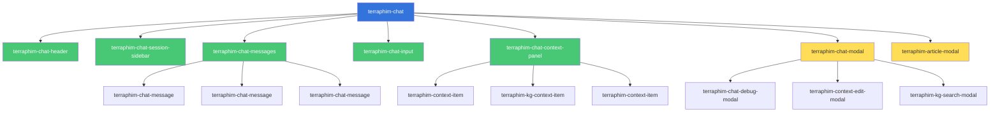
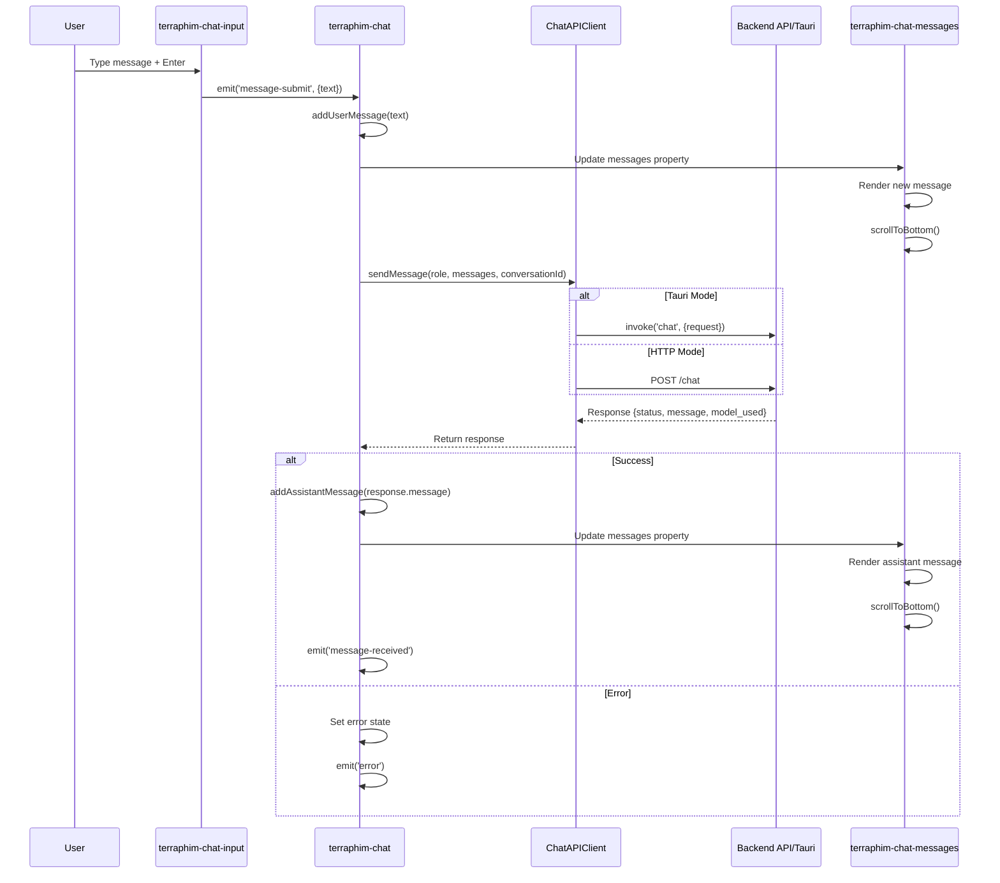
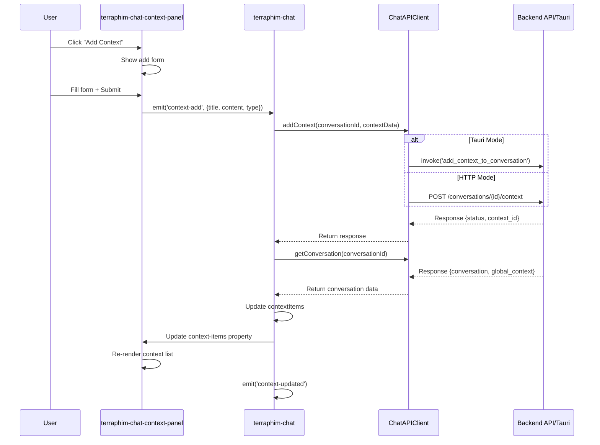
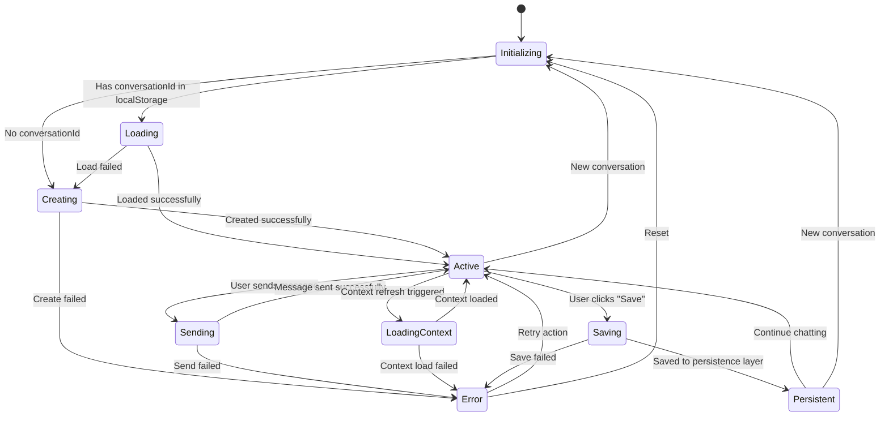
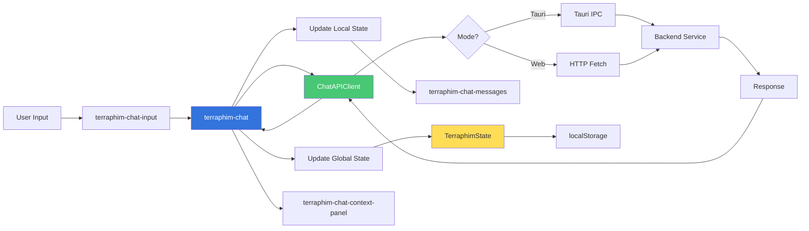
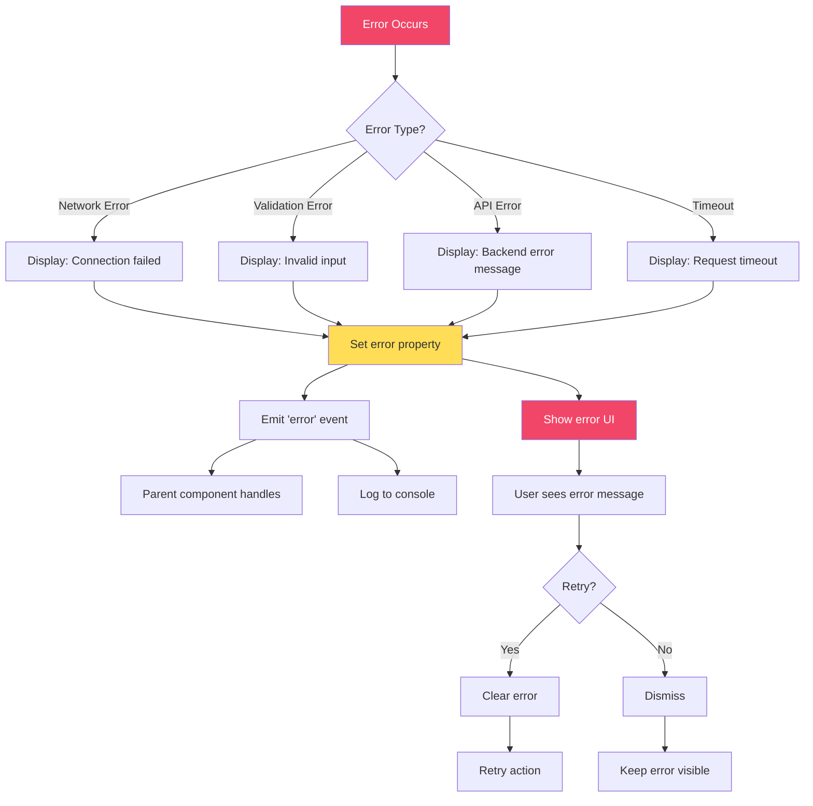

# Phase 3.1: Chat Component Architecture Blueprint

**Document Version:** 1.0
**Created:** 2025-10-25
**Status:** READY FOR IMPLEMENTATION
**Zestic AI Strategy Compliance:** FULL

---

## Executive Summary

This blueprint defines the architecture for migrating the Svelte-based Chat component (`desktop/src/lib/Chat/Chat.svelte`) to a vanilla Web Component (`<terraphim-chat>`) following the Zestic AI Strategy principles: zero dependencies, no build tools, pure vanilla JavaScript with native Web Components.

### Key Architectural Decisions

1. **No WebSocket Required**: The current implementation uses HTTP POST/Tauri IPC, NOT WebSockets. The title reference to WebSocket was misleading.
2. **Communication Pattern**: HTTP long-polling for web mode, Tauri IPC for desktop mode
3. **Component Decomposition**: Single monolithic Svelte component → 7 specialized Web Components
4. **State Management**: Global TerraphimState for conversation data, local component state for UI
5. **Markdown Rendering**: Vanilla JavaScript markdown parser (marked.js via CDN or custom lightweight implementation)
6. **Persistence**: localStorage for session data, backend API for conversation persistence

### Performance Targets

- Initial render: < 100ms
- Message send latency: < 50ms (excluding network)
- Scroll to new message: < 16ms (60fps)
- Context panel updates: < 30ms
- Memory footprint: < 5MB for 100 messages

---

## Current State Analysis

### Svelte Component Structure (`Chat.svelte`)

**Lines of Code:** 1,706 lines (component + styles)
**Key Dependencies:**
- Svelte framework (reactivity, lifecycle)
- Svelte stores (role, configStore, showSessionList, etc.)
- Tauri APIs (@tauri-apps/api/tauri, dialog, fs)
- svelte-markdown (Markdown rendering)
- Multiple child components (ContextEditModal, KGSearchModal, SessionList, etc.)

**Core Functionality Groups:**

| Feature Group | LOC | Description |
|--------------|-----|-------------|
| Message Management | ~250 | Display messages, send/receive, markdown rendering |
| Conversation Lifecycle | ~180 | Create, load, save conversations |
| Context Management | ~320 | Add, edit, delete, refresh context items |
| Session Persistence | ~140 | localStorage and API persistence |
| UI State & Modals | ~180 | Debug modals, context forms, KG search |
| Styling | ~235 | CSS Grid layout, responsive design |
| Event Handlers | ~120 | Keyboard, click, form submission |

### Data Flow Analysis

```
User Input
    ↓
Chat Component State (Svelte reactive)
    ↓
[Tauri IPC / HTTP POST] → Backend API
    ↓
Response Processing
    ↓
Update Svelte Store & Local State
    ↓
Svelte Reactivity triggers re-render
    ↓
DOM Update
```

### API Endpoints Used

**Tauri Commands:**
- `chat` - Send chat message
- `create_conversation` - Create new conversation
- `get_conversation` - Get conversation by ID
- `get_persistent_conversation` - Get persistent conversation
- `create_persistent_conversation` - Create persistent conversation
- `update_persistent_conversation` - Update persistent conversation
- `list_conversations` - List all conversations
- `add_context_to_conversation` - Add context item
- `update_context` - Update context item
- `delete_context` - Delete context item
- `find_documents_for_kg_term` - Find KG documents

**HTTP Endpoints:**
- `POST /chat` - Send chat message
- `GET /conversations` - List conversations
- `POST /conversations` - Create conversation
- `GET /conversations/{id}` - Get conversation
- `POST /conversations/{id}/context` - Add context
- `PUT /conversations/{id}/context/{context_id}` - Update context
- `DELETE /conversations/{id}/context/{context_id}` - Delete context
- `GET /roles/{role}/kg_search?term={term}` - KG search

### State Structure

```javascript
// Local Component State
{
  messages: ChatMessage[],           // Array of user/assistant messages
  input: string,                     // Current input text
  sending: boolean,                  // Send in progress
  error: string | null,              // Error message
  modelUsed: string | null,          // Model name from last response
  conversationId: string | null,     // Current conversation ID
  contextItems: ContextItem[],       // Context items for conversation
  loadingContext: boolean,           // Context loading state
  renderMarkdown: boolean,           // Markdown toggle
  debugMode: boolean,                // Debug mode toggle
  lastRequest: any,                  // Debug: last request
  lastResponse: any                  // Debug: last response
}

// Global State (from stores)
{
  role: string,                      // Current role name
  is_tauri: boolean,                 // Desktop vs web mode
  configStore: Config,               // Full configuration
  showSessionList: boolean,          // Session list visibility
  currentPersistentConversationId: string | null
}

// Context Item Structure
{
  id: string,
  title: string,
  summary: string | null,
  content: string,
  context_type: 'Document' | 'SearchResult' | 'KGTermDefinition' | 'KGIndex' | ...,
  created_at: string,
  relevance_score?: number,
  metadata?: object,
  kg_term_definition?: { term: string }
}
```

---

## Architecture Design

### Component Hierarchy

```
<terraphim-chat>                        (Main container, state coordination)
├── <terraphim-chat-header>             (Title, role, conversation ID, actions)
├── <terraphim-chat-session-sidebar>    (Session list, optional, toggleable)
├── <terraphim-chat-messages>           (Message list container, auto-scroll)
│   └── <terraphim-chat-message> × N    (Individual message bubble)
├── <terraphim-chat-input>              (Textarea + Send button)
├── <terraphim-chat-context-panel>      (Context items sidebar)
│   ├── <terraphim-context-item> × N    (Individual context card)
│   └── <terraphim-kg-context-item> × N (Specialized KG context card)
├── <terraphim-chat-modal>              (Generic modal container)
│   ├── <terraphim-chat-debug-modal>    (Debug request/response viewer)
│   ├── <terraphim-context-edit-modal>  (Context editing form)
│   └── <terraphim-kg-search-modal>     (KG search interface)
└── <terraphim-article-modal>           (KG document viewer)
```

### Component Responsibilities

#### 1. `<terraphim-chat>` (Root Component)

**Purpose:** Main orchestrator, state management, API communication
**Extends:** TerraphimElement
**Shadow DOM:** Yes

**Properties:**
```javascript
{
  role: { type: String, reflect: true },              // Current role name
  conversationId: { type: String, reflect: false },   // Current conversation ID
  isTauri: { type: Boolean, reflect: false },         // Desktop mode flag
  serverUrl: { type: String, default: 'http://localhost:8000' }
}
```

**State Bindings:**
```javascript
// Bind to global state
this.bindState(globalState, 'currentRole', 'role', { immediate: true });
this.bindState(globalState, 'isTauri', 'isTauri', { immediate: true });
this.bindState(globalState, 'serverUrl', 'serverUrl', { immediate: true });
```

**Internal State:**
```javascript
{
  messages: [],           // ChatMessage[]
  contextItems: [],       // ContextItem[]
  sending: false,
  loadingContext: false,
  error: null,
  modelUsed: null,
  lastRequest: null,
  lastResponse: null
}
```

**Methods:**
```javascript
// Conversation Management
async initializeConversation()
async createNewConversation()
async loadConversation(conversationId)
async savePersistentConversation()

// Message Handling
async sendMessage(text)
addUserMessage(text)
addAssistantMessage(text, metadata)

// Context Management
async loadConversationContext()
async addContext(contextData)
async updateContext(contextId, contextData)
async deleteContext(contextId)

// Persistence
saveChatState()
loadChatState()

// API Communication (Tauri or HTTP)
async invokeBackend(command, params)
```

**Events Emitted:**
```javascript
'message-sent'          // { text, timestamp }
'message-received'      // { text, model, timestamp }
'conversation-created'  // { conversationId }
'conversation-loaded'   // { conversationId, title }
'context-updated'       // { contextItems }
'error'                 // { message, code }
```

**HTML Template Structure:**
```html
<div class="chat-container" data-layout="${this.layoutMode}">
  <terraphim-chat-header
    role="${this.role}"
    conversation-id="${this.conversationId}">
  </terraphim-chat-header>

  <div class="chat-grid">
    ${this.showSessionList ? '<terraphim-chat-session-sidebar></terraphim-chat-session-sidebar>' : ''}

    <div class="main-area">
      <terraphim-chat-messages
        .messages="${this.messages}"
        .sending="${this.sending}"
        .render-markdown="${this.renderMarkdown}">
      </terraphim-chat-messages>

      <terraphim-chat-input
        .disabled="${this.sending}"
        @message-submit="${this.handleMessageSubmit}">
      </terraphim-chat-input>
    </div>

    <terraphim-chat-context-panel
      .context-items="${this.contextItems}"
      .loading="${this.loadingContext}"
      .conversation-id="${this.conversationId}"
      @context-refresh="${this.loadConversationContext}"
      @context-add="${this.handleContextAdd}"
      @context-edit="${this.handleContextEdit}"
      @context-delete="${this.handleContextDelete}">
    </terraphim-chat-context-panel>
  </div>
</div>
```

#### 2. `<terraphim-chat-messages>` (Message Container)

**Purpose:** Display message list, auto-scroll, markdown rendering
**Extends:** TerraphimElement
**Shadow DOM:** Yes

**Properties:**
```javascript
{
  messages: { type: Array, default: () => [] },
  sending: { type: Boolean },
  renderMarkdown: { type: Boolean },
  debugMode: { type: Boolean }
}
```

**Methods:**
```javascript
scrollToBottom(smooth = true)
renderMessage(message, index)
formatTimestamp(timestamp)
```

**Auto-scroll Logic:**
```javascript
propertyChangedCallback(name, oldValue, newValue) {
  if (name === 'messages' && newValue.length > oldValue.length) {
    requestAnimationFrame(() => this.scrollToBottom(true));
  }
}
```

#### 3. `<terraphim-chat-message>` (Individual Message)

**Purpose:** Render single message bubble with actions
**Extends:** TerraphimElement
**Shadow DOM:** Yes

**Properties:**
```javascript
{
  role: { type: String },           // 'user' | 'assistant' | 'system'
  content: { type: String },
  timestamp: { type: String },
  renderMarkdown: { type: Boolean },
  debugMode: { type: Boolean },
  isLatest: { type: Boolean }       // For debug buttons
}
```

**Methods:**
```javascript
async copyToClipboard()
async saveAsMarkdown()
toggleDebugRequest()
toggleDebugResponse()
```

**Events Emitted:**
```javascript
'copy-message'
'save-message'
'show-debug-request'
'show-debug-response'
```

#### 4. `<terraphim-chat-input>` (Input Area)

**Purpose:** Message input with Enter-to-send, Shift+Enter for newline
**Extends:** TerraphimElement
**Shadow DOM:** Yes

**Properties:**
```javascript
{
  disabled: { type: Boolean },
  placeholder: { type: String, default: 'Type your message and press Enter...' },
  value: { type: String }
}
```

**Methods:**
```javascript
handleKeydown(event)
handleSubmit()
clear()
focus()
```

**Events Emitted:**
```javascript
'message-submit'    // { text }
```

**Keyboard Handling:**
```javascript
handleKeydown(event) {
  if ((event.key === 'Enter' || event.key === 'Return') && !event.shiftKey) {
    event.preventDefault();
    this.handleSubmit();
  }
}
```

#### 5. `<terraphim-chat-context-panel>` (Context Sidebar)

**Purpose:** Display and manage conversation context items
**Extends:** TerraphimElement
**Shadow DOM:** Yes

**Properties:**
```javascript
{
  contextItems: { type: Array, default: () => [] },
  loading: { type: Boolean },
  conversationId: { type: String },
  showAddForm: { type: Boolean }
}
```

**Methods:**
```javascript
toggleAddForm()
handleKGSearch()
handleRefresh()
```

**Events Emitted:**
```javascript
'context-refresh'
'context-add'      // { title, content, context_type }
'context-edit'     // { contextId }
'context-delete'   // { contextId }
'kg-search-open'
```

#### 6. `<terraphim-context-item>` (Context Card)

**Purpose:** Display individual context item with edit/delete actions
**Extends:** TerraphimElement
**Shadow DOM:** Yes

**Properties:**
```javascript
{
  contextId: { type: String, reflect: true },
  title: { type: String },
  summary: { type: String },
  content: { type: String },
  contextType: { type: String },
  relevanceScore: { type: Number },
  createdAt: { type: String },
  compact: { type: Boolean }
}
```

**Events Emitted:**
```javascript
'edit'      // { contextId, contextItem }
'delete'    // { contextId }
'view'      // { contextId }
```

#### 7. `<terraphim-chat-header>` (Header Section)

**Purpose:** Display title, role, conversation ID, action buttons
**Extends:** TerraphimElement
**Shadow DOM:** Yes

**Properties:**
```javascript
{
  role: { type: String },
  conversationId: { type: String },
  showSessionList: { type: Boolean },
  isPersistent: { type: Boolean }
}
```

**Events Emitted:**
```javascript
'toggle-sessions'
'save-conversation'
'new-conversation'
```

---

## API Communication Design

### Dual-Mode Communication Pattern

The component must support both Tauri IPC (desktop) and HTTP (web) transparently.

#### Communication Abstraction Layer

```javascript
class ChatAPIClient {
  constructor(isTauri, serverUrl = 'http://localhost:8000') {
    this.isTauri = isTauri;
    this.serverUrl = serverUrl;
  }

  // Generic command executor
  async execute(command, params) {
    if (this.isTauri) {
      return await this.invokeTauri(command, params);
    } else {
      return await this.invokeHTTP(command, params);
    }
  }

  // Tauri IPC implementation
  async invokeTauri(command, params) {
    // Dynamic import to avoid loading in web mode
    const { invoke } = await import('@tauri-apps/api/tauri');
    return await invoke(command, params);
  }

  // HTTP implementation
  async invokeHTTP(command, params) {
    const endpoint = this.getEndpoint(command);
    const method = this.getMethod(command);

    const response = await fetch(`${this.serverUrl}${endpoint}`, {
      method,
      headers: { 'Content-Type': 'application/json' },
      body: method !== 'GET' ? JSON.stringify(params) : undefined
    });

    if (!response.ok) {
      throw new Error(`HTTP ${response.status}: ${response.statusText}`);
    }

    return await response.json();
  }

  // Command routing table
  getEndpoint(command) {
    const routes = {
      'chat': '/chat',
      'create_conversation': '/conversations',
      'get_conversation': (params) => `/conversations/${params.conversationId}`,
      'list_conversations': '/conversations',
      'add_context_to_conversation': (params) => `/conversations/${params.conversationId}/context`,
      'update_context': (params) => `/conversations/${params.conversationId}/context/${params.contextId}`,
      'delete_context': (params) => `/conversations/${params.conversationId}/context/${params.contextId}`,
      'find_documents_for_kg_term': (params) => `/roles/${encodeURIComponent(params.roleName)}/kg_search?term=${encodeURIComponent(params.term)}`
    };

    const route = routes[command];
    return typeof route === 'function' ? route(params) : route;
  }

  getMethod(command) {
    const methods = {
      'chat': 'POST',
      'create_conversation': 'POST',
      'get_conversation': 'GET',
      'list_conversations': 'GET',
      'add_context_to_conversation': 'POST',
      'update_context': 'PUT',
      'delete_context': 'DELETE',
      'find_documents_for_kg_term': 'GET'
    };
    return methods[command] || 'GET';
  }

  // High-level API methods
  async sendMessage(role, messages, conversationId = null) {
    const payload = { role, messages };
    if (conversationId) {
      payload.conversation_id = conversationId;
    }

    return await this.execute('chat', { request: payload });
  }

  async createConversation(title, role) {
    return await this.execute('create_conversation', { title, role });
  }

  async getConversation(conversationId) {
    return await this.execute('get_conversation', { conversationId });
  }

  async listConversations() {
    return await this.execute('list_conversations', {});
  }

  async addContext(conversationId, context) {
    return await this.execute('add_context_to_conversation', {
      conversationId,
      context
    });
  }

  async updateContext(conversationId, contextId, request) {
    return await this.execute('update_context', {
      conversationId,
      contextId,
      request
    });
  }

  async deleteContext(conversationId, contextId) {
    return await this.execute('delete_context', {
      conversationId,
      contextId
    });
  }

  async findKGDocuments(roleName, term) {
    return await this.execute('find_documents_for_kg_term', {
      roleName,
      term
    });
  }
}
```

### Usage in Component

```javascript
class TerraphimChat extends TerraphimElement {
  constructor() {
    super();
    this.apiClient = null;
  }

  onConnected() {
    // Initialize API client based on environment
    const isTauri = this.getState(globalState, 'isTauri');
    const serverUrl = this.getState(globalState, 'serverUrl');

    this.apiClient = new ChatAPIClient(isTauri, serverUrl);

    // Initialize conversation
    this.initializeConversation();
  }

  async sendMessage(text) {
    this.sending = true;
    this.error = null;

    try {
      const response = await this.apiClient.sendMessage(
        this.role,
        this.messages,
        this.conversationId
      );

      if (response.status === 'success' && response.message) {
        this.addAssistantMessage(response.message, {
          model: response.model_used
        });
        this.emit('message-received', {
          text: response.message,
          model: response.model_used,
          timestamp: new Date().toISOString()
        });
      } else {
        throw new Error(response.error || 'Chat failed');
      }
    } catch (error) {
      this.error = error.message;
      this.emit('error', {
        message: error.message,
        code: error.code
      });
    } finally {
      this.sending = false;
    }
  }
}
```

---

## State Management Strategy

### Global State Structure

```javascript
// Create global state instance
const chatGlobalState = createGlobalState({
  // Runtime Environment
  isTauri: false,
  serverUrl: 'http://localhost:8000',

  // User Context
  currentRole: 'default',

  // UI State
  showSessionList: false,
  currentPersistentConversationId: null,

  // Configuration (loaded from backend)
  config: null,

  // Active Conversations (cache)
  conversations: [],

  // Theme
  theme: 'spacelab'
}, {
  persist: true,
  storagePrefix: 'terraphim-chat',
  debug: false
});
```

### Local Component State

Each `<terraphim-chat>` instance maintains its own local state:

```javascript
{
  // Conversation Data
  conversationId: null,
  messages: [],
  contextItems: [],

  // UI State
  sending: false,
  loadingContext: false,
  error: null,

  // Input State
  inputValue: '',

  // Settings
  renderMarkdown: true,  // Persisted to localStorage
  debugMode: false,

  // Debug Data
  lastRequest: null,
  lastResponse: null,

  // Modal State
  showDebugRequest: false,
  showDebugResponse: false,
  showContextEditModal: false,
  showKGSearchModal: false,
  showArticleModal: false,

  // Edit State
  editingContext: null,
  contextEditMode: 'edit',  // 'create' | 'edit'

  // KG Modal State
  kgDocument: null,
  kgTerm: null,
  kgRank: null
}
```

### State Persistence

**localStorage Keys:**
- `terraphim-chat:state` - Global state (from TerraphimState)
- `terraphim:chatState:{role}` - Per-role chat state (messages, conversationId)
- `terraphim:chatMarkdown` - Markdown rendering preference

**Persistence Pattern:**
```javascript
function saveChatState() {
  const stateKey = `terraphim:chatState:${this.role}`;
  const data = {
    messages: this.messages,
    conversationId: this.conversationId
  };
  localStorage.setItem(stateKey, JSON.stringify(data));
}

function loadChatState() {
  const stateKey = `terraphim:chatState:${this.role}`;
  const raw = localStorage.getItem(stateKey);
  if (raw) {
    const data = JSON.parse(raw);
    this.messages = data.messages || [];
    this.conversationId = data.conversationId || null;
  }
}
```

---

## Markdown Rendering Approach

### Option 1: Lightweight Custom Parser (Recommended)

Implement a minimal markdown parser for common features:
- Headers (# ## ###)
- Bold (**text**)
- Italic (*text*)
- Links ([text](url))
- Code blocks (```code```)
- Inline code (`code`)
- Lists (ordered and unordered)

**Advantages:**
- Zero dependencies
- < 5KB minified
- Full control over output HTML
- Security (XSS prevention built-in)

**Implementation:**
```javascript
class MarkdownRenderer {
  static render(markdown) {
    let html = markdown;

    // Escape HTML first
    html = this.escapeHTML(html);

    // Code blocks (must be first)
    html = html.replace(/```(\w+)?\n([\s\S]*?)```/g, (match, lang, code) => {
      return `<pre><code class="language-${lang || 'text'}">${code}</code></pre>`;
    });

    // Inline code
    html = html.replace(/`([^`]+)`/g, '<code>$1</code>');

    // Headers
    html = html.replace(/^### (.*$)/gim, '<h3>$1</h3>');
    html = html.replace(/^## (.*$)/gim, '<h2>$1</h2>');
    html = html.replace(/^# (.*$)/gim, '<h1>$1</h1>');

    // Bold
    html = html.replace(/\*\*(.+?)\*\*/g, '<strong>$1</strong>');

    // Italic
    html = html.replace(/\*(.+?)\*/g, '<em>$1</em>');

    // Links
    html = html.replace(/\[([^\]]+)\]\(([^)]+)\)/g, '<a href="$2" target="_blank" rel="noopener noreferrer">$1</a>');

    // Line breaks
    html = html.replace(/\n\n/g, '</p><p>');
    html = html.replace(/\n/g, '<br>');

    return `<p>${html}</p>`;
  }

  static escapeHTML(text) {
    const div = document.createElement('div');
    div.textContent = text;
    return div.innerHTML;
  }
}
```

### Option 2: CDN-Loaded Library

Use marked.js via CDN for full markdown support:

```html
<script src="https://cdn.jsdelivr.net/npm/marked/marked.min.js"></script>
```

**Usage:**
```javascript
const html = marked.parse(markdown, {
  breaks: true,
  gfm: true,
  sanitize: false  // Use DOMPurify for sanitization
});
```

**Recommendation:** Use Option 1 for Phase 3.1, add Option 2 if users require advanced markdown features (tables, task lists, etc.)

---

## Mermaid Diagrams

### 1. Component Hierarchy Diagram



### 2. Message Send Flow Diagram



### 3. Context Management Flow Diagram



### 4. Conversation Lifecycle State Machine



### 5. Data Flow Architecture



### 6. Error Handling Flow



---

## Component API Specifications

### `<terraphim-chat>` API

**Tag Name:** `terraphim-chat`

**Attributes:**
```html
<terraphim-chat
  role="terraphim_engineer"
  server-url="http://localhost:8000">
</terraphim-chat>
```

**Properties:**
| Property | Type | Default | Reflects | Description |
|----------|------|---------|----------|-------------|
| role | String | '' | Yes | Current role name |
| conversationId | String | null | No | Current conversation ID |
| isTauri | Boolean | false | No | Desktop mode flag |
| serverUrl | String | 'http://localhost:8000' | No | Backend API URL |

**Methods:**
| Method | Signature | Description |
|--------|-----------|-------------|
| sendMessage | (text: string) => Promise<void> | Send a chat message |
| loadConversation | (id: string) => Promise<void> | Load a conversation |
| createNewConversation | () => Promise<void> | Create new conversation |
| savePersistentConversation | () => Promise<void> | Save to persistence |
| addContext | (data: ContextData) => Promise<void> | Add context item |
| updateContext | (id: string, data: ContextData) => Promise<void> | Update context |
| deleteContext | (id: string) => Promise<void> | Delete context |
| clearMessages | () => void | Clear message history |
| exportAsMarkdown | () => string | Export chat as markdown |

**Events:**
| Event | Detail | Description |
|-------|--------|-------------|
| message-sent | { text, timestamp } | User sent a message |
| message-received | { text, model, timestamp } | Received assistant response |
| conversation-created | { conversationId } | New conversation created |
| conversation-loaded | { conversationId, title } | Conversation loaded |
| context-updated | { contextItems } | Context items changed |
| error | { message, code } | Error occurred |
| sending-changed | { sending: boolean } | Sending state changed |

**CSS Custom Properties:**
```css
--chat-bg: var(--bg-page);
--chat-border-color: var(--border-primary);
--chat-message-user-bg: var(--color-primary);
--chat-message-user-color: var(--color-primary-contrast);
--chat-message-assistant-bg: var(--bg-primary);
--chat-message-assistant-color: var(--text-primary);
--chat-message-border-radius: 12px;
--chat-message-padding: 0.75rem;
--chat-input-bg: var(--bg-elevated);
--chat-input-border: var(--border-primary);
--chat-input-focus-border: var(--border-focus);
--chat-context-panel-bg: var(--bg-secondary);
--chat-context-panel-width: 400px;
--chat-session-sidebar-width: 300px;
--chat-spacing: var(--spacing-md);
```

### `<terraphim-chat-message>` API

**Tag Name:** `terraphim-chat-message`

**Attributes:**
```html
<terraphim-chat-message
  role="assistant"
  content="Hello! How can I help you?"
  timestamp="2025-10-25T10:30:00Z"
  render-markdown>
</terraphim-chat-message>
```

**Properties:**
| Property | Type | Default | Reflects | Description |
|----------|------|---------|----------|-------------|
| role | String | 'user' | Yes | Message role |
| content | String | '' | No | Message content |
| timestamp | String | '' | No | ISO timestamp |
| renderMarkdown | Boolean | false | Yes | Render as markdown |
| debugMode | Boolean | false | No | Show debug buttons |
| isLatest | Boolean | false | No | Is latest message |

**Methods:**
| Method | Signature | Description |
|--------|-----------|-------------|
| copyToClipboard | () => Promise<void> | Copy message content |
| saveAsMarkdown | () => Promise<void> | Save as .md file |

**Events:**
| Event | Detail | Description |
|-------|--------|-------------|
| copy-message | { content } | Message copied |
| save-message | { content } | Save requested |
| show-debug-request | {} | Show debug request |
| show-debug-response | {} | Show debug response |

**CSS Custom Properties:**
```css
--message-bubble-max-width: 70ch;
--message-bubble-padding: var(--chat-message-padding);
--message-bubble-border-radius: var(--chat-message-border-radius);
--message-user-bg: var(--chat-message-user-bg);
--message-user-color: var(--chat-message-user-color);
--message-assistant-bg: var(--chat-message-assistant-bg);
--message-assistant-color: var(--chat-message-assistant-color);
--message-spacing: var(--spacing-sm);
```

### `<terraphim-chat-input>` API

**Tag Name:** `terraphim-chat-input`

**Attributes:**
```html
<terraphim-chat-input
  disabled
  placeholder="Type your message...">
</terraphim-chat-input>
```

**Properties:**
| Property | Type | Default | Reflects | Description |
|----------|------|---------|----------|-------------|
| disabled | Boolean | false | Yes | Disable input |
| placeholder | String | 'Type your message...' | No | Placeholder text |
| value | String | '' | No | Current input value |

**Methods:**
| Method | Signature | Description |
|--------|-----------|-------------|
| clear | () => void | Clear input |
| focus | () => void | Focus input |
| getValue | () => string | Get current value |
| setValue | (value: string) => void | Set value programmatically |

**Events:**
| Event | Detail | Description |
|-------|--------|-------------|
| message-submit | { text } | Enter pressed or send clicked |
| input-change | { value } | Input value changed |

**CSS Custom Properties:**
```css
--input-bg: var(--chat-input-bg);
--input-border: var(--chat-input-border);
--input-focus-border: var(--chat-input-focus-border);
--input-padding: var(--spacing-md);
--input-border-radius: var(--border-radius-lg);
--input-min-height: 3rem;
--input-max-height: 8rem;
```

### `<terraphim-chat-context-panel>` API

**Tag Name:** `terraphim-chat-context-panel`

**Attributes:**
```html
<terraphim-chat-context-panel
  conversation-id="conv-123"
  loading>
</terraphim-chat-context-panel>
```

**Properties:**
| Property | Type | Default | Reflects | Description |
|----------|------|---------|----------|-------------|
| contextItems | Array | [] | No | Array of context items |
| loading | Boolean | false | Yes | Loading state |
| conversationId | String | null | No | Current conversation ID |
| showAddForm | Boolean | false | No | Show add form |

**Methods:**
| Method | Signature | Description |
|--------|-----------|-------------|
| toggleAddForm | () => void | Toggle add form visibility |
| refresh | () => void | Trigger refresh |

**Events:**
| Event | Detail | Description |
|-------|--------|-------------|
| context-refresh | {} | Refresh requested |
| context-add | { title, content, context_type } | Add context |
| context-edit | { contextId } | Edit context |
| context-delete | { contextId } | Delete context |
| kg-search-open | {} | Open KG search |

**CSS Custom Properties:**
```css
--context-panel-bg: var(--chat-context-panel-bg);
--context-panel-width: var(--chat-context-panel-width);
--context-item-spacing: var(--spacing-md);
--context-item-hover-bg: var(--bg-hover);
--context-tag-bg: var(--color-info);
--context-tag-color: var(--color-primary-contrast);
```

---

## HTML Structure Templates

### `<terraphim-chat>` Complete Template

```html
<template id="terraphim-chat-template">
  <style>
    @import url('../styles/variables.css');

    :host {
      display: block;
      height: 100%;
      font-family: var(--font-family-sans);
      color: var(--text-primary);
      background: var(--chat-bg);
    }

    .chat-container {
      display: flex;
      flex-direction: column;
      height: 100%;
      max-height: calc(100vh - 100px);
    }

    .chat-grid {
      display: grid;
      grid-template-columns: 1fr var(--chat-context-panel-width, 400px);
      gap: 0;
      flex: 1;
      min-height: 0;
      transition: grid-template-columns 0.3s ease;
    }

    .chat-grid.with-sidebar {
      grid-template-columns: var(--chat-session-sidebar-width, 300px) 1fr var(--chat-context-panel-width, 400px);
    }

    .main-area {
      display: flex;
      flex-direction: column;
      min-height: 0;
      border-left: 1px solid var(--border-primary);
      border-right: 1px solid var(--border-primary);
    }

    /* Responsive */
    @media (max-width: 1024px) {
      .chat-grid {
        grid-template-columns: 1fr 350px;
      }

      .chat-grid.with-sidebar {
        grid-template-columns: 280px 1fr 350px;
      }
    }

    @media (max-width: 768px) {
      .chat-grid {
        grid-template-columns: 1fr;
        grid-template-rows: auto 1fr auto;
      }

      .main-area {
        border-left: none;
        border-right: none;
        border-top: 1px solid var(--border-primary);
        border-bottom: 1px solid var(--border-primary);
      }
    }
  </style>

  <div class="chat-container">
    <slot name="header">
      <terraphim-chat-header></terraphim-chat-header>
    </slot>

    <div class="chat-grid" id="chatGrid">
      <slot name="sidebar"></slot>

      <div class="main-area">
        <slot name="messages">
          <terraphim-chat-messages></terraphim-chat-messages>
        </slot>

        <slot name="input">
          <terraphim-chat-input></terraphim-chat-input>
        </slot>
      </div>

      <slot name="context">
        <terraphim-chat-context-panel></terraphim-chat-context-panel>
      </slot>
    </div>
  </div>

  <!-- Modals -->
  <slot name="modals"></slot>
</template>
```

### `<terraphim-chat-message>` Template

```html
<template id="terraphim-chat-message-template">
  <style>
    @import url('../styles/variables.css');

    :host {
      display: flex;
      margin-bottom: var(--message-spacing, 0.5rem);
    }

    :host([role="user"]) {
      justify-content: flex-end;
    }

    :host([role="assistant"]) {
      justify-content: flex-start;
    }

    .bubble {
      max-width: var(--message-bubble-max-width, 70ch);
      padding: var(--message-bubble-padding, 0.75rem);
      border-radius: var(--message-bubble-border-radius, 12px);
      word-wrap: break-word;
      transition: var(--transition-base);
    }

    :host([role="user"]) .bubble {
      background: var(--message-user-bg, var(--color-primary));
      color: var(--message-user-color, var(--color-primary-contrast));
    }

    :host([role="assistant"]) .bubble {
      background: var(--message-assistant-bg, var(--bg-primary));
      color: var(--message-assistant-color, var(--text-primary));
    }

    .content {
      white-space: pre-wrap;
      font-family: inherit;
      margin: 0;
    }

    .markdown-body {
      font-family: inherit;
    }

    .markdown-body pre {
      background: var(--bg-code);
      padding: var(--spacing-sm);
      border-radius: var(--border-radius-md);
      overflow-x: auto;
    }

    .markdown-body code {
      font-family: var(--font-family-mono);
      font-size: 0.9em;
    }

    .actions {
      margin-top: var(--spacing-xs);
      display: flex;
      gap: var(--spacing-xs);
    }

    .actions button {
      padding: var(--spacing-xs) var(--spacing-sm);
      border: 1px solid var(--border-primary);
      border-radius: var(--border-radius-sm);
      background: var(--bg-elevated);
      color: var(--text-secondary);
      cursor: pointer;
      font-size: var(--font-size-xs);
      transition: var(--transition-fast);
    }

    .actions button:hover {
      background: var(--bg-hover);
      border-color: var(--border-hover);
    }
  </style>

  <div class="bubble">
    <div class="content" id="contentContainer"></div>
    <div class="actions" id="actionsContainer"></div>
  </div>
</template>
```

### `<terraphim-chat-input>` Template

```html
<template id="terraphim-chat-input-template">
  <style>
    @import url('../styles/variables.css');

    :host {
      display: block;
      padding: var(--spacing-md);
      background: var(--bg-elevated);
      border-top: 1px solid var(--border-primary);
    }

    .input-container {
      display: flex;
      gap: var(--spacing-sm);
      align-items: flex-end;
    }

    .input-wrapper {
      flex: 1;
      position: relative;
    }

    textarea {
      width: 100%;
      min-height: var(--input-min-height, 3rem);
      max-height: var(--input-max-height, 8rem);
      padding: var(--input-padding, var(--spacing-md));
      border: 1px solid var(--input-border, var(--border-primary));
      border-radius: var(--input-border-radius, var(--border-radius-lg));
      background: var(--input-bg, var(--bg-page));
      color: var(--text-primary);
      font-family: inherit;
      font-size: var(--font-size-base);
      resize: vertical;
      transition: var(--transition-base);
    }

    textarea:focus {
      outline: none;
      border-color: var(--input-focus-border, var(--border-focus));
      box-shadow: var(--shadow-focus);
    }

    textarea:disabled {
      opacity: 0.6;
      cursor: not-allowed;
    }

    .send-button {
      padding: var(--spacing-md);
      background: var(--color-primary);
      color: var(--color-primary-contrast);
      border: none;
      border-radius: var(--border-radius-lg);
      cursor: pointer;
      transition: var(--transition-base);
      display: flex;
      align-items: center;
      justify-content: center;
      min-width: 3rem;
      height: 3rem;
    }

    .send-button:hover:not(:disabled) {
      background: var(--color-primary-dark);
    }

    .send-button:disabled {
      opacity: 0.5;
      cursor: not-allowed;
    }

    .icon {
      width: 1.25rem;
      height: 1.25rem;
    }
  </style>

  <div class="input-container">
    <div class="input-wrapper">
      <textarea
        id="messageInput"
        placeholder="Type your message and press Enter..."
        rows="3"
        autocomplete="off"
        autocorrect="off"
        autocapitalize="off"
        spellcheck="true">
      </textarea>
    </div>

    <button class="send-button" id="sendButton" type="button" aria-label="Send message">
      <svg class="icon" fill="currentColor" viewBox="0 0 20 20">
        <path d="M10.894 2.553a1 1 0 00-1.788 0l-7 14a1 1 0 001.169 1.409l5-1.429A1 1 0 009 15.571V11a1 1 0 112 0v4.571a1 1 0 00.725.962l5 1.428a1 1 0 001.17-1.408l-7-14z"></path>
      </svg>
    </button>
  </div>
</template>
```

---

## CSS Custom Properties Integration

All components will use the variables defined in `/Users/alex/projects/terraphim/terraphim-ai/components/styles/variables.css`.

### Theme-Aware Component Styling

Components will automatically adapt to theme changes via CSS custom properties:

```css
/* Example: Chat message styling */
.message-user {
  background: var(--color-primary);
  color: var(--color-primary-contrast);
}

.message-assistant {
  background: var(--bg-primary);
  color: var(--text-primary);
}

.chat-input {
  background: var(--bg-elevated);
  border: 1px solid var(--border-primary);
  color: var(--text-primary);
}

.chat-input:focus {
  border-color: var(--border-focus);
  box-shadow: var(--shadow-focus);
}

/* Transitions honor user preferences */
.transition {
  transition: var(--transition-base);
}
```

### Dark Mode Support

All components inherit dark mode styles automatically:

```css
/* Automatically applied when data-theme="darkly" (or other dark themes) */
[data-theme="darkly"] {
  --bg-page: #1a1a1a;
  --text-primary: #f5f5f5;
  /* ... all other dark theme variables */
}
```

No component-specific dark mode logic needed.

---

## Implementation Guidelines

### Development Order (Recommended)

**Phase 1: Foundation (Week 1)**
1. Create `ChatAPIClient` utility class
2. Implement `<terraphim-chat-message>` (standalone, testable)
3. Implement `<terraphim-chat-input>` (standalone, testable)
4. Implement `<terraphim-chat-messages>` (container for messages)

**Phase 2: Core Chat (Week 2)**
5. Implement `<terraphim-chat>` root component (integration)
6. Implement `<terraphim-chat-header>`
7. Wire up API communication (Tauri + HTTP)
8. Test basic send/receive flow

**Phase 3: Context & Sessions (Week 3)**
9. Implement `<terraphim-chat-context-panel>`
10. Implement `<terraphim-context-item>` and `<terraphim-kg-context-item>`
11. Implement `<terraphim-chat-session-sidebar>`
12. Wire up context CRUD operations

**Phase 4: Modals & Polish (Week 4)**
13. Implement `<terraphim-chat-modal>` (generic modal container)
14. Implement `<terraphim-chat-debug-modal>`
15. Implement `<terraphim-context-edit-modal>`
16. Implement `<terraphim-kg-search-modal>`
17. Implement `<terraphim-article-modal>`
18. Polish responsive layouts, accessibility, keyboard shortcuts

### Testing Strategy

**Unit Tests (Per Component):**
- Property/attribute reflection
- Event emission
- Method invocation
- State updates
- Markdown rendering (for message component)

**Integration Tests:**
- Message send/receive flow
- Context CRUD operations
- Session persistence
- Modal interactions
- API client (mock backend)

**E2E Tests:**
- Complete conversation flow
- Multi-conversation switching
- Context management workflow
- Tauri vs HTTP mode parity
- Theme switching
- Responsive layouts

### File Structure

```
/components/chat/
├── index.js                          # Export all chat components
├── terraphim-chat.js                 # Main chat component
├── terraphim-chat-header.js
├── terraphim-chat-messages.js
├── terraphim-chat-message.js
├── terraphim-chat-input.js
├── terraphim-chat-context-panel.js
├── terraphim-context-item.js
├── terraphim-kg-context-item.js
├── terraphim-chat-session-sidebar.js
├── terraphim-chat-modal.js
├── terraphim-chat-debug-modal.js
├── terraphim-context-edit-modal.js
├── terraphim-kg-search-modal.js
├── terraphim-article-modal.js
├── utils/
│   ├── chat-api-client.js            # API communication abstraction
│   ├── markdown-renderer.js          # Lightweight markdown parser
│   └── persistence.js                # localStorage helpers
└── __tests__/
    ├── terraphim-chat.test.js
    ├── terraphim-chat-message.test.js
    ├── terraphim-chat-input.test.js
    ├── chat-api-client.test.js
    └── integration/
        ├── message-flow.test.js
        ├── context-crud.test.js
        └── conversation-persistence.test.js
```

### Performance Considerations

**Virtual Scrolling:**
For large message lists (> 100 messages), implement virtual scrolling:
```javascript
class MessageVirtualScroller {
  constructor(container, itemHeight) {
    this.container = container;
    this.itemHeight = itemHeight;
    this.visibleCount = Math.ceil(container.offsetHeight / itemHeight) + 2;
  }

  renderVisibleItems(messages, scrollTop) {
    const startIndex = Math.floor(scrollTop / this.itemHeight);
    const endIndex = startIndex + this.visibleCount;
    return messages.slice(startIndex, endIndex);
  }
}
```

**Debounced Auto-Save:**
```javascript
const debouncedSave = createDebouncedSetter(globalState, 500);

messages.push(newMessage);
debouncedSave('chatState.messages', messages);
```

**Lazy Modal Loading:**
```javascript
async showDebugModal() {
  if (!this.debugModalLoaded) {
    await import('./terraphim-chat-debug-modal.js');
    this.debugModalLoaded = true;
  }
  this.showDebugRequest = true;
}
```

### Accessibility Requirements

**Keyboard Navigation:**
- `Enter` to send message (textarea)
- `Shift+Enter` for newline
- `Escape` to close modals
- `Tab` navigation through context items
- `Arrow keys` for message list navigation

**ARIA Labels:**
```html
<textarea
  aria-label="Chat message input"
  aria-describedby="chat-hint">
</textarea>

<div id="chat-hint" class="sr-only">
  Press Enter to send, Shift+Enter for new line
</div>

<button aria-label="Send message" aria-disabled="${this.sending}">
  <svg aria-hidden="true">...</svg>
</button>

<div role="log" aria-live="polite" aria-relevant="additions">
  <!-- Messages appear here -->
</div>
```

**Screen Reader Support:**
```javascript
// Announce new messages
addAssistantMessage(text) {
  this.messages.push({ role: 'assistant', content: text });

  // Announce to screen readers
  const announcement = document.createElement('div');
  announcement.className = 'sr-only';
  announcement.setAttribute('role', 'status');
  announcement.setAttribute('aria-live', 'polite');
  announcement.textContent = `Assistant says: ${text}`;
  this.shadowRoot.appendChild(announcement);

  setTimeout(() => announcement.remove(), 1000);
}
```

### Security Considerations

**XSS Prevention:**
```javascript
// Always escape HTML in user/assistant messages
function escapeHTML(text) {
  const div = document.createElement('div');
  div.textContent = text;
  return div.innerHTML;
}

// For markdown rendering, sanitize output
function sanitizeMarkdown(html) {
  const allowedTags = ['p', 'br', 'strong', 'em', 'code', 'pre', 'h1', 'h2', 'h3', 'a', 'ul', 'ol', 'li'];
  const allowedAttrs = {
    'a': ['href', 'target', 'rel']
  };

  // Use DOMParser to parse and filter
  const parser = new DOMParser();
  const doc = parser.parseFromString(html, 'text/html');

  // Remove disallowed elements and attributes
  // ... sanitization logic

  return doc.body.innerHTML;
}
```

**Content Security Policy:**
```html
<!-- In main index.html -->
<meta http-equiv="Content-Security-Policy"
      content="default-src 'self';
               style-src 'self' 'unsafe-inline';
               script-src 'self';
               img-src 'self' data: https:;
               connect-src 'self' http://localhost:*">
```

---

## Migration Strategy from Svelte

### Phased Rollout

**Phase 1: Parallel Development (Week 1-2)**
- Build Web Components alongside existing Svelte
- Use feature flag: `USE_WEB_COMPONENTS=true`
- Route to new components if flag enabled

**Phase 2: Testing & Validation (Week 3)**
- A/B test with subset of users
- Monitor performance metrics
- Fix bugs, polish UX

**Phase 3: Full Migration (Week 4)**
- Default to Web Components
- Remove Svelte components
- Update documentation

### Feature Parity Checklist

| Feature | Svelte | Web Component | Status |
|---------|--------|---------------|--------|
| Send/receive messages | ✓ | ☐ | Pending |
| Markdown rendering | ✓ | ☐ | Pending |
| Context management | ✓ | ☐ | Pending |
| Session persistence | ✓ | ☐ | Pending |
| Debug modals | ✓ | ☐ | Pending |
| KG search | ✓ | ☐ | Pending |
| Responsive layout | ✓ | ☐ | Pending |
| Dark mode | ✓ | ☐ | Pending |
| Keyboard shortcuts | ✓ | ☐ | Pending |
| Accessibility | Partial | ☐ | Pending |
| Tauri IPC | ✓ | ☐ | Pending |
| HTTP API | ✓ | ☐ | Pending |

### Data Migration

No data migration needed - all persistence is localStorage-based and API-driven. Web Components will use same keys and API endpoints.

**Backward Compatibility:**
```javascript
// Load state from old Svelte format if exists
function loadLegacyState() {
  const oldKey = 'terraphim:chatState:${role}';
  const newKey = 'terraphim-chat:state';

  const oldData = localStorage.getItem(oldKey);
  if (oldData && !localStorage.getItem(newKey)) {
    // Migrate old format to new
    localStorage.setItem(newKey, oldData);
  }
}
```

---

## Testing Considerations

### Component Testing Framework

Use native Web Component testing patterns:

```javascript
// Example: terraphim-chat-message.test.js
import { TerraphimChatMessage } from '../terraphim-chat-message.js';

describe('terraphim-chat-message', () => {
  let element;

  beforeEach(() => {
    element = document.createElement('terraphim-chat-message');
    document.body.appendChild(element);
  });

  afterEach(() => {
    element.remove();
  });

  it('should render user message with correct styling', () => {
    element.setAttribute('role', 'user');
    element.setAttribute('content', 'Hello world');

    const bubble = element.shadowRoot.querySelector('.bubble');
    expect(bubble).toBeTruthy();
    expect(bubble.textContent).toContain('Hello world');
  });

  it('should render markdown when enabled', () => {
    element.setAttribute('role', 'assistant');
    element.setAttribute('content', '**Bold** text');
    element.setAttribute('render-markdown', '');

    const content = element.shadowRoot.querySelector('.markdown-body');
    expect(content.innerHTML).toContain('<strong>Bold</strong>');
  });

  it('should emit copy-message event', async () => {
    element.setAttribute('content', 'Test message');

    const eventPromise = new Promise(resolve => {
      element.addEventListener('copy-message', resolve);
    });

    const copyButton = element.shadowRoot.querySelector('[title*="Copy"]');
    copyButton.click();

    const event = await eventPromise;
    expect(event.detail.content).toBe('Test message');
  });
});
```

### Integration Testing

```javascript
// Example: message-flow.test.js
describe('Chat Message Flow', () => {
  it('should send and receive a message', async () => {
    const chat = document.createElement('terraphim-chat');
    chat.setAttribute('role', 'test-role');
    document.body.appendChild(chat);

    // Mock API
    const mockAPI = {
      sendMessage: jest.fn().mockResolvedValue({
        status: 'success',
        message: 'Hello from assistant',
        model_used: 'test-model'
      })
    };

    chat.apiClient = mockAPI;

    // Send message
    await chat.sendMessage('Hello');

    // Verify message added
    expect(chat.messages.length).toBe(2); // User + Assistant
    expect(chat.messages[0].role).toBe('user');
    expect(chat.messages[0].content).toBe('Hello');
    expect(chat.messages[1].role).toBe('assistant');
    expect(chat.messages[1].content).toBe('Hello from assistant');

    chat.remove();
  });
});
```

### Mock API for Testing

```javascript
// __tests__/mocks/chat-api-client-mock.js
export class MockChatAPIClient {
  constructor() {
    this.responses = new Map();
  }

  mockResponse(command, response) {
    this.responses.set(command, response);
  }

  async execute(command, params) {
    const response = this.responses.get(command);
    if (!response) {
      throw new Error(`No mock response for command: ${command}`);
    }

    // Simulate network delay
    await new Promise(resolve => setTimeout(resolve, 10));

    return typeof response === 'function' ? response(params) : response;
  }

  async sendMessage(role, messages, conversationId) {
    return await this.execute('chat', {
      request: { role, messages, conversation_id: conversationId }
    });
  }
}
```

### Accessibility Testing

```javascript
// Use axe-core for automated a11y testing
import { axe } from 'axe-core';

describe('Accessibility', () => {
  it('should have no a11y violations', async () => {
    const chat = document.createElement('terraphim-chat');
    document.body.appendChild(chat);

    const results = await axe.run(chat);
    expect(results.violations.length).toBe(0);

    chat.remove();
  });
});
```

---

## Deployment Checklist

- [ ] All 14 components implemented and tested
- [ ] ChatAPIClient supports both Tauri and HTTP modes
- [ ] Markdown rendering works (custom or library)
- [ ] State persistence (localStorage + API)
- [ ] All events documented and emitted correctly
- [ ] CSS custom properties integration complete
- [ ] Responsive layouts tested (desktop, tablet, mobile)
- [ ] Dark mode support verified
- [ ] Accessibility audit passed (WCAG 2.1 AA)
- [ ] Keyboard navigation complete
- [ ] Error handling comprehensive
- [ ] Performance benchmarks met
- [ ] Documentation updated
- [ ] Migration guide written
- [ ] Example usage page created
- [ ] Feature parity with Svelte version confirmed

---

## Future Enhancements (Post-MVP)

1. **WebSocket Support** (if backend adds streaming)
   - Real-time message streaming
   - Typing indicators
   - Live context updates

2. **Advanced Markdown Features**
   - Tables
   - Task lists
   - Syntax highlighting for code blocks
   - LaTeX math rendering

3. **Message Reactions**
   - Emoji reactions
   - Message flagging (useful/not useful)

4. **Voice Input**
   - Web Speech API integration
   - Voice-to-text for message input

5. **Export Options**
   - Export as PDF
   - Export as HTML
   - Export as JSON

6. **Search Within Chat**
   - Full-text search in messages
   - Filter by date/role
   - Highlight search terms

7. **Message Editing**
   - Edit sent messages
   - Delete messages
   - Message history/versioning

8. **Collaboration Features**
   - Share conversations (if multi-user support added)
   - Comment on messages
   - Conversation forking

---

## Appendix A: Type Definitions

```typescript
// TypeScript definitions for reference (not required for vanilla JS)

interface ChatMessage {
  role: 'user' | 'assistant' | 'system';
  content: string;
  timestamp?: string;
  metadata?: {
    model?: string;
    tokens?: number;
    [key: string]: any;
  };
}

interface ContextItem {
  id: string;
  title: string;
  summary: string | null;
  content: string;
  context_type: 'Document' | 'SearchResult' | 'KGTermDefinition' | 'KGIndex' | 'UserInput' | 'Note';
  created_at: string;
  relevance_score?: number;
  metadata?: {
    normalized_term?: string;
    [key: string]: any;
  };
  kg_term_definition?: {
    term: string;
    definition?: string;
  };
}

interface Conversation {
  id: string;
  title: string;
  role: string;
  messages: ChatMessage[];
  global_context: ContextItem[];
  created_at: string;
  updated_at: string;
}

interface ChatResponse {
  status: 'success' | 'error';
  message?: string;
  model_used?: string;
  error?: string;
}

interface ConversationResponse {
  status: 'success' | 'error';
  conversation_id?: string;
  conversation?: Conversation;
  error?: string;
}

interface ContextMutationResponse {
  status: 'success' | 'error';
  context_id?: string;
  error?: string;
}
```

---

## Appendix B: Code Style Guidelines

### Naming Conventions
- Component files: `kebab-case.js` (e.g., `terraphim-chat-message.js`)
- Class names: `PascalCase` (e.g., `TerraphimChatMessage`)
- Custom element tags: `kebab-case` with prefix (e.g., `<terraphim-chat-message>`)
- Methods: `camelCase` (e.g., `sendMessage()`)
- Properties: `camelCase` (e.g., `conversationId`)
- CSS custom properties: `--kebab-case` (e.g., `--chat-message-bg`)
- Events: `kebab-case` (e.g., `message-sent`)

### Documentation
- JSDoc comments for all public methods
- Inline comments for complex logic
- README.md for each component directory
- API documentation in markdown

### Code Organization
```javascript
// 1. Imports
import { TerraphimElement } from '../base/terraphim-element.js';

// 2. Constants
const DEFAULT_PLACEHOLDER = 'Type your message...';

// 3. Helper functions
function formatTimestamp(timestamp) { /* ... */ }

// 4. Component class
export class TerraphimChatInput extends TerraphimElement {
  // 4.1 Static properties
  static get properties() { /* ... */ }

  // 4.2 Constructor
  constructor() { /* ... */ }

  // 4.3 Lifecycle methods
  onConnected() { /* ... */ }
  onDisconnected() { /* ... */ }

  // 4.4 Public methods
  sendMessage() { /* ... */ }

  // 4.5 Private methods
  _handleInput() { /* ... */ }

  // 4.6 Render method
  render() { /* ... */ }
}

// 5. Register component
customElements.define('terraphim-chat-input', TerraphimChatInput);
```

---

## Document Revision History

| Version | Date | Author | Changes |
|---------|------|--------|---------|
| 1.0 | 2025-10-25 | Zestic Architect | Initial blueprint creation |

---

**End of Blueprint Document**

This blueprint is ready for implementation by @zestic-front-craftsman. All architectural decisions comply with the Zestic AI Strategy: zero dependencies, no build tools, pure vanilla JavaScript with native Web Components.
