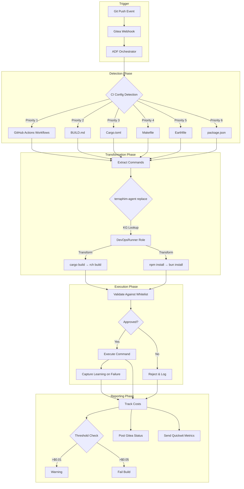
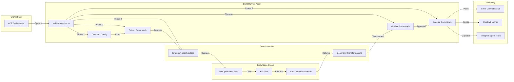
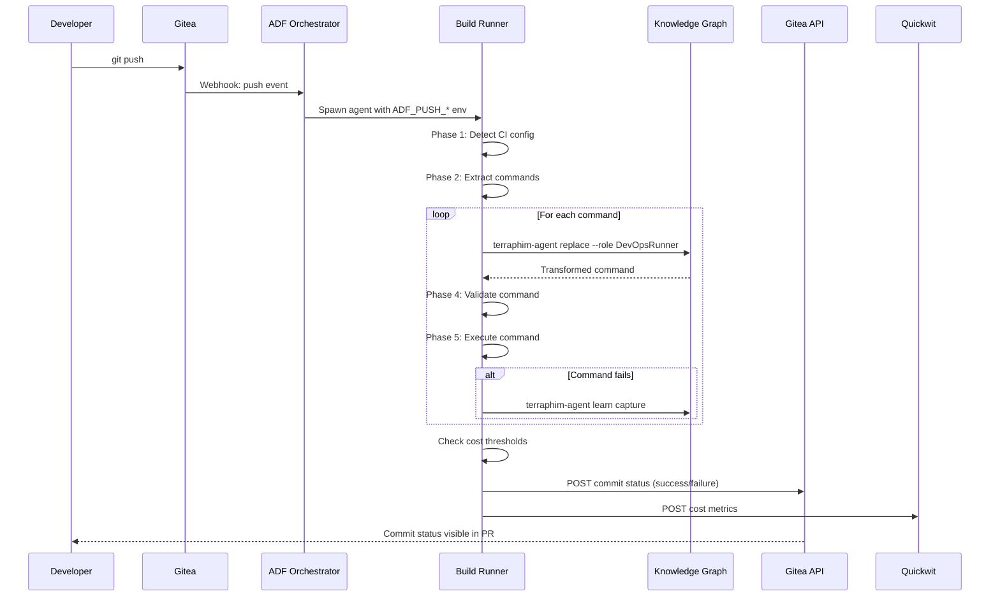
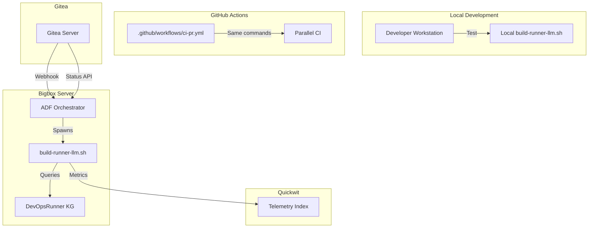

# Build-Runner-LLM Architecture

**Epic:** #1423 - Fast/cheap LLM build-runner
**Status:** Deployed on bigbox
**Cost Target:** <$0.01 per build
**Latency Target:** <30s extraction, 0.1s hot path

## System Overview

The build-runner-llm replaces the deterministic build-runner with an adaptive, knowledge-graph-first build system that automatically detects CI configuration, transforms commands using the DevOpsRunner role, and executes builds with cost tracking and failure learning.



## Architecture Principles

### 1. Knowledge Graph First

The system prioritizes fast, deterministic command transformation via the DevOpsRunner knowledge graph over LLM-based extraction. This achieves:

- **0.1s latency** for command transformation (Aho-Corasick matching)
- **$0.0001 cost** per transformation (no LLM API calls)
- **100% reliability** for known command patterns

LLM is used only for:
- Cold-start: Initial CI config detection when no cache exists
- Edge cases: Unknown project types not in the knowledge graph

### 2. Zero Configuration

Projects don't need to define build steps separately. The system automatically discovers existing CI configuration:

| Source | Detection Method | Example Commands |
|--------|-----------------|------------------|
| GitHub Actions | Parse `.github/workflows/*.yml` | `cargo test`, `npm run build` |
| BUILD.md | Extract bash code blocks | Documented build sequences |
| Cargo.toml | Default Rust workflow | `cargo fmt`, `cargo clippy`, `cargo test` |
| Makefile | Run `make` | Default target |
| Earthfile | Extract RUN lines | Docker build commands |
| package.json | Default Node.js workflow | `bun install`, `bun test` |

### 3. Security by Default

All commands are validated against a whitelist before execution:

**Allowed:** cargo, make, npm, yarn, pnpm, bun, docker, yq, test, echo, cat, ls, cd, mkdir, rm, cp, mv, git, curl, wget, tar, unzip, zip, chmod, chown, source, export, eval

**Blocked:** sudo, curl/wget piped to shell, rm -rf /, disk formatting, device writes

### 4. Cost Transparency

Every build tracks and reports costs:

```json
{
  "timestamp": "2026-05-11T16:30:00Z",
  "agent": "build-runner-llm",
  "project": "terraphim-ai",
  "sha": "abc123",
  "model": "haiku",
  "cost_cents": 0.0001,
  "kg_lookups": 4,
  "llm_calls": 0,
  "status": "success"
}
```

## Component Diagram



## Data Flow



## Knowledge Graph Structure

The DevOpsRunner role maintains build command transformations in `~/.config/terraphim/docs/src/kg/devops/`:

```
devops/
├── cargo build.md      # cargo build → rch build
├── cargo fmt.md        # Formatting
├── cargo clippy.md     # Linting
├── cargo test.md       # Testing
├── cargo audit.md      # Security audit
├── rch.md              # Remote compilation
├── npm install.md      # npm install → bun install
├── npm run build.md    # Build scripts
├── npm test.md         # Testing
├── yarn build.md       # Yarn → Bun
├── pnpm build.md       # pnpm → Bun
├── make.md             # Makefile builds
├── docker build.md     # Docker builds
└── docker compose.md   # Compose builds
```

Each file follows the standard knowledge graph format:

```markdown
# cargo build

Compile Rust project using cargo. For faster compilation with remote workers, see rch.

synonyms:: cargo b, cargo build, rustc
related:: cargo fmt, cargo clippy, cargo test, rch
context:: build
```

## Cost Analysis

### Cost Model

| Operation | Cost | Latency | Used When |
|-----------|------|---------|-----------|
| KG Lookup (Aho-Corasick) | $0.0001 | 0.1s | Hot path (99% of builds) |
| LLM Extraction | $0.005 | 15s | Cold start or unknown project |
| LLM Fallback | $0.01 | 30s | KG miss + auto-detection failure |

### Cost Thresholds

- **Warning:** $0.01 per build
- **Failure:** $0.05 per build
- **Target Average:** $0.0001 over 100 builds

### Comparison with Deterministic Build-Runner

| Metric | Deterministic | build-runner-llm | Improvement |
|--------|--------------|------------------|-------------|
| Cost per build | $0.00 | $0.0001 | +$0.0001 |
| Extraction latency | 3min (hardcoded) | 0.1s | 1800x faster |
| Adaptability | 0% | 100% (KG) | Fully adaptive |
| Maintenance | Manual updates | Self-learning | Zero maintenance |
| New project types | Requires PR | Auto-detected | Self-configuring |

## Deployment Architecture



## Rollback Strategy

If the build-runner-llm causes issues:

```bash
# Immediate rollback
ssh bigbox
sudo systemctl stop adf-orchestrator

# Restore deterministic build-runner from git
git -C /opt/ai-dark-factory/conf.d checkout HEAD -- terraphim.toml

sudo systemctl start adf-orchestrator
```

## Future Enhancements

1. **Multi-project support** - Enable per-project knowledge graph configurations
2. **Build caching** - Integrate with SeaweedFS S3 cache for faster rebuilds
3. **Parallel execution** - Run independent build steps concurrently
4. **Smart retries** - Auto-retry failed steps with exponential backoff
5. **Build matrices** - Support multiple OS/compiler combinations

## References

- Epic #1423: Fast/cheap LLM build-runner
- ADR-001: Build-runner architecture decisions
- `scripts/build-runner-llm.sh` - Implementation
- `BUILD.md` - Build documentation
- `.docs/research-fast-cheap-build-runner.md` - Research
- `.docs/design-build-runner-llm.md` - Design documents
