# AI Dark Factory (ADF) -- Architecture Reference

**Last updated**: 2026-04-25
**Environment**: bigbox (Ubuntu 20.04, 128 GiB RAM, 3.5 TiB disk)
**Orchestrator binary**: `/usr/local/bin/adf`
**Config**: `/opt/ai-dark-factory/conf.d/terraphim.toml`
**Tick cycle**: 300 s
**Active agents**: 19

---

## Overview

The AI Dark Factory is an autonomous multi-agent system that runs overnight on bigbox, performing continuous software engineering work on the `terraphim-ai` repository. Agents are LLM processes (claude CLI or opencode/kimi) spawned by a Rust orchestrator. They read Gitea issues, write code, run tests, and report findings -- without human intervention.

Two layers:

- **Core** -- cron-scheduled agents on a fixed schedule: health checks, dispatch, development, synthesis
- **Growth** -- mention-triggered or low-frequency agents invoked by `@adf:<role>` in Gitea issues

---

## System Architecture

```mermaid
graph TB
    subgraph Orchestrator["ADF Orchestrator (Rust) -- bigbox"]
        direction TB
        CONF[("conf.d/terraphim.toml")]
        KG[("KG Tier Router\ntaxonomy/routing_scenarios/adf/")]
        PROBE["Provider Health\nCircuit Breaker"]
        SCHED["Cron Scheduler\n300s tick"]
        CLASS["ExitClassifier\nexit_code=0 authoritative"]
        CONF --> SCHED
        KG --> SCHED
        PROBE --> KG
        CLASS --> SCHED
    end

    subgraph Providers["LLM Providers"]
        CLAUDE["claude CLI\nAnthropic haiku / sonnet"]
        KIMI["opencode\nkimi-for-coding/k2p5"]
        ZAI["opencode\nzai/glm-5-turbo"]
    end

    subgraph CoreLayer["Core Layer -- Cron Agents"]
        META["meta-coordinator\nFerrox | claude\n0 0-10"]
        COMPWATCH["compliance-watchdog\nVigil | opencode\n5 0-10"]
        RGUARD["runtime-guardian\nFerrox | opencode\n15 0-10"]
        PRODDEV["product-development\nFerrox | claude\n25 0-10"]
        SPECVAL["spec-validator\nCarthos | claude\n30 0-10"]
        TESTG["test-guardian\nEcho | opencode\n35 0-10"]
        DOCGEN["documentation-generator\nFerrox | opencode\n40 0-10"]
        IMPLSWARM["implementation-swarm\nEcho | opencode\n45 0-10"]
        LOGANALYST["log-analyst\nConduit | opencode\n50 0-10"]
        PRODOWNER["product-owner\nThemis | claude\n55 0-10"]
        SECSENT["security-sentinel\nVigil | opencode\n0 */6"]
        DRIFT["drift-detector\nConduit | opencode\n0 */6"]
        UPSYNCER["upstream-synchronizer\nConduit | claude\n30 1 daily"]
        ROADMAP["roadmap-planner\nCarthos | claude\n0 2 daily"]
        METALEARN["meta-learning\nMneme | claude\n0 11 daily"]
    end

    subgraph GrowthLayer["Growth Layer"]
        MERGECOORD["merge-coordinator\nFerrox | opencode\n0 */4"]
        QUALCOORD["quality-coordinator\nCarthos | opencode\nmention-only"]
        BROWSERQA["browser-qa\nEcho | opencode\nmention-only"]
        REPOSTEWARD["repo-steward\nCarthos | claude\n15 */6"]
    end

    subgraph External["External Systems"]
        GITEA[("Gitea\ngit.terraphim.cloud")]
        GITHUB[("GitHub\nterraphim-ai")]
        REPORTS[("/opt/ai-dark-factory/reports/")]
        WIKI[("Gitea Wiki\nlearning + fleet-health pages")]
    end

    SCHED -->|"isolated git worktree"| CoreLayer
    SCHED -->|"schedule or @adf: mention"| GrowthLayer
    CoreLayer --> CLAUDE
    CoreLayer --> KIMI
    GrowthLayer --> CLAUDE
    GrowthLayer --> KIMI
    CLAUDE -.->|fallback| ZAI
    KIMI -.->|fallback| ZAI

    META -->|"@adf:role dispatch"| GITEA
    RGUARD -->|"[Infra] issues + reports"| GITEA
    RGUARD --> REPORTS
    COMPWATCH -->|"[Compliance] issues"| GITEA
    SECSENT -->|"[Security] issues"| GITEA
    DRIFT -->|"[ADF drift] issues"| GITEA
    UPSYNCER -->|"[Infra] upstream drift issues"| GITEA
    REPOSTEWARD -->|"[Repo Stewardship] issues"| GITEA
    PRODOWNER -->|"scored roadmap issues + reports"| GITEA
    PRODOWNER --> REPORTS
    IMPLSWARM -->|"code commits + PRs"| GITEA
    MERGECOORD -->|"merges PRs"| GITEA
    METALEARN -->|"Fleet-Health wiki + alerts"| WIKI
    METALEARN -->|"[ADF] fleet alerts"| GITEA
    GITEA <-->|"git sync"| GITHUB
```



---

## Tier Routing

Agents are matched to a KG tier via Aho-Corasick on their `capabilities`. The tier file lists providers in priority order; `first_healthy_route` returns the first not in the circuit-breaker's unhealthy set.

| Tier | Priority | Agents | Primary model | Fallbacks |
|------|----------|--------|---------------|-----------|
| `planning_tier` | **80** | meta-coordinator, product-owner | anthropic/opus | kimi/k2p5, zai/glm-5-turbo |
| `implementation_tier` | **50** | implementation-swarm, runtime-guardian, product-development, browser-qa, repo-steward | anthropic/sonnet | kimi/k2p5, zai/glm-5-turbo |
| `review_tier` | **40** | compliance-watchdog, spec-validator, drift-detector, log-analyst, roadmap-planner, upstream-synchronizer | anthropic/haiku | kimi/k2p5, zai/glm-5-turbo |

**Priority invariant**: planning (80) > implementation (50) > review (40). When an agent's capabilities match multiple tiers, the highest priority tier wins. This prevents implementation agents from routing to the cheaper haiku model via a review-tier false match.

---

## Cron Timeline (daily cycle)

```
00:00  meta-coordinator         dispatch top issue
00:05  compliance-watchdog      licence / supply-chain audit
00:15  runtime-guardian         infra health + dependency check
00:25  product-development      tech lead code review
00:30  spec-validator           spec vs implementation fidelity
00:35  test-guardian            cargo test + clippy
00:40  documentation-generator  changelog + rustdoc
00:45  implementation-swarm     coding from top @mention
00:50  log-analyst              ADF log analysis
00:55  product-owner (Themis)   5/25 filter + Compound-RICE + WIG + UAT

01:00 ... 10:00  (above repeats hourly)

01:30  upstream-synchronizer    gitea fork vs go-gitea divergence (daily once)
02:00  roadmap-planner          strategic roadmap (daily once)
11:00  meta-learning (Mneme)    fleet pattern synthesis (daily once, after window)

Every 4h:   merge-coordinator
Every 6h:   security-sentinel, drift-detector, repo-steward
```

---

## Agent Catalogue

### meta-coordinator
- **Persona**: Ferrox | **Layer**: Core | **CLI**: claude/haiku | **max_cpu**: 300 s
- **Schedule**: `0 0-10 * * *`
- **Job**: Reads top PageRank-unblocked Gitea issue, scope-clarity check (LLM call 1, max 3 turns), role selection (LLM call 2, max 3 turns), posts `@adf:<role>` dispatch mention.
- **Skills**: disciplined-research, disciplined-verification, devops, quality-oversight

### compliance-watchdog
- **Persona**: Vigil | **Layer**: Core | **CLI**: opencode/kimi | **max_cpu**: 7200 s
- **Schedule**: `5 0-10 * * *`
- **Job**: Licence and regulatory compliance. Runs `cargo deny`, checks SPDX compatibility, scans for GDPR-sensitive patterns, audits dependency provenance, reviews responsible-AI constraints.
- **Skills**: disciplined-research, disciplined-verification, security-audit, responsible-ai, via-negativa-analysis

### runtime-guardian
- **Persona**: Ferrox | **Layer**: Core | **CLI**: opencode/kimi | **max_cpu**: 7200 s
- **Schedule**: `15 0-10 * * *`
- **Job**: Infrastructure health watchdog. Checks disk (alert >80%), Docker image accumulation, memory (RAM-aware: only critical when swap AND available RAM <20 GiB on this 128 GiB machine), GitHub Actions runner status, Rust `target/` directory sizes, `git fetch origin`, `cargo outdated`.
- **Note**: Renamed from `upstream-synchronizer` (which was a misnomer). Fork-sync is now a separate agent.
- **Skills**: disciplined-verification, devops, git-safety-guard

### product-development
- **Persona**: Ferrox | **Layer**: Core | **CLI**: claude/haiku | **max_cpu**: 7200 s
- **Schedule**: `25 0-10 * * *`
- **Job**: Tech lead. Runs cargo clippy, validates spec coverage against `plans/`, reviews architecture decisions, ensures PRs have tests and documentation. Reports findings to Gitea.
- **Note**: Persona corrected from Lux (frontend/UX) to Ferrox (Rust Engineer) -- Ferrox is the correct character for reviewing Rust code quality.
- **Skills**: disciplined-research, disciplined-design, disciplined-specification, disciplined-verification, code-review, architecture, testing, requirements-traceability

### spec-validator
- **Persona**: Carthos | **Layer**: Core | **CLI**: claude/haiku | **max_cpu**: 7200 s
- **Schedule**: `30 0-10 * * *`
- **Job**: Reads `plans/` directory (6 active plan files), cross-references with crate implementations, generates validation report, flags spec gaps.
- **Skills**: disciplined-research, disciplined-design, requirements-traceability, business-scenario-design

### test-guardian
- **Persona**: Echo | **Layer**: Core | **CLI**: opencode/kimi | **max_cpu**: 7200 s
- **Schedule**: `35 0-10 * * *`
- **Job**: Test coverage and quality guardian. Runs `cargo test --workspace`, checks clippy warnings, identifies untested code paths.
- **Skills**: disciplined-verification, disciplined-validation, testing, acceptance-testing

### documentation-generator
- **Persona**: Ferrox | **Layer**: Core | **CLI**: opencode/kimi | **max_cpu**: 7200 s
- **Schedule**: `40 0-10 * * *`
- **Job**: Keeps docs current. Updates CHANGELOG, Rustdoc, mdBook architectural decisions.
- **Skills**: disciplined-implementation, disciplined-verification, documentation, md-book

### implementation-swarm
- **Persona**: Echo | **Layer**: Core | **CLI**: opencode/kimi | **max_cpu**: 7200 s
- **Schedule**: `45 0-10 * * *`
- **Job**: Primary implementation agent. Picks up `@adf:implementation-swarm` issues, codes TDD-first, commits, posts verdict. Carries the heaviest skill chain (9 skills).
- **Skills**: disciplined-research, disciplined-design, disciplined-implementation, disciplined-verification, disciplined-validation, implementation, rust-development, rust-mastery, testing

### log-analyst
- **Persona**: Conduit | **Layer**: Core | **CLI**: opencode/kimi | **max_cpu**: 7200 s
- **Schedule**: `50 0-10 * * *`
- **Job**: Reads ADF orchestrator journal (`journalctl`), classifies error patterns, identifies recurring agent failures, summarises overnight health. Writes report to `/opt/ai-dark-factory/reports/`.
- **Skills**: (none -- shell + LLM analysis)

### product-owner (Themis)
- **Persona**: Themis | **Layer**: Core | **CLI**: claude/sonnet | **max_cpu**: 7200 s
- **Schedule**: `55 0-10 * * *`
- **Job**: Product strategy cycle using three discipline layers (see below). The only agent that explicitly names what is NOT being worked on this cycle.
- **Skills**: disciplined-research, disciplined-design, disciplined-specification, architecture, business-scenario-design, requirements-traceability, acceptance-testing

#### Themis Three-Layer Product Cycle

**Layer 1 -- Essentialism / 5/25 Rule** (from disciplined-design ELIMINATE phase):

Before any scoring, Themis lists all open issues, selects the vital 5 that serve current WIGs, and explicitly marks the other 20 as "Avoid At All Cost". This is Warren Buffett's 5/25 rule applied to the backlog.

```
TOP 5 (vital few -- will be scored):
#NNN: reason it is essential -- which WIG does it serve?

AVOID AT ALL COST (dangerous distractions this cycle):
#NNN: one-line reason why not now

NOT DOING THIS CYCLE: [explicit essentialism statement]
```

Without naming what is NOT being done, prioritisation is not real.

**Layer 2 -- Compound-RICE Scoring**:

Scores the vital 5 with `(Reach × Impact × Confidence × Synergy) / (Effort × Maintenance)`:

| Component | Definition | Range |
|-----------|-----------|-------|
| Reach | Users/agents/workflows affected | 1--100 |
| Impact | Improvement significance | 1--10 |
| Confidence | Certainty this will work | 0.1--1.0 |
| Synergy | Builds on prior / unlocks future work | 1.0--3.0+ |
| Effort | Relative implementation cost | 1--10 |
| Maintenance | Ongoing burden multiplier | 0.5--2.0 |

Priority bands: **critical ≥30**, high ≥15, medium ≥7, low <7.

Synergy > 2.0 is flagged as a **compound opportunity** and a **4DX lead measure**: completing it unlocks downstream WIGs. Also applied: Simplicity check (flag Effort ≥7), Nothing Speculative check (flag vague scope).

**Layer 3 -- WIG Alignment + Mini-UAT Acceptance Block** (from flawless-execution / acceptance-testing):

Every scored issue is checked against current WIGs from `progress.md`. Issues with WIG=NONE are deprioritised unless critical.

Every created issue includes a Gherkin acceptance block:
```gherkin
Given [precondition]
When [action]
Then [observable outcome]
And [additional condition]
```

And a one-line marketing hint. *Evidence over vibes: if it can't be shown, it doesn't count. A feature is not done until it has been announced.*

---

### security-sentinel
- **Persona**: Vigil | **Layer**: Core | **CLI**: opencode/kimi | **max_cpu**: 1200 s
- **Schedule**: `0 */6 * * *` (every 6 hours)
- **Job**: Security posture reviewer. Runs `cargo audit` (CVEs), scans for hardcoded secrets, audits unsafe blocks, runs UBS static analysis, checks port exposure, reviews recent security-relevant commits.
- **Skills**: security-audit, via-negativa-analysis, disciplined-verification, disciplined-validation

### drift-detector
- **Persona**: Conduit | **Layer**: Core | **CLI**: opencode/kimi | **max_cpu**: 7200 s
- **Schedule**: `0 */6 * * *` (every 6 hours)
- **Job**: Configuration drift auditor. Compares running ADF config vs tracked git version, detects `tick_interval_secs` drift, provider health changes, memory pressure trends.
- **Skills**: disciplined-verification, disciplined-validation

### upstream-synchronizer
- **Persona**: Conduit | **Layer**: Core | **CLI**: claude/haiku | **max_cpu**: 600 s
- **Schedule**: `30 1 * * *` (1:30am daily)
- **Job**: Monitors the terraphim gitea fork (`/home/alex/projects/terraphim/gitea`) against upstream `go-gitea/gitea.git`. Adds the `upstream` remote if absent, fetches (depth=200), counts divergence, scans for CVE/security commits. Creates a Gitea issue only if >50 commits behind AND security-relevant commits found.
- **Skills**: devops, git-safety-guard

### roadmap-planner
- **Persona**: Carthos | **Layer**: Core | **CLI**: claude/haiku | **max_cpu**: 1200 s
- **Schedule**: `0 2 * * *` (2am daily)
- **Job**: Strategic roadmap synthesis. Reads open issues, identifies themes, produces a roadmap document aligned with quarterly goals.
- **Skills**: disciplined-research, disciplined-design, documentation

### meta-learning (Mneme)
- **Persona**: Mneme | **Layer**: Core | **CLI**: claude/sonnet | **max_cpu**: 1200 s
- **Schedule**: `0 11 * * *` (11am daily -- after overnight window closes)
- **Job**: Fleet pattern synthesis. Parses `sudo journalctl` exit stats for the last 24h (160 structured log lines/day), reads latest infra-health report, counts open Gitea Theme-IDs, synthesises patterns with sonnet (max 3 turns), writes `Fleet-Health-YYYYMMDD-Mneme` wiki page. Creates `[ADF] Fleet health alert` issue only for P0/P1 patterns.
- **Data sources**: systemd journal (structured exit records), `/opt/ai-dark-factory/reports/`, Gitea open issues, Gitea wiki (previous Mneme reports)
- **Skills**: disciplined-research, disciplined-verification

---

### merge-coordinator
- **Persona**: Ferrox | **Layer**: Growth | **CLI**: opencode/kimi | **max_cpu**: 7200 s
- **Schedule**: `0 */4 * * *` (every 4 hours)
- **Job**: PR lifecycle manager. Checks open PRs for test-guardian and quality-coordinator verdicts. Merges when both approve; blocks and comments when either is missing or FAIL.

### quality-coordinator
- **Persona**: Carthos | **Layer**: Growth | **CLI**: opencode/kimi
- **Schedule**: mention-only (`@adf:quality-coordinator`)
- **Job**: Deep code review. Reviews architecture, interfaces, test coverage, correctness. Issues PASS/FAIL verdict.

### browser-qa
- **Persona**: Echo | **Layer**: Growth | **CLI**: opencode/kimi
- **Schedule**: mention-only (`@adf:browser-qa`)
- **Job**: Playwright UI tests against Tauri desktop or web frontend when UI changes are in a PR.

### repo-steward
- **Persona**: Carthos | **Layer**: Growth | **CLI**: claude/sonnet | **max_cpu**: 1200 s
- **Schedule**: `15 */6 * * *` (every 6 hours at :15)
- **Job**: Repository health synthesiser. Reads findings from runtime-guardian, drift-detector, test-guardian. Identifies recurring stability and usefulness themes. Creates consolidated `[Repo Stewardship]` issues with Theme-IDs.

---

## Exit Classification

`exit_code=0` is **always authoritative**. Pattern matches are preserved in `matched_patterns` for observability but never override a clean exit. This was fixed after false-positive `resource_exhaustion` and `timeout` classifications were observed on agents that discussed failure conditions in their output (e.g. an infra agent reporting "OOM risk" was being classified as OOM'd).

| Class | Trigger (exit_code ≠ 0) | Downstream effect |
|-------|------------------------|-------------------|
| `success` | exit_code=0, has output | Record effective learnings |
| `empty_success` | exit_code=0, no output | Monitor for recurrence |
| `timeout` | "timed out", "deadline exceeded" | Log |
| `rate_limit` | "429", "too many requests" | Trip provider circuit breaker |
| `model_error` | "model not found", "invalid api key" | Trip provider circuit breaker |
| `resource_exhaustion` | "OOM", "out of memory" | Log |
| `compilation_error` | "error[E", "cannot find" | Log |
| `test_failure` | "test result: FAILED" | Log |
| `crash` | "SIGSEGV", "SIGKILL" | Log |
| `unknown` | no pattern matched | Log |

---

## Persona Registry

| Persona | SFIA Title | Level | Symbol | Agents assigned |
|---------|-----------|-------|--------|-----------------|
| Vigil | Principal Security Engineer | 5 | Shield-lock | security-sentinel, compliance-watchdog |
| Ferrox | Principal Software Engineer | 5 | Fe (iron) | meta-coordinator, runtime-guardian, product-development, documentation-generator, merge-coordinator |
| Conduit | Senior DevOps Engineer | 4 | Pipeline | drift-detector, log-analyst, upstream-synchronizer |
| Themis | Senior Product Manager | 4 | Balance scales | product-owner |
| Carthos | Principal Solution Architect | 5 | Compass rose | spec-validator, quality-coordinator, roadmap-planner, repo-steward |
| Echo | Senior Integration Engineer | 4 | Parallel lines | test-guardian, implementation-swarm, browser-qa |
| Mneme | Principal Knowledge Engineer | 5 | Palimpsest | meta-learning |
| Meridian | Senior Research Analyst | 4 | Sextant | (available) |
| Lux | Senior Frontend Engineer | 4 | Prism | (available -- removed from product-owner/product-development; correct persona was Themis/Ferrox) |

---

## Product Strategy Framework (Themis / product-owner)

The product-owner cycle combines three disciplines into a single decision engine:

```
All open issues (up to 25)
         │
         ▼ Layer 1: 5/25 Rule (Essentialism)
Top 5 vital few ─────────────────── Avoid At All Cost (20 items, named explicitly)
         │
         ▼ Layer 2: Compound-RICE Scoring
Each of 5 scored: (Reach × Impact × Confidence × Synergy) / (Effort × Maintenance)
  critical ≥30 / high ≥15 / medium ≥7 / low <7
  Synergy > 2.0 → compound opportunity → 4DX lead measure
         │
         ▼ Layer 3: WIG Alignment + Mini-UAT
Each issue → maps to current WIG from progress.md
Each created issue → Gherkin acceptance block (Given/When/Then/And)
Each created issue → marketing hint (feature not done until announced)
         │
         ▼
Roadmap report → /opt/ai-dark-factory/reports/roadmap-YYYYMMDD-HHMM.md
New issues → Gitea (with RICE score, WIG, UAT block, marketing hint)
```

**WIG alignment**: WIG = Wildly Important Goal from `progress.md`. Synergy in Compound-RICE directly measures 4DX lead-measure potential: work that builds on prior investment and unlocks future WIGs scores higher, making the compounding effect explicit in the priority score.

---

## Key Paths (bigbox)

| Path | Purpose |
|------|---------|
| `/usr/local/bin/adf` | Orchestrator binary |
| `/opt/ai-dark-factory/conf.d/terraphim.toml` | Live agent config |
| `/opt/ai-dark-factory/skills/` | Skill prompt files |
| `/opt/ai-dark-factory/reports/` | Agent output reports (87+ files) |
| `/tmp/adf-worktrees/<agent>-<hash>/` | Isolated git worktree per run |
| `/home/alex/terraphim-ai/` | Repository clone |
| `/home/alex/terraphim-ai/data/personas/` | Persona TOML definitions |
| `/home/alex/terraphim-ai/docs/taxonomy/routing_scenarios/adf/` | Tier routing files |
| `/home/alex/projects/terraphim/gitea/` | Gitea fork (monitored by upstream-synchronizer) |
| `/etc/systemd/system/adf-orchestrator.service` | Systemd unit |
| `/etc/sysctl.d/99-bigbox-tuning.conf` | Kernel tuning (vm.swappiness=1) |
