# AI Dark Factory (ADF) -- Architecture Reference

**Last updated**: 2026-04-25
**Environment**: bigbox (Ubuntu 20.04, 128 GiB RAM, 3.5 TiB disk)
**Orchestrator binary**: `/usr/local/bin/adf`
**Config**: `/opt/ai-dark-factory/conf.d/terraphim.toml`
**Tick cycle**: 300 s

---

## Overview

The AI Dark Factory is an autonomous multi-agent system that runs overnight on bigbox, performing continuous software engineering work on the `terraphim-ai` repository. Agents are LLM processes (claude CLI or opencode/kimi) spawned by a Rust orchestrator. They read Gitea issues, write code, run tests, and report findings -- without human intervention.

The system uses two layers:

- **Core** -- cron-scheduled agents that run on a fixed schedule, performing health checks, dispatch, and development work
- **Growth** -- mention-triggered or low-frequency agents invoked by `@adf:<role>` in Gitea issues or on a less-frequent schedule

---

## System Architecture

```mermaid
graph TB
    subgraph Orchestrator["ADF Orchestrator (Rust) -- bigbox"]
        direction TB
        CONF[("conf.d/terraphim.toml")]
        KG[("KG Tier Router\ntaxonomy/routing_scenarios/adf/")]
        PROBE["Provider Health\nCircuit Breaker"]
        SCHED["Cron Scheduler\n300s tick"]
        CLASS["ExitClassifier\nAho-Corasick"]
        CONF --> SCHED
        KG --> SCHED
        PROBE --> KG
        CLASS --> SCHED
    end

    subgraph Providers["LLM Providers"]
        CLAUDE["claude CLI\nAnthropic haiku / sonnet"]
        KIMI["opencode\nkimi-for-coding/k2p5"]
        ZAI["opencode\nzai/glm-5-turbo"]
    end

    subgraph CoreLayer["Core Layer -- Cron Agents (00:00 -- 10:00 daily)"]
        direction TB
        META["meta-coordinator\nFerrox | claude\n0 0-10 * * *"]
        UPSTREAM["upstream-synchronizer\nFerrox | opencode\n15 0-10 * * *"]
        COMPWATCH["compliance-watchdog\nVigil | opencode\n5 0-10 * * *"]
        DRIFT["drift-detector\nConduit | opencode\n0 */6 * * *"]
        SECSENT["security-sentinel\nVigil | opencode\n0 */6 * * *"]
        PRODDEV["product-development\nLux | claude\n25 0-10 * * *"]
        SPECVAL["spec-validator\nCarthos | claude\n30 0-10 * * *"]
        TESTG["test-guardian\nEcho | opencode\n35 0-10 * * *"]
        DOCGEN["documentation-generator\nFerrox | opencode\n40 0-10 * * *"]
        IMPLSWARM["implementation-swarm\nEcho | opencode\n45 0-10 * * *"]
        LOGANALYST["log-analyst\nConduit | opencode\n50 0-10 * * *"]
        PRODOWNER["product-owner\nLux | claude\n55 0-10 * * *"]
        ROADMAP["roadmap-planner\nCarthos | claude\n0 2 * * *"]
    end

    subgraph GrowthLayer["Growth Layer -- Mention / Periodic"]
        MERGECOORD["merge-coordinator\nFerrox | opencode\n0 */4 * * *"]
        QUALCOORD["quality-coordinator\nCarthos | opencode\nmention-only"]
        BROWSERQA["browser-qa\nEcho | opencode\nmention-only"]
        REPOSTEWARD["repo-steward\nCarthos | claude\n15 */6 * * *"]
    end

    subgraph External["External Systems"]
        GITEA[("Gitea\ngit.terraphim.cloud")]
        GITHUB[("GitHub\nterraphim-ai")]
        REPORTS[("/opt/ai-dark-factory/reports/")]
        WIKI[("Gitea Wiki\nlearning pages")]
    end

    SCHED -->|"spawn in isolated\ngit worktree"| CoreLayer
    SCHED -->|"spawn on schedule\nor @adf: mention"| GrowthLayer

    CoreLayer --> CLAUDE
    CoreLayer --> KIMI
    GrowthLayer --> CLAUDE
    GrowthLayer --> KIMI
    CLAUDE -.-> ZAI
    KIMI -.-> ZAI

    META -->|"@adf:role dispatch"| GITEA
    UPSTREAM -->|"[Infra] issues"| GITEA
    UPSTREAM --> REPORTS
    COMPWATCH -->|"[Compliance] issues"| GITEA
    SECSENT -->|"[Security] issues"| GITEA
    DRIFT -->|"[ADF drift] issues"| GITEA
    REPOSTEWARD -->|"[Repo Stewardship] issues"| GITEA
    PRODOWNER -->|"roadmap issues"| GITEA
    IMPLSWARM -->|"code commits + PRs"| GITEA
    MERGECOORD -->|"merges PRs"| GITEA
    LOGANALYST --> REPORTS
    SECSENT --> WIKI
    COMPWATCH --> WIKI

    GITEA <-->|"git sync"| GITHUB
```



---

## Tier Routing

Each agent is matched to a KG tier via Aho-Corasick on its `capabilities`. The tier file lists providers in priority order; `first_healthy_route` returns the first not in the circuit-breaker's unhealthy set.

| Tier | Agents | Primary | Fallbacks |
|------|--------|---------|-----------|
| `review_tier` | meta-coordinator, compliance-watchdog, spec-validator, drift-detector, log-analyst, roadmap-planner | anthropic/haiku | kimi/k2p5, zai/glm-5-turbo |
| `implementation_tier` | implementation-swarm, upstream-synchronizer, product-development, browser-qa, repo-steward | anthropic/sonnet | kimi/k2p5, zai/glm-5-turbo |
| `planning_tier` | product-owner, merge-coordinator, quality-coordinator, test-guardian, documentation-generator, security-sentinel | anthropic/opus | kimi/k2p5, zai/glm-5-turbo |

---

## Cron Timeline (daily cycle, midnight -- 10am)

```
00:00  meta-coordinator         dispatch top issue
00:05  compliance-watchdog      licence / supply-chain audit
00:15  upstream-synchronizer    infra health + dependency sync
00:25  product-development      tech lead code review
00:30  spec-validator           spec vs implementation fidelity
00:35  test-guardian            cargo test + clippy
00:40  documentation-generator  changelog + rustdoc
00:45  implementation-swarm     coding from top @mention
00:50  log-analyst              ADF log analysis
00:55  product-owner            roadmap issue creation

01:00 ... 10:00  (above repeats hourly)

02:00  roadmap-planner          strategic roadmap (daily, once)

Every 4h:   merge-coordinator
Every 6h:   security-sentinel, drift-detector, repo-steward
```

---

## Agent Catalogue

### meta-coordinator
- **Persona**: Ferrox | **Layer**: Core | **CLI**: claude/haiku | **max_cpu**: 300 s
- **Schedule**: `0 0-10 * * *` (hourly, midnight--10am)
- **Job**: Reads the top PageRank-unblocked Gitea issue, runs a scope-clarity LLM check, selects the right `@adf:<role>`, posts the dispatch mention. Two LLM calls, max 3 turns each.
- **Skills**: disciplined-research, disciplined-verification, devops, quality-oversight
- **Outputs**: `@adf:<role>` mention on top Gitea issue

### upstream-synchronizer
- **Persona**: Ferrox | **Layer**: Core | **CLI**: opencode/kimi | **max_cpu**: 7200 s
- **Schedule**: `15 0-10 * * *` (at :15 past each hour)
- **Job**: Infrastructure watchdog. Checks disk (alert >80%), Docker image accumulation, memory (RAM-aware: only critical when both swap AND available RAM <20 GiB), service health, GitHub Actions runner status, Rust `target/` directory sizes, upstream git divergence, `cargo outdated`.
- **Skills**: disciplined-verification, devops, git-safety-guard
- **Outputs**: `[Infra]` Gitea issues (max 2/run, no duplicates); infra health report

### compliance-watchdog
- **Persona**: Vigil | **Layer**: Core | **CLI**: opencode/kimi | **max_cpu**: 7200 s
- **Schedule**: `5 0-10 * * *` (at :05 past each hour)
- **Job**: Licence and regulatory compliance. Runs `cargo deny`, checks SPDX compatibility, scans for GDPR-sensitive patterns, audits dependency provenance, reviews responsible-AI constraints.
- **Skills**: disciplined-research, disciplined-verification, security-audit, responsible-ai, via-negativa-analysis
- **Outputs**: `[Compliance]` Gitea issues; compliance audit wiki pages

### drift-detector
- **Persona**: Conduit | **Layer**: Core | **CLI**: opencode/kimi | **max_cpu**: 7200 s
- **Schedule**: `0 */6 * * *` (every 6 hours)
- **Job**: Configuration drift auditor. Compares running ADF config vs tracked git version, detects `tick_interval_secs` drift, provider health changes, memory pressure trends over multiple sessions.
- **Skills**: disciplined-verification, disciplined-validation
- **Outputs**: `[ADF]` drift issues when divergence found

### security-sentinel
- **Persona**: Vigil | **Layer**: Core | **CLI**: opencode/kimi | **max_cpu**: 1200 s
- **Schedule**: `0 */6 * * *` (every 6 hours)
- **Job**: Security posture reviewer. Runs `cargo audit` (CVEs), scans for hardcoded secrets, audits unsafe blocks, runs UBS static analysis, checks port exposure, reviews recent security-relevant commits.
- **Skills**: security-audit, via-negativa-analysis, disciplined-verification, disciplined-validation
- **Outputs**: `[Security]` issues for P0/P1 findings; wiki learning pages

### product-development
- **Persona**: Lux | **Layer**: Core | **CLI**: claude/sonnet | **max_cpu**: 7200 s
- **Schedule**: `25 0-10 * * *` (at :25 past each hour)
- **Job**: Tech lead. Reviews code quality, tracks spec coverage, validates architecture, ensures PRs have tests and docs. Acts as the first line of quality enforcement before merge-coordinator.
- **Skills**: disciplined-research, disciplined-design, disciplined-specification, disciplined-verification, code-review, architecture, testing, requirements-traceability
- **Outputs**: Code review comments; spec gap issues

### spec-validator
- **Persona**: Carthos | **Layer**: Core | **CLI**: claude/haiku | **max_cpu**: 7200 s
- **Schedule**: `30 0-10 * * *` (at :30 past each hour)
- **Job**: Specification fidelity checker. Reads `plans/` directory, cross-references with crate implementations, generates validation report, flags spec gaps.
- **Skills**: disciplined-research, disciplined-design, requirements-traceability, business-scenario-design
- **Outputs**: `reports/spec-validation-YYYYMMDD.md`; `[fix(spec)]` issues

### test-guardian
- **Persona**: Echo | **Layer**: Core | **CLI**: opencode/kimi | **max_cpu**: 7200 s
- **Schedule**: `35 0-10 * * *` (at :35 past each hour)
- **Job**: Test coverage and quality guardian. Runs `cargo test --workspace`, checks clippy warnings, identifies untested code paths, verifies regression coverage for new failure modes.
- **Skills**: disciplined-verification, disciplined-validation, testing, acceptance-testing
- **Outputs**: `[fix(tests)]` issues; test guardian verdict posted to Gitea

### documentation-generator
- **Persona**: Ferrox | **Layer**: Core | **CLI**: opencode/kimi | **max_cpu**: 7200 s
- **Schedule**: `40 0-10 * * *` (at :40 past each hour)
- **Job**: Keeps docs current. Updates CHANGELOG, generates Rustdoc summaries for new crates, writes mdBook pages for architectural decisions.
- **Skills**: disciplined-implementation, disciplined-verification, documentation, md-book
- **Outputs**: Documentation commits; changelog updates

### implementation-swarm
- **Persona**: Echo | **Layer**: Core | **CLI**: opencode/kimi | **max_cpu**: 7200 s
- **Schedule**: `45 0-10 * * *` (at :45 past each hour)
- **Job**: Primary implementation agent. Picks up `@adf:implementation-swarm` issues, writes code TDD-first, commits, posts a verdict. Carries the heaviest skill chain in the fleet (9 skills).
- **Skills**: disciplined-research, disciplined-design, disciplined-implementation, disciplined-verification, disciplined-validation, implementation, rust-development, rust-mastery, testing
- **Outputs**: Code commits; PR comments; implementation verdicts

### log-analyst
- **Persona**: Conduit | **Layer**: Core | **CLI**: opencode/kimi | **max_cpu**: 7200 s
- **Schedule**: `50 0-10 * * *` (at :50 past each hour)
- **Job**: ADF orchestrator log analyst. Reads `journalctl` output for the ADF service, classifies error patterns, identifies recurring agent failures, summarises overnight health.
- **Outputs**: Log analysis report to `/opt/ai-dark-factory/reports/`

### product-owner
- **Persona**: Lux | **Layer**: Core | **CLI**: claude/sonnet | **max_cpu**: 7200 s
- **Schedule**: `55 0-10 * * *` (at :55 past each hour)
- **Job**: Maintains the development roadmap. Creates well-scoped Gitea issues, prioritises backlog by PageRank impact, ensures issues have acceptance criteria.
- **Skills**: disciplined-research, disciplined-design, disciplined-specification, architecture, business-scenario-design, requirements-traceability
- **Outputs**: New Gitea issues with scoped requirements

### roadmap-planner
- **Persona**: Carthos | **Layer**: Core | **CLI**: claude/haiku | **max_cpu**: 1200 s
- **Schedule**: `0 2 * * *` (2am daily)
- **Job**: Strategic roadmap synthesis. Reads open issues, identifies themes, produces a roadmap document aligned with quarterly goals.
- **Skills**: disciplined-research, disciplined-design, documentation
- **Outputs**: Roadmap wiki page; strategic planning documents

### merge-coordinator
- **Persona**: Ferrox | **Layer**: Growth | **CLI**: opencode/kimi | **max_cpu**: 7200 s
- **Schedule**: `0 */4 * * *` (every 4 hours)
- **Job**: PR lifecycle manager. Checks open PRs for test-guardian and quality-coordinator verdicts. Merges when both approve; blocks and comments when either is missing or FAIL.
- **Skills**: disciplined-research, disciplined-design, disciplined-specification, disciplined-verification
- **Outputs**: PR merges; merge-blocked comments

### quality-coordinator
- **Persona**: Carthos | **Layer**: Growth | **CLI**: opencode/kimi
- **Schedule**: mention-only (`@adf:quality-coordinator`)
- **Job**: Deep code review. Invoked by merge-coordinator or human mention on a PR. Reviews architecture, interfaces, test coverage, correctness. Issues PASS/FAIL verdict.
- **Skills**: disciplined-research, disciplined-verification, code-review, quality-gate, quality-oversight
- **Outputs**: Review verdict

### browser-qa
- **Persona**: Echo | **Layer**: Growth | **CLI**: opencode/kimi
- **Schedule**: mention-only (`@adf:browser-qa`)
- **Job**: Browser automation and UI testing. Runs Playwright tests against the Tauri desktop or web frontend when UI changes are in a PR.
- **Skills**: disciplined-research, disciplined-verification, testing, acceptance-testing, dev-browser
- **Outputs**: Browser test results; screenshots

### repo-steward
- **Persona**: Carthos | **Layer**: Growth | **CLI**: claude/sonnet | **max_cpu**: 1200 s
- **Schedule**: `15 */6 * * *` (every 6 hours at :15)
- **Job**: Repository health synthesiser. Reads findings from upstream-synchronizer, drift-detector, test-guardian. Identifies recurring stability and usefulness themes. Creates consolidated `[Repo Stewardship]` issues. Tracks Theme-IDs to prevent duplicate synthesis.
- **Skills**: disciplined-research, disciplined-design, disciplined-verification, documentation
- **Outputs**: `[Repo Stewardship][Stability]` and `[Repo Stewardship][Usefulness]` Gitea issues

---

## Exit Classification Rules

`exit_code=0` is always authoritative. Patterns in `matched_patterns` are observational only.

| Class | Pattern (exit_code ≠ 0) | Downstream effect |
|-------|------------------------|-------------------|
| `success` | exit_code=0, has output | Record effective learnings |
| `empty_success` | exit_code=0, no output | Record, monitor for recurrence |
| `timeout` | "timed out", "deadline exceeded" | Log |
| `rate_limit` | "429", "too many requests" | Trip provider circuit breaker |
| `model_error` | "model not found", "invalid api key" | Trip provider circuit breaker |
| `resource_exhaustion` | "OOM", "out of memory" | Log |
| `compilation_error` | "error[E", "cannot find" | Log |
| `test_failure` | "test result: FAILED" | Log |
| `crash` | "SIGSEGV", "SIGKILL" | Log |
| `unknown` | no pattern matched | Log |

---

## Persona Registry

| Persona | SFIA Title | Level | Symbol | Agents assigned |
|---------|-----------|-------|--------|-----------------|
| Vigil | Principal Security Engineer | 5 | Shield-lock | security-sentinel, compliance-watchdog |
| Ferrox | Principal Software Engineer | 5 | Fe (iron) | meta-coordinator, upstream-synchronizer, documentation-generator, merge-coordinator |
| Conduit | Senior DevOps Engineer | 4 | Pipeline | drift-detector, log-analyst |
| Lux | Senior Frontend Engineer | 4 | Prism | product-development, product-owner |
| Carthos | Principal Solution Architect | 5 | Compass rose | spec-validator, quality-coordinator, roadmap-planner, repo-steward |
| Echo | Senior Integration Engineer | 4 | Parallel lines | test-guardian, implementation-swarm, browser-qa |
| Meridian | Senior Research Analyst | 4 | Sextant | (available) |
| Mneme | Principal Knowledge Engineer | 5 | Palimpsest | (available) |

---

## Key Paths (bigbox)

| Path | Purpose |
|------|---------|
| `/usr/local/bin/adf` | Orchestrator binary |
| `/opt/ai-dark-factory/conf.d/terraphim.toml` | Live agent config |
| `/opt/ai-dark-factory/skills/` | Skill prompt files |
| `/opt/ai-dark-factory/reports/` | Agent output reports |
| `/tmp/adf-worktrees/<agent>-<hash>/` | Isolated git worktree per run |
| `/home/alex/terraphim-ai/` | Repository clone |
| `/home/alex/terraphim-ai/data/personas/` | Persona TOML definitions |
| `/home/alex/terraphim-ai/docs/taxonomy/routing_scenarios/adf/` | Tier routing files |
| `/etc/systemd/system/adf-orchestrator.service` | Systemd unit |
| `/etc/sysctl.d/99-bigbox-tuning.conf` | Kernel tuning (vm.swappiness=1) |
