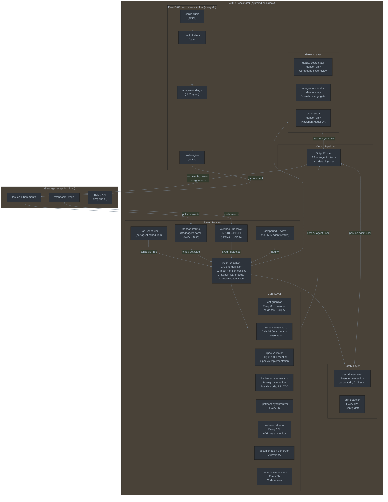
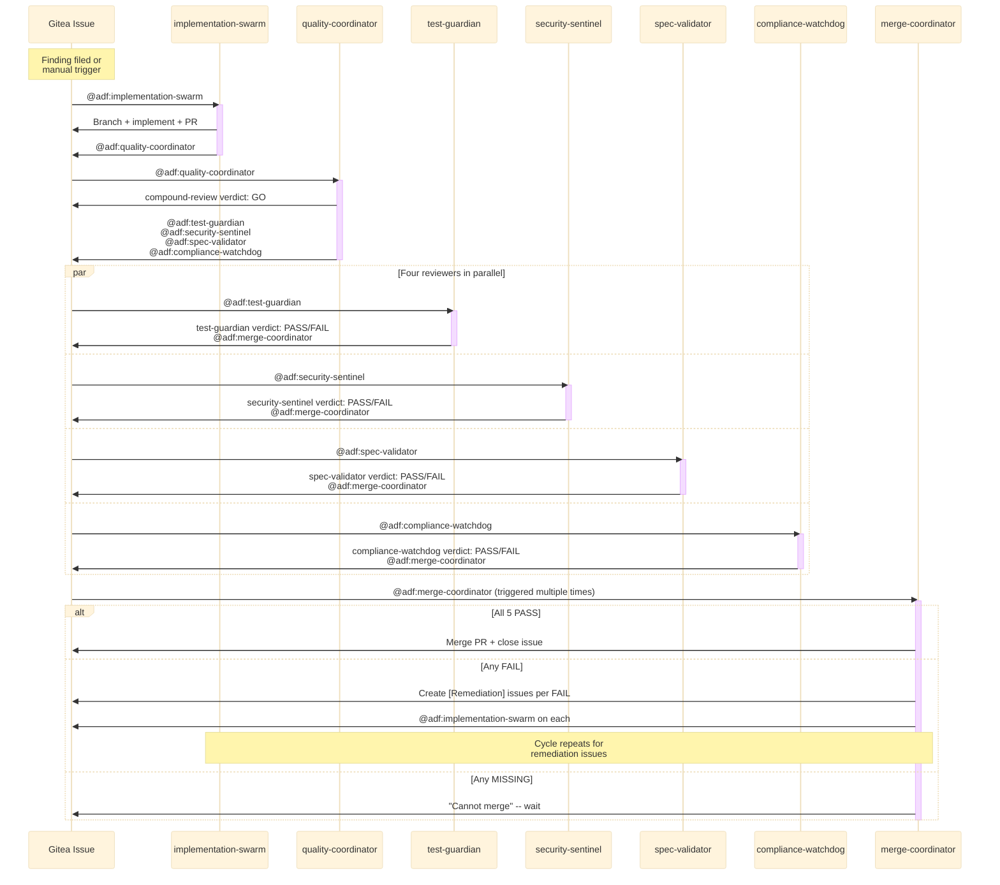

# AI Dark Factory (ADF) Architecture

## ASCII Overview

```
+=========================================================================+
|                     AI DARK FACTORY ORCHESTRATOR                        |
|                        (bigbox systemd service)                         |
+=========================================================================+
|                                                                         |
|  +------------------+   +------------------+   +---------------------+  |
|  |  MENTION POLLING  |   |     WEBHOOK      |   |  CRON SCHEDULER    |  |
|  |  (every 2 ticks)  |   | 172.18.0.1:9091  |   |  (per-agent cron)  |  |
|  |                   |   |  HMAC-SHA256 sig  |   |                    |  |
|  | Scans comments    |   |  Real-time push   |   | Fires agents on   |  |
|  | for @adf:agent    |   |  from Gitea       |   | schedule           |  |
|  +--------+----------+   +--------+----------+   +---------+----------+  |
|           |                       |                         |            |
|           +------------+----------+----------+--------------+            |
|                        |                     |                           |
|                        v                     v                           |
|              +---------+--------+   +--------+---------+                 |
|              |  AGENT DISPATCH  |   | COMPOUND REVIEW  |                 |
|              |                  |   |  (hourly swarm)  |                 |
|              | 1. Clone def     |   |  6-agent review  |                 |
|              | 2. Inject ctx    |   |  in git worktree |                 |
|              | 3. Spawn process |   |  files findings  |                 |
|              | 4. Assign issue  |   |  as Gitea issues |                 |
|              +---------+--------+   +------------------+                 |
|                        |                                                 |
|  +---------------------+---------------------------------------------+  |
|  |                    AGENT OUTPUT PIPELINE                           |  |
|  |                                                                    |  |
|  |  OutputPoster                                                      |  |
|  |  +-- default_tracker (root token)                                  |  |
|  |  +-- agent_trackers (13 per-agent tokens from agent_tokens.json)   |  |
|  |      Each agent posts comments under its own Gitea user            |  |
|  +--------------------------------------------------------------------+  |
|                                                                         |
+=========================================================================+


================================ AGENT LAYERS ================================

SAFETY LAYER (always-on watchdogs)
+---------------------+   +---------------------+
| security-sentinel   |   | drift-detector      |
| Every 6h + mention  |   | Every 12h           |
| cargo audit, CVE    |   | Config drift scan   |
| Posts to issue #108  |   |                     |
+---------------------+   +---------------------+

CORE LAYER (essential pipeline agents)
+---------------------+   +---------------------+   +---------------------+
| test-guardian       |   | compliance-watchdog |   | spec-validator      |
| Every 8h + mention  |   | Daily 03:00 + ment. |   | Daily 03:00 + ment. |
| cargo test + clippy |   | License audit       |   | Spec vs impl check  |
| Verdict: PASS/FAIL  |   | Verdict: PASS/FAIL  |   | Verdict: PASS/FAIL  |
+---------------------+   +---------------------+   +---------------------+
+---------------------+   +---------------------+   +---------------------+
| implementation-swarm|   | upstream-sync       |   | meta-coordinator    |
| Midnight + mention  |   | Every 6h            |   | Every 12h           |
| Branch, code, PR    |   | Check upstream deps |   | ADF health monitor  |
| TDD workflow        |   | Flag risky commits  |   | Creates P0/P1 issues|
+---------------------+   +---------------------+   +---------------------+
+---------------------+   +---------------------+
| documentation-gen   |   | product-development |
| Daily 04:00         |   | Every 6h            |
| Doc comments, CHLOG |   | Code review         |
| Posts to issue #114  |   | Posts to issue #112  |
+---------------------+   +---------------------+

GROWTH LAYER (coordination and quality)
+---------------------+   +---------------------+   +---------------------+
| quality-coordinator |   | merge-coordinator   |   | browser-qa          |
| Mention-only        |   | Mention-only        |   | Mention-only        |
| Compound code review|   | 5-verdict merge gate|   | Playwright visual   |
| Triggers 4 reviewers|   | Creates remediation |   | testing             |
|                     |   | issues for FAILs    |   |                     |
+---------------------+   +---------------------+   +---------------------+

FLOW DAG (multi-step pipeline)
+---------------------------------------------------------------------+
| security-audit-flow  (every 6h)                                     |
|                                                                      |
|  [cargo-audit] ---> [check-findings] ---> [analyse-findings] ---->  |
|   action: run        gate: exit!=0?        agent: LLM analysis      |
|   cargo audit        yes: continue         categorise P0-P3         |
|                      no: abort             write report              |
|                                                                      |
|  ----> [post-to-gitea]                                              |
|          action: gtr comment to #108                                 |
+---------------------------------------------------------------------+


========================== REVIEWER CHAIN FLOW ===========================

  Issue created (finding or manual)
       |
       v
  @adf:implementation-swarm  ------>  Branch + implement + PR
       |
       v
  @adf:quality-coordinator  ------>  Compound code review
       |
       | (if GO)
       v
  Triggers 4 reviewers on same issue:
  +---> @adf:test-guardian       ----> cargo test, verdict PASS/FAIL
  +---> @adf:security-sentinel   ----> cargo audit, verdict PASS/FAIL
  +---> @adf:spec-validator      ----> spec check, verdict PASS/FAIL
  +---> @adf:compliance-watchdog ----> license audit, verdict PASS/FAIL
       |
       | Each posts verdict + @adf:merge-coordinator
       v
  merge-coordinator checks all 5 verdicts:
       |
       +--- All PASS ---> Merge PR, close issue
       |
       +--- Any FAIL ---> Create [Remediation] issues
       |                  per FAIL verdict
       |                  Trigger @adf:implementation-swarm
       |                  on each remediation issue
       |
       +--- Any MISSING -> Post "Cannot merge", wait


========================= INFRASTRUCTURE ==================================

  Gitea (git.terraphim.cloud)          ADF Orchestrator (bigbox)
  +----------------------------+       +---------------------------+
  | Docker: gitea:1.26.0       |       | systemd: adf-orchestrator |
  | Postgres, SeaweedFS S3     |       | Binary: /usr/local/bin/adf|
  | Robot API: /api/v1/robot/* |       | Config: orchestrator.toml |
  | PageRank issue scoring     |       | Tokens: agent_tokens.json |
  | Webhook --> ADF:9091       |       | WorkDir: /opt/ai-dark-fac |
  | 29 users (13 agent users)  |       | Memory: 16G max           |
  +----------------------------+       | CPU: 400% (4 cores)       |
           |                            +---------------------------+
           | HTTPS API                             |
           +<--------------------------------------+
             Comments, issues, PRs, assignments
```

## Mermaid Diagram



## Reviewer Chain (Mermaid)



## Agent Token Coverage

```
Agent                    Token  Gitea User  Layer
------------------------ ------ ----------- --------
security-sentinel        yes    yes         Safety
drift-detector           yes    yes         Safety
test-guardian            yes    yes         Core
compliance-watchdog      yes    yes         Core
spec-validator           yes    yes         Core
implementation-swarm     yes    yes         Core
upstream-synchronizer    yes    yes         Core
meta-coordinator         yes    yes         Core
documentation-generator  yes    yes         Core
product-development      yes    yes         Core
quality-coordinator      yes    yes         Growth
merge-coordinator        yes    yes         Growth
browser-qa               yes    yes         Growth
---
analyse-findings         n/a    n/a         Flow step (uses root)
cargo-audit              n/a    n/a         Flow step (action)
check-findings           n/a    n/a         Flow step (gate)
post-to-gitea            n/a    n/a         Flow step (action)
```
