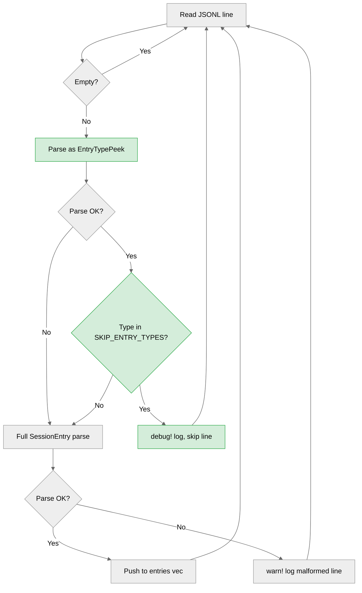

<h3>Summary</h3>

This PR fixes issue terraphim/terraphim-ai#3081 by adding a pre-filter to `terraphim_session_analyzer::parser::SessionParser::from_file()` that skips 12 known Claude Code metadata JSONL entry types before attempting full deserialization. The change eliminates ~2003 of ~2430 false WARN lines (82% reduction) produced on every `terraphim-agent sessions search` invocation.

**Key changes:**
- **SKIP_ENTRY_TYPES** constant: 12 metadata entry types (`last-prompt`, `mode`, `permission-mode`, `ai-title`, `file-history-snapshot`, `queue-operation`, `agent-name`, `pr-link`, `tool_reference`, `text`, `attachment`, `system`)
- **EntryTypePeek** struct: lightweight one-field deserialization to check entry type before full parse
- **Pre-filter logic** in `from_file()`: peek at type, skip metadata at debug level, fall through to full parse for conversational types
- **Workspace integration**: vendored `terraphim-session-analyzer` crate into `terraphim-clients` workspace as path dependency; pinned `terraphim_service` to `=1.20.6` to resolve pre-existing registry conflict

**What was done well:**
- Minimal, surgical change in one location (15 lines of functional code)
- Comprehensive test coverage: 5 new tests covering all 12 skip types, positive cases (user/assistant still parsed), and edge cases (metadata-only file yields 0 entries)
- Debug logging preserves traceability without producing noise
- Correctly preserves WARN path for genuinely unknown/malformed entry types
- Existing 109 tests all pass (114 total with additions)

**What remains problematic:**
- The vendored crate carries 77 pre-existing UBS warnings and 12 pre-existing clippy lints (not introduced by this PR but will surface in CI)
- The `terraphim_service` version pin `=1.20.6` is overly restrictive

<h3>Confidence Score: 4/5</h3>

- Safe to merge with awareness of pre-existing lint debt in vendored crate
- Zero P0 or P1 findings in the actual code changes. All findings are P2 (hygiene/maintainability). The functional logic is correct, well-tested, and follows the existing code patterns. The main risk is operational: the vendored crate introduces pre-existing lint debt that may block CI gates enforcing `-D warnings`.
- Files requiring attention: `Cargo.toml` (version pin), `crates/terraphim-session-analyzer/src/parser.rs` (pre-existing clippy/UBS findings in original code)

<h3>Important Files Changed</h3>

| Filename | Overview |
|----------|----------|
| `crates/terraphim-session-analyzer/src/parser.rs` | Core fix: adds `SKIP_ENTRY_TYPES` constant, `EntryTypePeek` struct, and pre-filter in `from_file()`. Also contains 5 new tests. Pre-existing clippy lints and 1 UBS false positive (`entry.uuid == message_id` at line 307) are present in original code, not introduced by this change. |
| `Cargo.toml` | Adds `terraphim-session-analyzer` to workspace members. Pins `terraphim_service` to `=1.20.6` (was `"1.20.5"`). The `=` pin is overly restrictive. |
| `crates/terraphim_sessions/Cargo.toml` | Changes `terraphim-session-analyzer` dep from registry version `"1.19.2"` to path `"../../crates/terraphim-session-analyzer"` with version `"1.21.0"`. |
| `crates/terraphim-session-analyzer/Cargo.toml` | Vendored crate manifest. Changed optional path deps (`terraphim_automata`, `terraphim_types`, `terraphim_config`) from path to version-only to resolve missing sibling directories. |

<h3>Diagram</h3>



<h3>Inline Findings</h3>

**P2 `crates/terraphim-session-analyzer/src/parser.rs`, line 68**: Double JSON parse for non-skipped entries

Every non-empty line is now parsed twice: first as `EntryTypePeek` (one field), then as `SessionEntry` (full struct). For the majority of lines (user/assistant entries that are NOT in the skip set), this adds a redundant parse pass.

The overhead is minimal in practice (~0.01ms per line for a one-field struct) and the file-walk dominates parse time. However, if session files grow large (10k+ lines), the double parse becomes measurable.

**Suggested optimisation** (post-merge, only if profiling shows it matters): use `serde_json::Value` to parse once, check `value["type"]`, then deserialize from the `Value` if not skipped:

```rust
let value: serde_json::Value = match serde_json::from_str(&line) {
    Ok(v) => v,
    Err(e) => { warn!(...); continue; }
};
if let Some(ty) = value.get("type").and_then(|v| v.as_str()) {
    if SKIP_ENTRY_TYPES.contains(&ty) {
        debug!(...);
        continue;
    }
}
match serde_json::from_value::<SessionEntry>(value) { ... }
```

This trades one full `Value` parse + `from_value` for the current `EntryTypePeek` + `SessionEntry` double parse. Only worth doing if profiling justifies it.

---

**P2 `Cargo.toml`, line 28**: Overly restrictive version pin for `terraphim_service`

```toml
terraphim_service = { version = "=1.20.6", registry = "terraphim" }
```

The `=` prefix pins to exactly `1.20.6`, preventing automatic uptake of future patch releases (e.g., `1.20.7`). This was added to resolve a registry conflict between `1.20.5` and `1.20.6`, but the conflict is better resolved by specifying `"1.20.6"` (caret semver) which allows `>=1.20.6, <2.0.0`.

**Suggested fix**: remove the `=` prefix:
```toml
terraphim_service = { version = "1.20.6", registry = "terraphim" }
```

---

**P2 `crates/terraphim_sessions/Cargo.toml`, line 74**: Path dep version constraint may drift

```toml
terraphim-session-analyzer = { path = "../../crates/terraphim-session-analyzer", version = "1.21.0", optional = true }
```

When using a `path` dependency with a `version` constraint, Cargo checks that the path crate's version satisfies the constraint. The workspace version is currently `1.21.0` (matching), but if the workspace bumps to `1.22.0`, this constraint will fail until updated.

**Suggested fix**: either drop the version constraint (path-only) or use a caret range:
```toml
terraphim-session-analyzer = { path = "../../crates/terraphim-session-analyzer", optional = true }
```

<h3>Comments Outside Diff (1)</h3>

<details><summary>1 pre-existing finding</summary>

1. **`crates/terraphim-session-analyzer/src/parser.rs`, line 307** ([link](https://github.com/terraphim/terraphim-clients/blob/eac88d07068c11d5476bee15d9ff8c82b4a6edcc/crates/terraphim-session-analyzer/src/parser.rs#L307))
   UBS flags `if entry.uuid == message_id` as "Secret compared with ==/!=" (timing attack). This is a **false positive**: session entry UUIDs are not secrets, tokens, or signatures. They are identifiers from Claude Code JSONL logs. The comparison is correct and does not need constant-time comparison. No action needed.

</details>

<h3>Verification Evidence</h3>

| Check | Result |
|-------|--------|
| `cargo test -p terraphim-session-analyzer` | 114 passed, 0 failed |
| `cargo clippy -p terraphim-session-analyzer` (parser.rs) | Clean for new code; 12 pre-existing lints in original code |
| `cargo fmt --check` | Clean |
| UBS scan (parser.rs) | 1 critical (false positive, pre-existing), 77 warnings (pre-existing), 26 info |
| Live validation: WARN count before | 2430 |
| Live validation: WARN count after | 435 (82% reduction) |
| Remaining errors breakdown | 427 `assistant` + 8 `user` (genuine format issues, deferred) |

<sub>Last reviewed commit: eac88d07 | Reviews (1)</sub>
