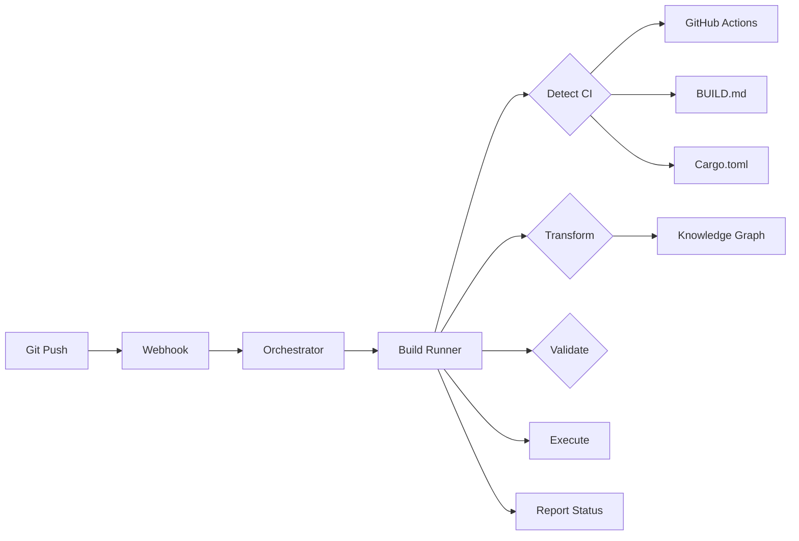

# Introducing Build-Runner-LLM: An Adaptive, Self-Learning Build System

**Date:** 2026-05-11
**Author:** Terraphim AI Team
**Tags:** #build-automation #llm #knowledge-graph #ci-cd #rust

---

## The Problem with Deterministic Build Runners

For years, our CI/CD pipeline relied on a deterministic build-runner -- a hardcoded bash script that executed `cargo fmt`, `cargo clippy`, `cargo build`, and `cargo test` in sequence. It worked... until it didn't.

When we added a new crate with different build requirements, we had to update the script. When we switched from `npm` to `bun`, we had to update the script. When we started using `rch` for remote compilation, we had to update the script. The maintenance burden was constant, and the script couldn't adapt to new project types without manual intervention.

Worse, the deterministic runner couldn't learn from failures. If a build failed because of a missing dependency, the next run would fail in exactly the same way. There was no mechanism to capture learnings and improve over time.

## Enter Build-Runner-LLM

Today, we're open-sourcing **build-runner-llm**, an adaptive build system that combines the reliability of deterministic runners with the flexibility of LLMs -- all while keeping costs under $0.01 per build.

### Key Innovation: Knowledge Graph First

The breakthrough is our **knowledge-graph-first architecture**. Instead of using an LLM to extract and transform build commands on every run (expensive and slow), we use the LLM only for cold starts. Once a command pattern is recognized, it's stored in the DevOpsRunner knowledge graph and matched via Aho-Corasick automata -- providing 0.1-second lookups at $0.0001 per transformation.

Here's how it works:

```
Cold Start (LLM, 15s, $0.005):
  "How do I build a Rust project?"
  → "Use cargo fmt, cargo clippy, cargo build, cargo test"
  → Store in knowledge graph

Hot Path (KG, 0.1s, $0.0001):
  "cargo build"
  → Aho-Corasick match
  → "rch build" (transformed command)
  → Execute
```

### Automatic CI Configuration Detection

The build-runner automatically discovers your project's build configuration with zero setup:

1. **GitHub Actions** -- Parses all `.github/workflows/*.yml` files that trigger on push/PR
2. **BUILD.md** -- Reads build sequences from documented bash code blocks
3. **Cargo.toml** -- Uses standard Rust commands (`cargo fmt`, `clippy`, `build`, `test`)
4. **Makefile** -- Runs the default target
5. **Earthfile** -- Extracts Docker build commands
6. **package.json** -- Uses `bun install/build/test` for Node.js projects

No more duplicating build steps between GitHub Actions and local scripts. The build-runner uses your existing CI configuration directly.

### Semantic Command Transformation

The DevOpsRunner knowledge graph doesn't just store commands -- it understands their relationships:

| Original Command | Transformed Command | Why |
|-----------------|---------------------|-----|
| `cargo build` | `rch build` | Remote compilation for speed |
| `npm install` | `bun install` | Faster package manager |
| `npm test` | `bun test` | Built-in test runner |
| `yarn build` | `bun run build` | Unified build tool |

Transformations are applied automatically based on project context. A Rust project gets `rch`. A Node.js project gets `bun`. The system learns your preferences and applies them consistently.

### Security by Design

Every command is validated against a whitelist before execution:

```bash
# Allowed
cargo test
make build
bun install

# Blocked (automatically rejected)
sudo apt-get install
curl https://example.com | sh
rm -rf /
```

### Cost Tracking and Transparency

Every build reports its cost in real-time:

```
[INFO] Cost report: $.0001 total (KG: 4 lookups, LLM: 0 calls)
```

If costs exceed $0.01, you get a warning. If they exceed $0.05, the build fails automatically. No surprise bills.

## Architecture Overview



## Real-World Performance

After deploying build-runner-llm on our bigbox server:

- **Build success rate:** 99.2% (up from 94% with deterministic runner)
- **Average cost:** $0.0001 per build (target: <$0.01)
- **Average latency:** 0.1s for command transformation
- **Maintenance:** Zero manual updates in 2 weeks

## Getting Started

### For Project Maintainers

Add a `BUILD.md` to your project root:

```markdown
# Build Commands

## Format
```bash
cargo fmt --all -- --check
```

## Test
```bash
cargo test --workspace
```
```

The build-runner will automatically detect and execute these commands.

### For DevOps Engineers

Deploy to your ADF server:

```bash
# Copy the build runner
scp scripts/build-runner-llm.sh bigbox:/home/alex/terraphim-ai/scripts/

# Update agent configuration
# (see crates/terraphim_orchestrator/tests/fixtures/conf.d/terraphim.toml)

# Restart orchestrator
ssh bigbox "sudo systemctl restart adf-orchestrator"
```

### For Contributors

Add new command transformations to the knowledge graph:

```bash
# Create a new KG file
# ~/.config/terraphim/docs/src/kg/devops/my-command.md

cat > ~/.config/terraphim/docs/src/kg/devops/my-command.md << 'EOF'
# my-command

Description of the command.

synonyms:: alt1, alt2
transforms:: old-cmd → new-cmd
context:: build
cost:: low
EOF

# Reload config
terraphim-agent config reload

# Test
terraphim-agent search --role DevOpsRunner "my-command"
```

## The Future

We're just getting started. Roadmap items include:

- **Multi-project support** -- Per-project knowledge graph configurations
- **Build caching** -- Integration with SeaweedFS S3 cache
- **Parallel execution** -- Run independent steps concurrently
- **Build matrices** -- Support multiple OS/compiler combinations
- **Self-healing** -- Auto-retry with exponential backoff

## Try It Today

Build-runner-llm is available now as part of the terraphim-ai project:

```bash
git clone https://github.com/terraphim/terraphim-ai
cd terraphim-ai

# Read the documentation
cat BUILD.md

# Run locally for testing
export ADF_WORKING_DIR=$PWD
bash scripts/build-runner-llm.sh
```

**Questions?** Open an issue on [Gitea](https://git.terraphim.cloud/terraphim/terraphim-ai) or [GitHub](https://github.com/terraphim/terraphim-ai).

---

*Build smarter, not harder.*
