# Terraphim AI -- Full Codebase Exploration Report

**Generated**: 2026-03-06
**Workspace version**: 1.12.0
**Rust edition**: 2024
**Build status**: All workspace crates compile. 3,133 tests pass, 0 failures, 79 ignored.

---

## Table of Contents

1. [Architecture Overview](#architecture-overview)
2. [Core Crates](#1-core-crates)
3. [Service and Server Layer](#2-service-and-server-layer)
4. [Agent System](#3-agent-system)
5. [Haystack Integrations](#4-haystack-integrations)
6. [CLI, TUI, and Binaries](#5-cli-tui-and-binaries)
7. [Supporting Crates](#6-supporting-crates)
8. [Dependency Graph](#dependency-graph)
9. [Cross-Cutting Patterns](#cross-cutting-patterns)
10. [Maturity Assessment](#maturity-assessment)

---

## Architecture Overview

```
+------------------------------------------------------------------+
|                    TERRAPHIM_SERVER (Axum HTTP/WS)                |
|    REST endpoints | Workflow orchestration | WebSocket updates    |
+----------------------------+-------------------------------------+
                             |
+----------------------------+-------------------------------------+
|                    TERRAPHIM_SERVICE (Business Logic)             |
|   Search | AI/LLM | Conversations | Summarization | Rate Limit  |
+----------------------------+-------------------------------------+
                             |
+----------------------------+-------------------------------------+
|                  TERRAPHIM_MIDDLEWARE (Data Integration)          |
|   Haystack adapters: QueryRs, MCP, ClickUp, Atomic, Perplexity  |
+----------------------------+-------------------------------------+
                             |
+--------+---------+---------+---------+---------+-----------------+
| types  | automata| rolegraph| config | persist | settings        |
+--------+---------+----------+--------+---------+-----------------+
```

**Workspace members**: `crates/*`, `terraphim_server`, `terraphim_firecracker`, `terraphim_ai_nodejs`
**Default member**: `terraphim_server`
**Excluded** (experimental/special build): `terraphim_agent_application`, `terraphim_truthforge`, `terraphim_validation`, `terraphim_rlm`, `terraphim_automata_py`, `terraphim_rolegraph_py`, `desktop/src-tauri`, `terraphim_build_args`, `terraphim-markdown-parser`, `haystack_atlassian`, `haystack_discourse`, `haystack_jmap`, `haystack_grepapp`, `terraphim_repl`

---

## 1. Core Crates

### 1.1 terraphim_types (~2,750 LOC)

**Purpose**: Central type definitions hub for the entire ecosystem. No workspace dependencies (root crate).

**Key types**:
- **Knowledge Graph**: `Concept`, `Node` (with rank + edges), `Edge` (connecting nodes with document hashing), `Thesaurus` (AHashMap), `NormalizedTerm`, `NormalizedTermValue`
- **Documents**: `Document` (id, title, body, URL, tags, type, rank), `DocumentType` (KgEntry, SearchResult, ChatMessage), `IndexedDocument` (matched edges, rank, nodes)
- **Search**: `SearchQuery` (multi-term with operators, pagination), `LogicalOperator` (And/Or), `RelevanceFunction` (BM25, BM25F, TitleScorer, TerraphimGraph)
- **LLM Routing**: `RoutingRule`, `RoutingDecision`, `RoutingScenario`, `MultiAgentContext`, `AgentInfo`
- **Conversations**: `Conversation`, `ChatMessage`, `ConversationId`, `ContextItem`, `ContextHistory`
- **Dynamic Ontology**: `SchemaSignal`, `ExtractedEntity`, `CoverageSignal`, `GroundingMetadata`
- **Medical** (feature-gated): `HgncGene`, `HgncNormalizer`

**Notable**: Uses `ahash::AHashMap` throughout for performance. WASM-compatible with tsify TypeScript bindings. Features: `typescript`, `medical`, `hgnc`, `ontology`.

---

### 1.2 terraphim_automata (~628 LOC in lib.rs, extensive modules)

**Purpose**: High-performance Aho-Corasick automata-based text matching, autocomplete via FST, fuzzy search, link generation, paragraph extraction, thesaurus loading.

**Key types/functions**:
- `AutomataPath` (Local/Remote), `AutocompleteIndex`, `AutocompleteResult`, `Matched`
- `load_thesaurus()`, `load_thesaurus_from_json()`, `build_autocomplete_index()`
- `autocomplete_search()`, `fuzzy_autocomplete_search()` (Levenshtein + Jaro-Winkler)
- `find_matches()`, `replace_matches()`, `extract_paragraphs_from_automata()`
- Medical modules: SNOMED CT and UMLS concept extraction (feature-gated)

**Key patterns**: LeftmostLongest Aho-Corasick matching, FST prefix search ~O(log n), remote HTTP thesaurus loading.

**Depends on**: `terraphim_types`

---

### 1.3 terraphim_rolegraph (~1,687 LOC)

**Purpose**: In-memory knowledge graph for role-based semantic search. Manages node/edge/document relationships with ranking.

**Key types**:
- `RoleGraph`: Main graph with nodes, edges, documents, thesaurus, Aho-Corasick automata
- `RoleGraphSync`: Thread-safe `Arc<Mutex<RoleGraph>>` wrapper
- `SerializableRoleGraph`: JSON-serializable form (excludes automata, rebuilds on deserialize)
- `GraphStats`: Node/edge/document counts

**Key methods**:
- `find_matching_node_ids()` -- Aho-Corasick matching
- `is_all_terms_connected_by_path()` -- DFS-based Hamiltonian path checking
- `query_graph()` / `query_graph_with_operators()` -- Single/multi-term search with AND/OR
- `insert_document()`, `add_or_update_document()`
- `magic_pair()` / `magic_unpair()` -- Elegant pairing function for edge IDs

**Ranking**: Sum of node.rank + edge.rank + document_rank.

**Depends on**: `terraphim_automata`, `terraphim_types`

---

### 1.4 terraphim_config (~1,465 LOC)

**Purpose**: Centralized role-based configuration management. Fluent builder pattern. LLM provider configuration. Path expansion with `~`, `$HOME`, `${VAR:-default}`.

**Key types**:
- `Config`, `ConfigId` (Server/Desktop/Embedded), `ConfigBuilder`, `ConfigState`
- `Role`: name, relevance function, haystacks, LLM settings
- `Haystack`: data source definition (location, service, read_only)
- `ServiceType`: Ripgrep, Atomic, QueryRs, ClickUp, Mcp, Perplexity, GrepApp, AiAssistant, Quickwit
- `KnowledgeGraph`, `KnowledgeGraphLocal`
- `LlmRouterConfig`: 6-phase intelligent routing

**Depends on**: `terraphim_automata`, `terraphim_rolegraph`, `terraphim_types`, `terraphim_persistence`, `terraphim_settings`

---

### 1.5 terraphim_settings (~361 LOC)

**Purpose**: Cross-platform device configuration (TOML). Server hostname, API endpoint, storage profiles, 1Password integration (feature-gated).

**Key types**: `DeviceSettings`, `Error`

**Key functions**: `new()`, `default_embedded()`, `load_from_env_and_file()`, `load_with_onepassword()` (feature-gated)

**Depends on**: `terraphim_onepassword_cli` (optional)

---

### 1.6 terraphim_persistence (~531 LOC)

**Purpose**: Multi-backend storage abstraction via OpenDAL. Speed-ranked operators (memory > dashmap > sqlite > s3). Cache warm-up. Compression (zstd for >1MB objects). Schema evolution detection.

**Key types**:
- `DeviceStorage`: Global singleton with operator map + fastest operator
- `Persistable` trait: `save()`, `load()`, `save_to_one()`, `load_from_operator()` with fallback + cache warm-up

**Key patterns**: Fire-and-forget `tokio::spawn` for cache write-back. Concurrent document loading via `JoinSet`. Memory-only mode for test isolation.

**Depends on**: `terraphim_settings`, `terraphim_types`

---

### Core Dependency Chain

```
terraphim_types (root, no deps)
    |
terraphim_automata
    |
terraphim_rolegraph
    |
terraphim_config (integrates all + persistence + settings)
```

---

## 2. Service and Server Layer

### 2.1 terraphim_middleware (~2,000+ LOC)

**Purpose**: Haystack indexing, search orchestration across multiple providers, thesaurus management.

**Key traits**: `IndexerOps` (index/search), `HaystackOps` (adapter per provider)

**Haystack adapters**: QueryRs (Reddit + Rust stdlib), MCP, ClickUp, Atomic Server, Perplexity, AI Assistant, GrepApp, Quickwit

**Depends on**: `terraphim_types`, `terraphim_config`, `terraphim_automata`, `terraphim_rolegraph`

---

### 2.2 terraphim_service (~3,500+ LOC)

**Purpose**: Main business logic layer. Search orchestration, AI integration, conversation management, summarization queue, rate limiting.

**Key components**:
- **SearchContext** (836 LOC): Orchestrated search across haystacks with role-based scoring
- **Scoring** (367 LOC): `TitleScorer`, `BM25Scorer`, `BM25PlusScorer`, `BM25FScorer` with field weights
- **LLM Client** (~600 LOC): `LlmClient` trait with `OllamaClient`, `OpenRouterClient` (feature-gated), `RouterBridgeLlmClient`
- **ConversationService**: CRUD + search + export/import + statistics
- **SummarizationManager**: Async queue with priority, deduplication, rate limiting, callbacks, batch processing
- **TokenBucketLimiter**: Per-provider rate limiting

**Depends on**: `terraphim_types`, `terraphim_config`, `terraphim_middleware`, `terraphim_persistence`, `terraphim_rolegraph`, `terraphim_automata`

---

### 2.3 terraphim_server (~3,000+ LOC)

**Purpose**: HTTP REST API + WebSocket server via Axum.

**AppState**: `ConfigState` + `SummarizationManager` + `ConversationService` + `WorkflowSessions` + `WebSocketBroadcaster`

**API Endpoints**:

| Group | Endpoints |
|-------|-----------|
| Search | `POST /documents/search`, `GET /documents/{id}`, `GET /documents/search/stats` |
| Summarization | `POST /documents/summarize`, `GET /summarization/{task_id}`, `POST /summarization/{task_id}/cancel`, `GET /summarization/stats` |
| Conversations | Full CRUD: `GET/POST /conversations`, `GET/PUT/DELETE /conversations/{id}`, search, export/import, statistics |
| Workflows | `POST /workflows/{prompt-chain,route,parallel,orchestrate,optimize,vm-execution-demo}`, `GET /workflows/{id}/status`, `GET /ws` |
| Config | `GET/POST /config`, `GET /config/roles`, `POST /config/roles/{name}/switch` |
| Health | `GET /health`, `GET /status` |

**Workflow modules**: Prompt chain (sequential), routing (intelligent), parallel (concurrent), orchestration (multi-agent), optimization, VM execution (Firecracker), WebSocket (real-time updates).

**Config loading priority**: Custom `--config` > role configs > persistence > embedded defaults.

**Depends on**: `terraphim_service`, `terraphim_config`, `terraphim_types`, `terraphim_persistence`

---

## 3. Agent System

The agent system implements Erlang/OTP-inspired patterns: supervision trees, gen_server messaging, fault tolerance.

### 3.1 terraphim_agent_supervisor

**Purpose**: OTP-style supervision trees for fault-tolerant AI agent management.

**Key types**: `AgentSupervisor`, `AgentPid` (UUID), `SupervisorId`, `AgentStatus`, `ExitReason`, `SupervisorConfig`

**Restart strategies**: `OneForOne`, `OneForAll`, `RestForOne` with configurable restart intensity and time windows. Max 100 children default. Background health check tasks.

---

### 3.2 terraphim_agent_registry

**Purpose**: Knowledge graph-based agent discovery and capability matching.

**Key trait**: `AgentRegistry` with `register_agent()`, `discover_agents()`, `find_agents_by_role()`, `find_agents_by_capability()`

**Main impl**: `KnowledgeGraphAgentRegistry` uses automata + role graphs for semantic agent matching. Cache with TTL. Auto-cleanup of terminated agents. Builder pattern.

**Depends on**: `terraphim_rolegraph`, `terraphim_automata`

---

### 3.3 terraphim_agent_messaging

**Purpose**: Erlang-style async message passing with delivery guarantees.

**Message patterns**: `Call` (sync with oneshot), `Cast` (fire-and-forget), `Info` (system), `Reply`, `Ack`

**Key types**: `MessageEnvelope` (UUID, from/to, delivery options, attempt tracking), `MessagePriority` (Low/Normal/High/Critical), `MessageRouter`, `MailboxManager`, `MessageSystem`

**Delivery options**: At-most-once, at-least-once, exactly-once. Retry with exponential backoff.

---

### 3.4 terraphim_agent_evolution

**Purpose**: Agent learning and adaptation with versioned state.

**Key components**:
- `MemoryEvolution`: Versioned memory snapshots with consolidation
- `TasksEvolution`: Task completion tracking and analysis
- `LessonsEvolution`: Categorized lessons (Technical, Process, Domain, Failure, SuccessPattern) with evidence-based validation, confidence scoring, success rates

**Persistence**: Implements `Persistable` trait for multi-backend storage. Time-travel via `load_snapshot()`.

---

### 3.5 terraphim_multi_agent

**Purpose**: Production multi-agent system with individual evolution, knowledge graphs, and VM execution.

**Key type**: `TerraphimAgent` wrapping role config + LLM client + knowledge graphs + individual evolution.

**Command pipeline**: `CommandInput` -> context enrichment (KG matches, connected concepts, haystack sources, agent memory) -> LLM -> `CommandOutput`

**Command types**: Generate, Answer, Search, Analyze, Execute, Create, Edit, Review, Plan, System, Custom

**Depends on**: `terraphim_config`, `terraphim_rolegraph`, `terraphim_automata`, `terraphim_agent_evolution`, `terraphim_persistence`, rust-genai

---

### 3.6 terraphim_goal_alignment

**Purpose**: Multi-level goal management (global/high-level/local) with KG-based conflict detection.

Uses `is_all_terms_connected_by_path()` for conflict detection. Goal propagation through role hierarchies.

---

### 3.7 terraphim_task_decomposition

**Purpose**: KG-based task analysis and execution planning.

**Key types**: `Task` (with TaskStatus, TaskComplexity), `ExecutionPlan` (ordered steps with dependencies), `TaskDecompositionSystem`

---

### 3.8 terraphim_kg_agents

**Purpose**: GenAgent implementations leveraging knowledge graph capabilities. Currently stub/placeholder awaiting GenAgent framework completion.

---

### 3.9 terraphim_kg_orchestration

**Purpose**: Multi-agent workflow orchestration using KG for task decomposition.

**Architecture**: AgentPool -> TaskScheduler -> ExecutionCoordinator -> Result Aggregation

---

### 3.10 terraphim_agent (Main TUI Binary)

**Purpose**: Interactive REPL + robot mode + forgiving CLI.

**Components**:
- **Robot mode**: JSON/YAML/Text/Table/ASCII Graph output, self-documentation
- **Forgiving CLI**: Typo-tolerant command parsing with fuzzy suggestions
- **REPL** (feature-gated): Local/Firecracker/hybrid execution modes, MCP tools integration
- **Learning system**: Automatic failure capture via hooks, redaction of sensitive data
- **Onboarding**: Interactive setup wizard

---

## 4. Haystack Integrations

All haystacks implement the core `HaystackProvider` trait:

```rust
pub trait HaystackProvider {
    type Error: Display + Debug + Send + Sync + 'static;
    async fn search(&self, query: &SearchQuery) -> Result<Vec<Document>, Self::Error>;
}
```

### 4.1 haystack_core

**Purpose**: Foundational trait abstraction. Minimal, no concrete implementations.

### 4.2 haystack_atlassian

**Purpose**: Confluence (CQL search) + Jira (JQL search) integration.

**Auth**: Basic Auth (Base64 username:token). Maps pages/issues to Documents with URLs, tags (space, type, status, priority).

### 4.3 haystack_discourse

**Purpose**: Discourse forum search. Dual API calls (search -> fetch full content).

**Auth**: Custom headers (Api-Key, Api-Username). Returns HTML-rendered post content.

### 4.4 haystack_jmap

**Purpose**: Email search via JMAP protocol (RFC 8620). Fastmail-compatible.

**Auth**: Bearer token. Two-phase: `Email/query` -> `Email/get`. Capabilities: `urn:ietf:params:jmap:core`, `urn:ietf:params:jmap:mail`.

### 4.5 haystack_grepapp

**Purpose**: GitHub code search via grep.app public API.

**Auth**: None (public). Maps code hits to Documents with GitHub blob URLs. HTML `<mark>` tag cleanup. Rate limit (429) detection.

### Document Mapping Summary

| Provider | ID | URL | Title | Body |
|----------|-----|-----|-------|------|
| Atlassian | Page/Issue ID | web_ui/issue link | Title/[KEY] Summary | Excerpt/description |
| Discourse | Post ID | Forum URL | fancy_title | HTML post content |
| JMAP | Email ID | -- | Subject | Text body value |
| GrepApp | repo:branch:path | GitHub blob URL | repo - filename | Code snippet |

---

## 5. CLI, TUI, and Binaries

### 5.1 terraphim-cli (crates/terraphim_cli/)

**Purpose**: Automation-friendly, non-interactive CLI with JSON output for scripting and CI/CD.

**Commands**: `search`, `config`, `roles {list,select}`, `graph`, `replace`, `find`, `thesaurus`, `extract`, `coverage`, `completions`, `check-update`, `update`, `rollback`

**Config loading priority**: `--config` flag > `settings.toml` role_config > persistence > embedded defaults

**Output formats**: JSON, pretty-JSON, text

---

### 5.2 terraphim-session-analyzer (crates/terraphim-session-analyzer/)

**Purpose**: Multi-source AI coding session log analysis. Parses Claude Code, Cursor, Aider, OpenCode, Codex.

**Binaries**: `tsa` (primary), `cla` (legacy alias)

**Commands**: `analyze`, `list`, `summary`, `timeline` (HTML), `watch` (real-time), `tools` (usage patterns)

**Features**: Aho-Corasick pattern matching, tool chain/correlation analysis, parallel processing via rayon, optional KG enrichment.

---

### 5.3 terraphim_firecracker (terraphim_firecracker/)

**Purpose**: Sub-2 second Firecracker microVM boot. VM pooling with <500ms allocation.

**Binary**: `terraphim-vm-manager`

**Commands**: `start`, `test`, `benchmark`, `init-pool`

**Key types**: `Sub2SecondVmManager`, `VmPoolManager`, `VmAllocator`, `PrewarmingManager`, `Sub2SecondOptimizer`

---

### 5.4 terraphim_ai_nodejs (terraphim_ai_nodejs/)

**Purpose**: Node.js NAPI bindings exposing Rust core to JavaScript.

**Exported functions**: `buildAutocompleteIndexFromJson()`, `autocomplete()`, `fuzzyAutocompleteSearch()`, `buildRoleGraphFromJson()`, `areTermsConnected()`, `queryGraph()`, `getGraphStats()`, `getConfig()`, `searchDocumentsSelectedRole()`, `replaceLinks()`

**Pattern**: Binary serialization via Buffer for index/graph transfer.

---

### 5.5 terraphim_sessions (crates/terraphim_sessions/)

**Purpose**: Library providing unified session management interface across AI assistants. Feature-gated Terraphim enrichment and connector support.

---

## 6. Supporting Crates

### 6.1 terraphim_mcp_server (Active)

MCP protocol server exposing Terraphim tools (autocomplete, text processing, thesaurus, graph connectivity, fuzzy search) via stdio and SSE transports. 12 test files.

### 6.2 terraphim_atomic_client (Active)

Atomic Data protocol client. Dual-build: native (reqwest) + WASM (web-sys). Ed25519 signing for authentication.

### 6.3 terraphim_onepassword_cli (Active)

1Password CLI integration with `SecretLoader` trait abstraction. 30-second timeout, pattern validation.

### 6.4 terraphim-markdown-parser (Active)

Block ID tracking with ULIDs for Novel editor integration. GFM parsing with byte-level span information.

### 6.5 terraphim_build_args (Planned)

Build argument management for Docker/Earthfile/cargo. Multiple targets and environments.

### 6.6 terraphim_validation (Experimental)

Release validation system for QA/CI-CD. Cross-platform, with Docker/security/performance feature gates.

### 6.7 terraphim_rlm (Advanced Dev)

Recursive Language Model orchestration with Firecracker VM isolation. Dual budget tracking (tokens + time). Multiple execution backends: Firecracker, Docker, E2B.

### 6.8 terraphim_repl (Superseded)

Offline REPL for semantic KG search. Replaced by `terraphim_agent`.

### 6.9 terraphim_automata_py (Published)

Python bindings via PyO3. Published on PyPI. Exposes autocomplete, fuzzy search, text matching. abi3-py39 stable ABI.

### 6.10 terraphim_rolegraph_py (Published)

Python bindings via PyO3. Published on PyPI. Exposes graph construction, querying, connectivity analysis. abi3-py39 stable ABI.

---

## Dependency Graph

```mermaid
graph TD
    %% ── Styles ──────────────────────────────────────────────
    classDef core fill:#e8f4fd,stroke:#2196f3,stroke-width:2px,color:#0d47a1
    classDef service fill:#e8f5e9,stroke:#4caf50,stroke-width:2px,color:#1b5e20
    classDef agent fill:#fff3e0,stroke:#ff9800,stroke-width:2px,color:#e65100
    classDef haystack fill:#f3e5f5,stroke:#9c27b0,stroke-width:2px,color:#4a148c
    classDef binary fill:#fce4ec,stroke:#e91e63,stroke-width:2px,color:#880e4f
    classDef support fill:#eceff1,stroke:#607d8b,stroke-width:2px,color:#263238
    classDef binding fill:#e0f7fa,stroke:#00bcd4,stroke-width:2px,color:#006064

    %% ── Core Layer ──────────────────────────────────────────
    subgraph Core["Core Crates"]
        types["terraphim_types\n(root, ~2750 LOC)"]
        automata["terraphim_automata\n(Aho-Corasick + FST)"]
        rolegraph["terraphim_rolegraph\n(Knowledge Graph)"]
        config["terraphim_config\n(Role-based config)"]
        settings["terraphim_settings\n(Device/TOML config)"]
        persistence["terraphim_persistence\n(OpenDAL multi-backend)"]
    end

    types --> automata
    automata --> rolegraph
    types --> persistence
    settings --> persistence
    automata --> config
    rolegraph --> config
    persistence --> config
    settings --> config

    %% ── Service Layer ───────────────────────────────────────
    subgraph Service["Service & Server"]
        middleware["terraphim_middleware\n(Haystack orchestration)"]
        service["terraphim_service\n(Search + AI + LLM)"]
        server["terraphim_server\n(Axum HTTP/WS API)"]
    end

    config --> middleware
    automata --> middleware
    rolegraph --> middleware
    middleware --> service
    config --> service
    persistence --> service
    rolegraph --> service
    service --> server
    config --> server
    persistence --> server

    %% ── Haystack Providers ──────────────────────────────────
    subgraph Haystacks["Haystack Integrations"]
        hcore["haystack_core\n(HaystackProvider trait)"]
        hatlassian["haystack_atlassian\n(Confluence + Jira)"]
        hdiscourse["haystack_discourse\n(Forum search)"]
        hjmap["haystack_jmap\n(Email / JMAP)"]
        hgrepapp["haystack_grepapp\n(GitHub code search)"]
    end

    types --> hcore
    hcore --> hatlassian
    hcore --> hdiscourse
    hcore --> hjmap
    hcore --> hgrepapp
    hatlassian -.-> middleware
    hdiscourse -.-> middleware
    hjmap -.-> middleware
    hgrepapp -.-> middleware

    %% ── Agent System ────────────────────────────────────────
    subgraph Agents["Agent System (OTP-inspired)"]
        supervisor["agent_supervisor\n(Supervision trees)"]
        registry["agent_registry\n(KG-based discovery)"]
        messaging["agent_messaging\n(Erlang-style msgs)"]
        evolution["agent_evolution\n(Learning + adaptation)"]
        multi_agent["multi_agent\n(Role-as-Agent)"]
        goal["goal_alignment\n(Multi-level goals)"]
        taskdecomp["task_decomposition\n(KG-based planning)"]
        kgagents["kg_agents\n(KG-specialized)"]
        kgorch["kg_orchestration\n(Workflow coordination)"]
    end

    supervisor --> registry
    rolegraph --> registry
    automata --> registry
    messaging --> multi_agent
    evolution --> multi_agent
    config --> multi_agent
    rolegraph --> multi_agent
    rolegraph --> goal
    registry --> goal
    taskdecomp --> kgorch
    supervisor --> kgorch

    %% ── Binaries ────────────────────────────────────────────
    subgraph Binaries["Binaries"]
        bin_server["terraphim_server\n(HTTP API)"]
        bin_agent["terraphim_agent\n(TUI / REPL)"]
        bin_cli["terraphim_cli\n(Automation CLI)"]
        bin_tsa["session-analyzer\n(tsa / cla)"]
        bin_fc["terraphim_firecracker\n(VM manager)"]
    end

    server --> bin_server
    service --> bin_agent
    service --> bin_cli
    service --> bin_fc

    %% ── Bindings ────────────────────────────────────────────
    subgraph Bindings["Language Bindings"]
        nodejs["terraphim_ai_nodejs\n(NAPI / Node.js)"]
        pyauto["terraphim_automata_py\n(PyO3 / PyPI)"]
        pyrg["terraphim_rolegraph_py\n(PyO3 / PyPI)"]
    end

    automata --> nodejs
    rolegraph --> nodejs
    service --> nodejs
    automata --> pyauto
    rolegraph --> pyrg

    %% ── Supporting ──────────────────────────────────────────
    subgraph Supporting["Supporting Crates"]
        mcp["terraphim_mcp_server\n(MCP protocol)"]
        atomic["terraphim_atomic_client\n(Atomic Data)"]
        onepass["terraphim_onepassword_cli\n(1Password)"]
        mdparser["terraphim-markdown-parser\n(Block IDs / ULID)"]
        rlm["terraphim_rlm\n(Recursive LLM + VM)"]
    end

    service --> mcp
    automata --> mcp
    rolegraph --> mcp
    onepass -.-> settings
    bin_fc -.-> rlm

    %% ── Apply styles ────────────────────────────────────────
    class types,automata,rolegraph,config,settings,persistence core
    class middleware,service,server service
    class supervisor,registry,messaging,evolution,multi_agent,goal,taskdecomp,kgagents,kgorch agent
    class hcore,hatlassian,hdiscourse,hjmap,hgrepapp haystack
    class bin_server,bin_agent,bin_cli,bin_tsa,bin_fc binary
    class mcp,atomic,onepass,mdparser,rlm support
    class nodejs,pyauto,pyrg binding

    %% ── Click links to source directories ───────────────────
    click types "https://github.com/terraphim/terraphim-ai/tree/main/crates/terraphim_types" _blank
    click automata "https://github.com/terraphim/terraphim-ai/tree/main/crates/terraphim_automata" _blank
    click rolegraph "https://github.com/terraphim/terraphim-ai/tree/main/crates/terraphim_rolegraph" _blank
    click config "https://github.com/terraphim/terraphim-ai/tree/main/crates/terraphim_config" _blank
    click settings "https://github.com/terraphim/terraphim-ai/tree/main/crates/terraphim_settings" _blank
    click persistence "https://github.com/terraphim/terraphim-ai/tree/main/crates/terraphim_persistence" _blank
    click middleware "https://github.com/terraphim/terraphim-ai/tree/main/crates/terraphim_middleware" _blank
    click service "https://github.com/terraphim/terraphim-ai/tree/main/crates/terraphim_service" _blank
    click server "https://github.com/terraphim/terraphim-ai/tree/main/terraphim_server" _blank
    click hcore "https://github.com/terraphim/terraphim-ai/tree/main/crates/haystack_core" _blank
    click hatlassian "https://github.com/terraphim/terraphim-ai/tree/main/crates/haystack_atlassian" _blank
    click hdiscourse "https://github.com/terraphim/terraphim-ai/tree/main/crates/haystack_discourse" _blank
    click hjmap "https://github.com/terraphim/terraphim-ai/tree/main/crates/haystack_jmap" _blank
    click hgrepapp "https://github.com/terraphim/terraphim-ai/tree/main/crates/haystack_grepapp" _blank
    click supervisor "https://github.com/terraphim/terraphim-ai/tree/main/crates/terraphim_agent_supervisor" _blank
    click registry "https://github.com/terraphim/terraphim-ai/tree/main/crates/terraphim_agent_registry" _blank
    click messaging "https://github.com/terraphim/terraphim-ai/tree/main/crates/terraphim_agent_messaging" _blank
    click evolution "https://github.com/terraphim/terraphim-ai/tree/main/crates/terraphim_agent_evolution" _blank
    click multi_agent "https://github.com/terraphim/terraphim-ai/tree/main/crates/terraphim_multi_agent" _blank
    click goal "https://github.com/terraphim/terraphim-ai/tree/main/crates/terraphim_goal_alignment" _blank
    click taskdecomp "https://github.com/terraphim/terraphim-ai/tree/main/crates/terraphim_task_decomposition" _blank
    click kgagents "https://github.com/terraphim/terraphim-ai/tree/main/crates/terraphim_kg_agents" _blank
    click kgorch "https://github.com/terraphim/terraphim-ai/tree/main/crates/terraphim_kg_orchestration" _blank
    click bin_server "https://github.com/terraphim/terraphim-ai/tree/main/terraphim_server" _blank
    click bin_agent "https://github.com/terraphim/terraphim-ai/tree/main/crates/terraphim_agent" _blank
    click bin_cli "https://github.com/terraphim/terraphim-ai/tree/main/crates/terraphim_cli" _blank
    click bin_tsa "https://github.com/terraphim/terraphim-ai/tree/main/crates/terraphim-session-analyzer" _blank
    click bin_fc "https://github.com/terraphim/terraphim-ai/tree/main/terraphim_firecracker" _blank
    click nodejs "https://github.com/terraphim/terraphim-ai/tree/main/terraphim_ai_nodejs" _blank
    click pyauto "https://github.com/terraphim/terraphim-ai/tree/main/crates/terraphim_automata_py" _blank
    click pyrg "https://github.com/terraphim/terraphim-ai/tree/main/crates/terraphim_rolegraph_py" _blank
    click mcp "https://github.com/terraphim/terraphim-ai/tree/main/crates/terraphim_mcp_server" _blank
    click atomic "https://github.com/terraphim/terraphim-ai/tree/main/crates/terraphim_atomic_client" _blank
    click onepass "https://github.com/terraphim/terraphim-ai/tree/main/crates/terraphim_onepassword_cli" _blank
    click mdparser "https://github.com/terraphim/terraphim-ai/tree/main/crates/terraphim-markdown-parser" _blank
    click rlm "https://github.com/terraphim/terraphim-ai/tree/main/crates/terraphim_rlm" _blank
```



---

## Cross-Cutting Patterns

### Error Handling
- `thiserror` for custom error types
- `anyhow::Result<T>` for propagation
- Graceful degradation: return empty results on network failures
- Structured JSON error responses in server

### Async Patterns
- `tokio` runtime throughout
- `tokio::sync::Mutex` / `RwLock` for shared state
- `tokio::spawn` for fire-and-forget (cache warm-up, summarization)
- `tokio::select!` for managing concurrent tasks
- Bounded channels for backpressure

### Configuration
- Role-based with sensible defaults
- Feature flags for optional functionality
- Environment variable overrides
- JSON for role configs, TOML for system settings
- Hierarchical loading: CLI flag > file > persistence > embedded defaults

### Testing
- `tokio::test` for async tests
- No mocks -- real implementations and integration tests
- Memory-only persistence for test isolation
- Live tests gated by environment variables (`#[ignore]`)
- `wiremock`/`mockito` for HTTP API testing

### Serialization
- `serde` throughout (JSON, TOML)
- `ahash::AHashMap` for performance-critical maps
- Binary serialization for autocomplete index and RoleGraph (NAPI)
- zstd compression for large objects (>1MB) in persistence

---

## Maturity Assessment

| Category | Crates | Status |
|----------|--------|--------|
| **Production-ready** | types, automata, rolegraph, config, settings, persistence, middleware, service, server, cli, mcp_server, session-analyzer | Stable, well-tested |
| **Active development** | agent (TUI), multi_agent, agent_evolution, agent_messaging, agent_supervisor, agent_registry | Functional, evolving API |
| **Published bindings** | automata_py, rolegraph_py, ai_nodejs | Published on PyPI / npm |
| **Partial implementation** | kg_agents, kg_orchestration, goal_alignment, task_decomposition | Architecture defined, minimal tests |
| **Experimental** | rlm, validation, truthforge, build_args | Excluded from workspace builds |
| **Superseded** | repl | Replaced by terraphim_agent |

### Total Crate Count: 35+
### Total Approximate LOC (Rust): ~25,000+ across active crates
