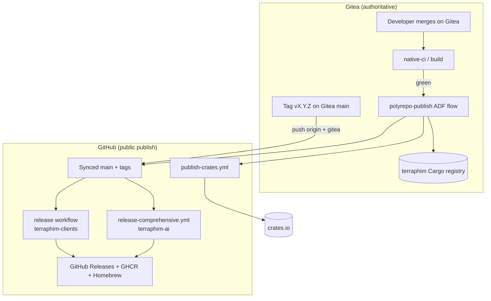

# Implementation Plan: Gitea-Authoritative Release CI with GitHub Publishing

**Status**: Draft — awaiting human approval  
**Research Doc**: `.docs/research-release-ci-gitea-github.md`  
**Author**: Terraphim AI (Grok)  
**Date**: 2026-06-14  
**Updated**: 2026-06-14 (terraphim_service registry bug + client-binary decision)  
**Estimated Effort**: Phase 1: 1–2 days; Phase 2: 2–3 days; Phase 3: 1 day

## Decisions locked (2026-06-14)

| Decision | Choice | Rationale |
|----------|--------|-----------|
| Client binary release target | **`terraphim/terraphim-ai` GitHub release** | Keeps `self_update` and existing download URLs stable (`github.com/terraphim/terraphim-ai/releases/...`) |
| `terraphim_service` registry | **Republish from Gitea `terraphim-service` source** | Published `1.20.2` is broken; fix already on Gitea `main` but not in registry |

## Overview

### Summary

Redesign release publishing so **Gitea remains the source of truth** for code and pre-release validation, while **GitHub Actions publishes public artefacts** only after gates pass. The plan decomposes the old monolithic `release-comprehensive.yml` into a **coordinated two-repo release model** aligned with ADR-0001 and ADR-0002.

### Approach

Use the **existing polyrepo publish pipeline** for client crates/binaries and a **slimmed monorepo release workflow** for `terraphim_server`, Docker, and bindings. Introduce an explicit **release runbook** and optional ADF flow that enforces ordering: Gitea CI → (polyrepo publish if needed) → version bump → dual-remote tag → GitHub release.

### Scope

**In scope (Phase 1)**

- Fix monorepo `release-comprehensive.yml` for post-#1910 workspace
- Client binary release via `terraphim-clients` (build on GitHub after polyrepo mirror is current)
- Hard-fail version verification; block empty GitHub releases
- Repair v1.20.4 situation (v1.20.5 full release)
- Align `publish-crates.yml` with `crate_list` dispatch from polyrepo script
- Release runbook documenting Gitea → GitHub flow

**Out of scope**

- Moving GitHub Releases hosting to Gitea
- Rewriting `terraphim_gitea_runner` M2/M3 (Firecracker route, full `uses:` emulation)
- Automated changelog generation

**Avoid at all cost (5/25 rule)**

- Re-merging extracted crates into `terraphim-ai` monorepo for release convenience
- Using GitHub Actions push/PR workflows as merge gates again
- Publishing to crates.io from ADF staging checkouts (bypass GitHub Gate 2)
- `continue-on-error` on version or asset verification steps
- Force-pushing tags to fix failed releases

## Architecture

### Component diagram



### Release data flow

```
[1] Merge feature → Gitea main (native-ci green)
[2] If client/core crates changed → polyrepo-publish (per ADR-0002 order)
[3] Bump workspace.package.version on Gitea main
[4] git tag vX.Y.Z; push origin; push gitea; verify diff empty
[5] GitHub tag triggers:
      terraphim-ai: server + docker + deb + nodejs/wasm (optional)
      terraphim-clients: agent + cli + grep binaries + macOS sign
[6] release-sign.yml signs tarballs on release created
[7] Homebrew update (from terraphim-ai or clients release — single source)
```

### Key design decisions

| Decision | Rationale | Alternatives rejected |
|----------|-----------|----------------------|
| Gitea tags are canonical; sync to GitHub | Matches remote sync protocol + ADR-0001 | Tag only on GitHub (bypasses Gitea CI visibility) |
| Client binaries built from `terraphim-clients` repo | Crates extracted in #1910; monorepo exclude list confirms | Keep building `-p terraphim_agent` in monorepo (broken) |
| Monorepo release publishes server/docker only | Reduces duplicate crate publish paths | Full monorepo crate publish via stale `publish-crates.sh` |
| Polyrepo publish before monorepo tag when deps changed | GitHub builds lack private registry | Pin git deps to Gitea (not public) |
| `verify-versions` fails hard | v1.20.4 shipped with 1.20.3 workspace | `continue-on-error: true` |

### Eliminated options

| Option | Why rejected |
|--------|--------------|
| Single `release-comprehensive.yml` builds everything | Incompatible with polyrepo extraction |
| Gitea-hosted GitHub Releases | No community expectation; ADR-0001 |
| Manual binary upload | Not reproducible; error-prone |

### Simplicity check

**What if this could be easy?**

Minimum viable path for the next release:

1. Bump version on Gitea `main`.
2. Run `polyrepo-publish.sh full terraphim-clients` if agent/cli/grep changed.
3. Tag on Gitea, push both remotes.
4. Split workflow: monorepo builds server only; clients repo builds CLIs.
5. Delete/recreate botched v1.20.4 assets via v1.20.5.

No new runners, no new registries — only workflow scope correction and a written runbook.

## File Changes

### Phase 1 — Unblock releases

| File | Changes |
|------|---------|
| `.github/workflows/release-comprehensive.yml` | Remove `terraphim_agent`, `terraphim-cli`, `terraphim_grep` build steps; build `terraphim_server` only; hard-fail `verify-versions`; fix deb job (`cargo install cargo-deb` pin or use preinstalled); add `needs` gate so `create-release` requires assets |
| `.github/workflows/release-comprehensive.yml` | Add job `trigger-clients-release` (like desktop) dispatching `terraphim/terraphim-clients` workflow on `v*` tags |
| `terraphim-clients/.github/workflows/release.yml` | **New** (in polyrepo, injected by publish script): matrix build agent/cli/grep, macOS universal + sign, upload to GitHub release on `terraphim-clients` OR attach to monorepo release via GH API (decision: attach to `terraphim-ai` release for auto-update URL stability) |
| `.github/workflows/publish-crates.yml` | Add `crate_list` input; map to `publish-crates.sh --crate` loop; default `dry_run: true` |
| `scripts/publish-crates.sh` | Trim `CRATES` array to monorepo-resident crates only (`terraphim_gitea_runner`, `terraphim_rlm`, etc.) OR deprecate for monorepo tag releases |
| `Cargo.toml` | Bump `workspace.package.version` to match next tag |
| `docs/runbooks/release.md` | **New** — human release checklist (Gitea-first) |

### Phase 2 — Gitea integration

| File | Changes |
|------|---------|
| `.gitea/workflows/release-preflight.yml` | **New** — on tag push: verify version, `cargo metadata` resolves, optional wait for polyrepo publish marker |
| `scripts/adf-setup/polyrepo-publish/polyrepo-publish-flow.toml` | Add optional final step `trigger-terraphim-ai-release` after all polyrepos synced |
| `.github/workflows/deploy-docs.yml` | Restrict to `workflow_dispatch` or `release` only (ADR-0001 follow-up) |
| `.github/workflows/python-bindings.yml` | Tag-only trigger, remove `push: branches` |

### Phase 3 — Hardening

| File | Changes |
|------|---------|
| `.github/workflows/release-comprehensive.yml` | `workflow_dispatch.test_run` dry-run uploads artefacts to staging, not GH release |
| `.github/workflows/release-sign.yml` | Fix checkout@v4 → v6; verify `ZIPSIGN_PRIVATE_KEY` matches embedded pubkey (#2519) |
| `crates/terraphim_update/src/signature.rs` | Confirm production Ed25519 pubkey |

## API / Workflow Design

### New workflow input: `publish-crates.yml`

```yaml
workflow_dispatch:
  inputs:
    crate_list:
      description: 'Space-separated crate names to publish in order'
      required: false
      type: string
    dry_run:
      description: 'Dry run only'
      type: boolean
      default: true
```

### New job: `trigger-clients-release` (terraphim-ai)

```yaml
trigger-clients-release:
  needs: verify-versions
  if: startsWith(github.ref, 'refs/tags/v')
  runs-on: ubuntu-latest
  steps:
    - uses: actions/github-script@v9
      with:
        github-token: ${{ secrets.CLIENTS_REPO_TOKEN }}
        script: |
          await github.rest.actions.createWorkflowDispatch({
            owner: 'terraphim',
            repo: 'terraphim-clients',
            workflow_id: 'release-binaries.yml',
            ref: 'main',
            inputs: { version: '${{ needs.verify-versions.outputs.version }}', attach_to_repo: 'terraphim-ai' }
          });
```

### Gitea `release-preflight.yml` (sketch)

```yaml
name: release-preflight
on:
  push:
    tags: ['v*']
jobs:
  preflight:
    runs-on: terraphim-native
    steps:
      - run: |
          TAG="${GITHUB_REF_NAME#v}"
          WS=$(grep '^version' Cargo.toml | head -1 | sed 's/.*"\(.*\)".*/\1/')
          test "$TAG" = "$WS"
      - run: cargo build --workspace -p terraphim_server
```

## Test Strategy

### Pre-merge verification

| Test | Command / check | Purpose |
|------|-----------------|---------|
| Workspace builds | `cargo build -p terraphim_server --release` | Monorepo release target |
| Version extract | Script mirroring `verify-versions` job | Tag/Cargo alignment |
| Workflow YAML | `actionlint .github/workflows/release-comprehensive.yml` | Syntax |
| Polyrepo dry-run | `POLYREPO_DRY_RUN=1 bash polyrepo-publish.sh full terraphim-clients` | Pipeline wiring |
| Dual-remote sync | `git diff origin/main gitea/main --stat` | Empty before tag |

### Post-tag acceptance (UAT)

| Scenario | Expected |
|----------|----------|
| `gh release view vX.Y.Z` | ≥ 10 binary assets + `checksums.txt` |
| `terraphim_server` linux binary | `--version` contains tag version |
| `terraphim-agent` auto-update check | Finds asset on GitHub release |
| Homebrew tap commit | Formulas point to new URLs/SHA256 |
| crates.io | `cargo install terraphim_grep --version X.Y.Z` resolves (if published) |

### Regression tests to add

| Test | Location |
|------|----------|
| `test_release_version_extraction` | `scripts/tests/release-version.sh` |
| CI workflow policy test | Assert no `on: push` for build workflows except Gitea |

## Implementation Steps

### Step 1: Document and approve (this deliverable)

**Files:** `.docs/research-release-ci-gitea-github.md`, `.docs/design-release-ci-gitea-github.md`  
**Gate:** Human approval  
**Estimated:** 0.5 day (done)

### Step 2: Fix monorepo release workflow

**Files:** `.github/workflows/release-comprehensive.yml`  
**Changes:**

1. Set `verify-versions.continue-on-error: false`.
2. Remove agent/cli/grep build matrix steps.
3. Keep server, docker, debian (fix `cargo-deb` install).
4. Add `trigger-clients-release` job.
5. Tighten `create-release` `if:` to require binary job success.

**Tests:** `workflow_dispatch` with `test_run: true` on a test tag branch  
**Estimated:** 4 hours

### Step 3: Client binary release (build in terraphim-clients, attach to terraphim-ai)

**Decision:** Binaries are **built** from the `terraphim-clients` polyrepo (source of truth for agent/cli/grep) but **uploaded to the `terraphim-ai` GitHub release** so auto-update URLs remain unchanged.

**Files:**

- `terraphim-clients` (Gitea): `.github/workflows/release-binaries.yml` — matrix build + macOS sign
- `terraphim-ai`: `.github/workflows/release-comprehensive.yml` — `trigger-clients-release` job passes `release_repo: terraphim-ai`, `release_tag: vX.Y.Z`

**Upload pattern (clients workflow final step):**

```yaml
- name: Attach binaries to terraphim-ai release
  env:
    GH_TOKEN: ${{ secrets.TERRAPHIM_AI_RELEASE_TOKEN }}
  run: |
    gh release upload "v${VERSION}" artifacts/* \
      --repo terraphim/terraphim-ai --clobber
```

**Tests:** Manual dispatch with `version: 1.20.5`; verify assets appear on `terraphim-ai` release, not `terraphim-clients`.  
**Estimated:** 6 hours

### Step 4: Align crate publishing

**Files:** `.github/workflows/publish-crates.yml`, `scripts/publish-crates.sh`  
**Changes:** `crate_list` input; split monorepo vs polyrepo publish documentation.

**Tests:** `workflow_dispatch` dry_run with `crate_list: "terraphim_gitea_runner"`  
**Estimated:** 2 hours

### Step 0 (prerequisite): Republish `terraphim_service` to Gitea registry

**Bug confirmed:** Gitea registry `terraphim_service@1.20.2` cannot compile with `--features openrouter`. `search.rs` calls `enhance_descriptions_with_ai` but `summary.rs` defines it as a **private** method. Gitea source `main` fixed this in commit `554d202` (`pub(crate)` + `#[cfg(feature = "openrouter")]`) but **was never republished** — registry still serves the broken `1.20.2` tarball.

| Location | `enhance_descriptions_with_ai` visibility |
|----------|-------------------------------------------|
| Registry `1.20.2` | `async fn` (private) — **broken** |
| Gitea `terraphim-service` `main` | `pub(crate) async fn` — **fixed** |

**Republish at source (`terraphim-service` on Gitea):**

```bash
source ~/.profile
cd /path/to/terraphim-service   # git.terraphim.cloud/terraphim/terraphim-service

# 1. Bump crate version (1.20.2 is consumed and broken; use 1.20.5 to align with release)
#    Edit crates/terraphim_service/Cargo.toml: version = "1.20.5"

# 2. Verify fix compiles with openrouter
cargo check -p terraphim_service --features openrouter

# 3. Gitea native-ci green on commit

# 4. Publish to Gitea terraphim registry
export CARGO_REGISTRIES_TERRAPHIM_TOKEN="Bearer $GITEA_TOKEN"
cargo publish -p terraphim_service --registry terraphim

# 5. Bump downstream consumers (terraphim-ai monorepo + terraphim-clients)
#    terraphim_server, terraphim_rlm, terraphim_github_runner*, terraphim_ai_nodejs:
#    terraphim_service = { version = "1.20.5", registry = "terraphim" }
```

**Note:** `polyrepo-publish.sh` also lists `terraphim_service` for crates.io publish during GitHub mirror promotion. That is a separate path (public crates.io). The **Gitea registry republish** above unblocks internal/polyrepo consumers immediately; crates.io can follow in the same `terraphim-service` publish cycle if needed.

### Step 5: Release runbook + v1.20.5 execution

**Files:** `docs/runbooks/release.md`  
**Procedure:**

```bash
# On Gitea main (after native-ci green)
source ~/.profile

# 0. Republish terraphim_service@1.20.5 to Gitea registry (see Step 0)
#    Bump terraphim_service dep in terraphim-ai + terraphim-clients

# 1. Polyrepo if client crates changed
POLYREPO_DRY_RUN=0 bash scripts/adf-setup/polyrepo-publish/polyrepo-publish.sh full terraphim-clients

# 2. Version bump
# Edit Cargo.toml workspace.package.version → 1.20.5

# 3. Commit on Gitea, merge PR
tea comment 2706 "Release prep: version 1.20.5"

# 4. Tag (dual-remote)
git fetch origin && git fetch gitea && git merge origin/main --no-edit
git tag -a v1.20.5 -m "Release v1.20.5"
git push origin v1.20.5 && git push gitea v1.20.5
git diff origin/main gitea/main --stat  # must be empty

# 5. Monitor terraphim-ai release (server + docker + client binaries attached)
gh run watch --workflow=release-comprehensive.yml
```

**Repair v1.20.4:** Add release note on GitHub marking incomplete; do not delete tag (already consumed) — ship v1.20.5 as first complete artefact set.

**Estimated:** 2 hours operator time + CI wall clock (plus Step 0 republish)

### Step 6: Gitea release-preflight (Phase 2)

**Files:** `.gitea/workflows/release-preflight.yml`  
**Estimated:** 3 hours

## Rollback Plan

| Step | Rollback |
|------|----------|
| Bad GitHub release | `gh release delete vX.Y.Z`; fix workflow; re-tag patch version |
| Bad crates.io publish | `cargo yank --vers X.Y.Z` per crate |
| Polyrepo merge-back bad | Revert Gitea main commit; GitHub mirror reset to previous `publish/v*` tag per ADR-0002 |
| Workflow change breaks CI | Revert PR; releases remain manual via `workflow_dispatch` |

Feature flag: `test_run: true` on `release-comprehensive.yml` prevents GH release creation.

## SRD Traceability (release readiness #2706)

| Requirement | Design section | Step | Test |
|-------------|----------------|------|------|
| Gitea CI gates release SHA | Architecture / Phase 2 | Step 6 | native-ci green on tag commit |
| GitHub publishes public artefacts | Phase 1 Step 2–3 | Step 5 UAT | Asset count > 0 |
| Polyrepo sync before public deps | Data flow [2] | Step 5 runbook | polyrepo-publish success |
| Dual-remote convergence | Step 5 | `git diff` empty | |
| No empty releases | Key decisions | Step 2 `if:` guards | v1.20.5 assets |

## Performance Considerations

| Metric | Target | Notes |
|--------|--------|-------|
| Monorepo binary matrix | < 45 min | Self-hosted bigbox + macOS |
| Full polyrepo publish | < 4 h | Serial per ADR-0002 |
| crates.io index visibility | 5–30 min | Increase sleep in verify step |

## Open Items

| Item | Status | Owner |
|------|--------|-------|
| Confirm native-ci green on bigbox (#2462) | Open | Alex |
| `CLIENTS_REPO_TOKEN` secret on terraphim-ai | Open | Alex |
| Attach client binaries to terraphim-ai vs terraphim-clients release | **Resolved: terraphim-ai release** | Alex |
| Republish `terraphim_service@1.20.5` to Gitea registry before v1.20.5 tag | **Required** | Alex |
| Production zipsign keypair (#2519) | Open | Alex |
| Promote ADR-0002 from Proposed → Accepted | Open | Alex |

## Approval

- [ ] Technical review complete
- [ ] Test strategy approved
- [ ] Open items resolved or deferred with explicit risk acceptance
- [ ] Human approval received

---

**Recommended immediate action:** Approve Phase 1, then execute v1.20.5 release using the Step 5 runbook after merging workflow fixes.