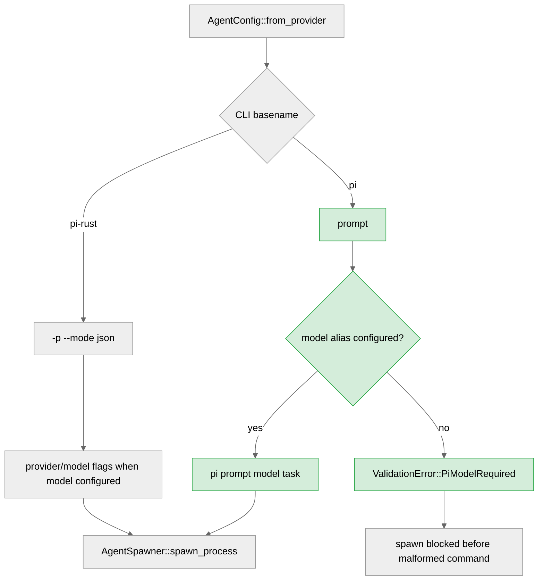

<h3>Summary</h3>

This change adds badlogic/pi CLI support while preserving the existing pi-rust integration.

- **CLI contract split**: `pi-rust` keeps `-p --mode json` and provider/model flags; badlogic `pi` now uses `prompt <model> <prompt>`.
- **Validation guard**: badlogic `pi` now fails validation if no model alias is configured, avoiding malformed `pi prompt <task>` invocations.
- **Real process evidence**: a temporary executable named `pi` captures argv in an integration test, proving the spawner builds the expected command without mocks.
- **ADF proof harness correction**: the stage runner now requires `issue=<number>` from direct-dispatch context rather than hardcoding a target issue.

The implementation follows the approved research/design scope. The main risk area was conflating `pi` and `pi-rust`; that has been addressed with separate match arms and tests for both CLIs.

<h3>Confidence Score: 5/5</h3>

- Safe to merge with minimal risk after full verification gates pass.
- No P0/P1/P2 findings remain in the reviewed diff. The important behavioural risk, spawning badlogic `pi` without a model alias, is guarded by `ValidationError::PiModelRequired`.
- Files requiring attention: none beyond normal verification.

<h3>Important Files Changed</h3>

| Filename | Overview |
|----------|----------|
| `crates/terraphim_spawner/src/config.rs` | Separates badlogic `pi` from `pi-rust`, adds validation for required model alias, and adds unit coverage for both command contracts. |
| `crates/terraphim_spawner/src/lib.rs` | Adds an integration test that spawns a real temporary executable named `pi` and verifies argv shape. |
| `.terraphim/bin/adf-e2e-stage` | Makes ADF evidence comments dynamic by requiring `issue=<number>` in dispatch context. |
| `.terraphim/adf.toml` | Adds local ADF proof agents used by `adf-ctl --local trigger --direct`; stage tasks no longer hardcode the target issue. |
| `.docs/research-1881-badlogic-pi-cli-adf-flow.md` | Records disciplined research and the badlogic/pi vs pi-rust distinction. |
| `.docs/design-1881-badlogic-pi-cli-adf-e2e.md` | Records the approved dynamic ADF evidence plan and implementation steps. |

<h3>Diagram</h3>

<h3>Inline Findings</h3>

No findings.

Last reviewed commit: local working tree | Reviews (1)
