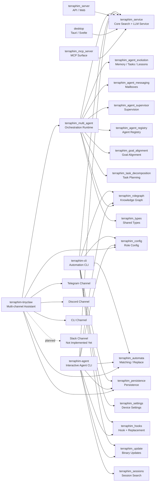

# Project Status And Component Map

Date: 2026-03-09

## Existing Docs Checked

- `docs/component-diagram.md`
  Broad repository architecture diagram. Useful for background, but not focused on `terraphim-agent`, `terraphim-cli`, or `terraphim-tinyclaw`.
- `.docs/AGENT_CLI_MULTIAGENT_STATUS.md`
  Useful historical summary, but stale for current validation. It reports all systems operational and does not reflect the current TinyClaw benchmark failure.
- `docs/TEST_REPORT_TERRAPHIM_AGENT_CLI.md`
  Useful historical test evidence, but counts are outdated relative to the current workspace.
- `docs/TINYCLAW_TEST_REPORT.md`
  Useful historical structure overview, but currently overstates TinyClaw readiness.

## Current Validation Summary

### 1. terraphim-agent

- Package: `terraphim_agent`
- Binary: `terraphim-agent`
- Validation command: `cargo test -p terraphim_agent --lib`
- Result: PASS
- Current verified result: 138/138 library tests passing

Implementation status:
- Interactive agent CLI is implemented.
- REPL, forgiving parser, robot mode, onboarding, hook-based command execution, and command registry infrastructure are wired into the crate.
- Fullscreen TUI still depends on a running Terraphim server for online mode, while REPL and robot-style modes remain the practical offline paths.

Assessment:
- Healthy core implementation.
- Current library coverage is strong.
- Main operational caveat is server dependence for some interactive paths, not a broken library.

### 2. terraphim-cli

- Package: `terraphim-cli`
- Binary: `terraphim-cli`
- Validation command: `cargo test -p terraphim-cli`
- Result: PASS
- Current verified result:
  - `cli_command_tests.rs`: 40 passing
  - `integration_tests.rs`: 32 passing
  - `service_tests.rs`: 31 passing
  - Total verified test count from this run: 103 passing

Implementation status:
- Non-interactive automation CLI is implemented.
- Commands for search, config, roles, graph, replace, find, thesaurus, extract, coverage, completions, and update flow are wired into the binary.
- Service initialization flows through `terraphim_service`, `terraphim_config`, `terraphim_settings`, and persistence-backed role state.

Assessment:
- Functionally healthy and the cleanest of the three for automation use.
- One notable test smell: `crates/terraphim_cli/tests/integration_tests.rs` shells out through `cargo run` per test, which makes the suite much slower than it needs to be and causes frequent long-running notices during execution.
- Some tests intentionally treat CLI misuse as a skip rather than a hard failure, so green results should not be mistaken for exhaustive behavioral guarantees.

### 3. terraphim-tinyclaw

- Package: `terraphim_tinyclaw`
- Binary: `terraphim-tinyclaw`
- Validation command: `cargo test -p terraphim_tinyclaw`
- Result: FAIL

Current verified result from this run:
- Library tests: 132 passing
- Binary unit tests: 132 passing
- `tests/gateway_dispatch.rs`: 4 passing
- `tests/skills_benchmarks.rs`: 2 passing, 1 failing

Current blocking failure:
- `benchmark_execution_small_skill`
- Observed execution time: about 5.17s
- Failure reason: benchmark threshold exceeded

Implementation status:
- Core TinyClaw implementation is real and substantial.
- Channel framework exists with concrete adapters for CLI, Telegram, and Discord.
- Tool-calling loop, proxy client, execution guard, session manager, skill executor, session tools, and voice transcription scaffolding are implemented.
- Slack is not implemented.
- Matrix is present in source history as a disabled direction, but not active in the current channel build path.

Assessment:
- TinyClaw is functionally close, but not fully validated end-to-end in the current workspace.
- Older docs calling it fully production-ready are stale.
- For deployment planning, treat TinyClaw as the right foundation, but not as fully release-clean until the benchmark regression is understood or the benchmark is deliberately re-scoped.

## Key Gaps For The Next Step

### Slack Integration

Current status:
- No Slack channel implementation exists in `crates/terraphim_tinyclaw/src/channels/`.
- No Slack config type exists in `crates/terraphim_tinyclaw/src/config.rs`.
- `build_channels_from_config()` only wires Telegram and Discord today.

Implication:
- The next deployment step is not configuration-only.
- It requires a new Slack adapter, config model, startup wiring, outbound formatting strategy, and allowlist/security model.

### Multi-Agent Personality In Slack

Current status:
- `terraphim_tinyclaw` runs a single `ToolCallingLoop` instance.
- Multi-agent capability exists elsewhere in the repo, mainly around `terraphim_multi_agent`, `terraphim_agent_evolution`, `terraphim_agent_messaging`, `terraphim_agent_supervisor`, and related orchestration crates.
- TinyClaw does not yet expose distinct agent identities or visible personalities per channel message thread.

Implication:
- To show multiple orchestrated personalities in Slack, TinyClaw needs a routing/orchestration layer above or inside the current single-loop architecture.
- That likely means either:
  1. one Slack app with persona-aware reply formatting and role routing, or
  2. a supervisor/router that maps Slack threads, mentions, or channels to multiple specialized agents backed by `terraphim_multi_agent`.

## Component Map

### User-Facing Components

| Component | Location | Functionality | Current Status |
|---|---|---|---|
| `terraphim-agent` | `crates/terraphim_agent` | Interactive agent CLI, REPL, robot mode, onboarding, command system | Verified green at library level |
| `terraphim-cli` | `crates/terraphim_cli` | Automation-first semantic CLI with JSON output | Verified green |
| `terraphim-tinyclaw` | `crates/terraphim_tinyclaw` | Multi-channel assistant with tool-calling loop and skills | Partially green, benchmark failure blocks full validation |
| `terraphim_server` | `terraphim_server` | Server-side web/API surface for Terraphim | Not validated in this pass |
| `desktop` | `desktop` | Tauri/Svelte desktop interface | Not validated in this pass |
| `terraphim_mcp_server` | `crates/terraphim_mcp_server` | MCP server integration surface | Not validated in this pass |

### Core Platform Components

| Component | Location | Functionality |
|---|---|---|
| `terraphim_service` | `crates/terraphim_service` | Core service logic, search, LLM integration, logging |
| `terraphim_config` | `crates/terraphim_config` | Role and system configuration model |
| `terraphim_settings` | `crates/terraphim_settings` | Device and environment settings loading |
| `terraphim_persistence` | `crates/terraphim_persistence` | Persistence layer and config/session storage |
| `terraphim_types` | `crates/terraphim_types` | Shared data types |
| `terraphim_automata` | `crates/terraphim_automata` | Matching, replacement, and fast text indexing utilities |
| `terraphim_rolegraph` | `crates/terraphim_rolegraph` | Knowledge graph and role-centric term graph |
| `terraphim_hooks` | `crates/terraphim_hooks` | Text replacement and hook execution support |
| `terraphim_update` | `crates/terraphim_update` | Update and rollback support for CLI binaries |

### Agent And Orchestration Components

| Component | Location | Functionality |
|---|---|---|
| `terraphim_multi_agent` | `crates/terraphim_multi_agent` | Main multi-agent runtime, command processing, LLM client integration |
| `terraphim_agent_evolution` | `crates/terraphim_agent_evolution` | Memory, task, and lesson evolution |
| `terraphim_agent_messaging` | `crates/terraphim_agent_messaging` | Mailbox and inter-agent messaging |
| `terraphim_agent_supervisor` | `crates/terraphim_agent_supervisor` | Supervision trees and restart policy |
| `terraphim_agent_registry` | `crates/terraphim_agent_registry` | Agent discovery and metadata |
| `terraphim_goal_alignment` | `crates/terraphim_goal_alignment` | Goal scoring and conflict analysis |
| `terraphim_task_decomposition` | `crates/terraphim_task_decomposition` | Task planning and decomposition |
| `terraphim_sessions` | `crates/terraphim_sessions` | Session indexing/search used by agent-facing tools |

## Clickable Mermaid Diagram

## Recommended Next Step

If the next objective is Slack deployment with visible multi-agent personalities, the most defensible sequence is:

1. Stabilize TinyClaw validation.
   Resolve or re-baseline `benchmark_execution_small_skill` so `cargo test -p terraphim_tinyclaw` is green.
2. Add a Slack channel adapter to TinyClaw.
   This includes Slack config, channel implementation, message normalization, outbound formatting, and auth / allowlist logic.
3. Add persona routing on top of TinyClaw.
   Start simple: map Slack mentions or thread prefixes to named roles.
4. Only after persona routing works, connect that surface to `terraphim_multi_agent` orchestration.
   That is the step that turns visible personalities into real orchestrated agents rather than prompt-only role labels.
