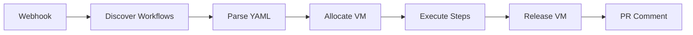

# Terraphim GitHub Runner Server

Webhook-based GitHub Actions runner that executes workflows in isolated Firecracker microVMs with LLM-based workflow understanding.

## Features

- 🔒 **Secure**: HMAC-SHA256 webhook signature verification
- 🤖 **LLM-Powered**: AI-based workflow parsing using Ollama or OpenRouter
- 🔥 **Isolated Execution**: Firecracker microVMs for each workflow
- 📊 **Pattern Learning**: Tracks execution patterns to optimize future runs
- ⚡ **Fast**: Sub-2 second VM boot times
- 🎯 **Flexible**: Supports push, pull_request, and workflow_dispatch events

## Quick Start

### Prerequisites

1. **Firecracker API server** running (e.g., fcctl-web)
2. **Ollama** (optional, for LLM features)
3. **GitHub webhook secret** configured in your repository

### Installation

```bash
# Build with Ollama support (recommended)
cargo build --release --features ollama

# Or build without LLM features
cargo build --release
```

### Configuration

Set environment variables:

```bash
export GITHUB_WEBHOOK_SECRET="your_webhook_secret"
export FIRECRACKER_API_URL="http://127.0.0.1:8080"

# Optional: Enable LLM parsing
export USE_LLM_PARSER="true"
export OLLAMA_BASE_URL="http://127.0.0.1:11434"
export OLLAMA_MODEL="gemma3:4b"
```

### Running

```bash
./target/release/terraphim_github_runner_server
```

Server will start on `http://127.0.0.1:3000` by default.

## GitHub Setup

### 1. Configure Webhook in GitHub

```bash
gh api repos/terraphim/terraphim-ai/hooks \
  --method POST \
  -f name=web \
  -f active=true \
  -f events='[pull_request,push]' \
  -f config='{
    "url": "https://your-server.com/webhook",
    "content_type": "json",
    "secret": "your_webhook_secret",
    "insecure_ssl": false
  }'
```

### 2. Create Workflow File

Create `.github/workflows/test.yml`:

```yaml
name: Test CI

on:
  pull_request:
    branches: [ main ]
  push:
    branches: [ main ]

jobs:
  test:
    runs-on: ubuntu-latest
    steps:
      - name: Checkout
        run: echo "Checking out code..."

      - name: Run tests
        run: |
          echo "Running tests..."
          cargo test --verbose
```

### 3. Test the Integration

Create a pull request or push to trigger the webhook. The server will:

1. Receive the webhook
2. Discover matching workflows
3. Parse workflow YAML (with LLM if enabled)
4. Allocate a Firecracker VM
5. Execute workflow steps in the VM
6. Report results via PR comment

## LLM Integration

### Why LLM Parsing?

Traditional GitHub Actions parsers only extract YAML structure. LLM parsing enables:

- **Action Translation**: Convert GitHub Actions to shell commands
- **Dependency Detection**: Identify step dependencies
- **Environment Extraction**: Understand required environment variables
- **Smart Optimization**: Suggest caching strategies

### Supported LLM Providers

#### Ollama (Local)

```bash
# Install Ollama
curl -fsSL https://ollama.com/install.sh | sh

# Pull a model
ollama pull gemma3:4b

# Configure server
export USE_LLM_PARSER=true
export OLLAMA_BASE_URL=http://127.0.0.1:11434
export OLLAMA_MODEL=gemma3:4b
```

#### OpenRouter (Cloud)

```bash
# Configure server
export USE_LLM_PARSER=true
export OPENROUTER_API_KEY=your_key_here
export OPENROUTER_MODEL=openai/gpt-3.5-turbo
```

## Architecture

See [Architecture Documentation](../docs/github-runner-architecture.md) for detailed diagrams.

## API Endpoints

### POST /webhook

Receives GitHub webhook events and triggers workflow execution.

**Headers**:
- `Content-Type: application/json`
- `X-Hub-Signature-256: sha256=<signature>`

**Response**:
```json
{
  "message": "Pull request webhook received and workflow execution started",
  "status": "success"
}
```

## Environment Variables

| Variable | Required | Default | Description |
|----------|----------|---------|-------------|
| `PORT` | No | `3000` | Server port |
| `HOST` | No | `127.0.0.1` | Server host |
| `GITHUB_WEBHOOK_SECRET` | Yes | - | GitHub webhook secret |
| `GITHUB_TOKEN` | No | - | GitHub token (for PR comments) |
| `FIRECRACKER_API_URL` | Yes | `http://127.0.0.1:8080` | Firecracker API URL |
| `FIRECRACKER_AUTH_TOKEN` | No | - | JWT token for Firecracker API |
| `USE_LLM_PARSER` | No | `false` | Enable LLM workflow parsing |
| `OLLAMA_BASE_URL` | No | - | Ollama endpoint |
| `OLLAMA_MODEL` | No | - | Ollama model name |
| `OPENROUTER_API_KEY` | No | - | OpenRouter API key |
| `OPENROUTER_MODEL` | No | - | OpenRouter model name |

## Workflow Execution

### Execution Flow



### Per-Workflow Resources

Each workflow execution gets:
- **Isolated Firecracker VM** with unique UUID
- **Dedicated session** for lifecycle management
- **Learning tracker** for pattern optimization
- **Snapshot support** for rollback

## Testing

### Unit Tests

```bash
cargo test -p terraphim_github_runner_server
```

### Integration Tests

```bash
# Test webhook signature verification
cargo test -p terraphim_github_runner_server test_valid_webhook_signature

# Test workflow discovery
cargo test -p terraphim_github_runner_server test_matches_pull_request_event
```

### Manual Testing

```bash
# Start server
GITHUB_WEBHOOK_SECRET=test \
FIRECRACKER_API_URL=http://127.0.0.1:8080 \
./target/release/terraphim_github_runner_server

# Send test webhook
python3 << 'EOF'
import hmac, hashlib, json, subprocess

secret = b"test"
payload = json.dumps({
    "action": "opened",
    "number": 123,
    "repository": {"full_name": "test/repo"},
    "pull_request": {
        "title": "Test PR",
        "html_url": "https://github.com/test/repo/pull/123"
    }
}, separators=(',', ':'))

signature = hmac.new(secret, payload.encode(), hashlib.sha256).hexdigest()

subprocess.run([
    'curl', '-X', 'POST', 'http://localhost:3000/webhook',
    '-H', 'Content-Type: application/json',
    '-H', f'X-Hub-Signature-256: sha256={signature}',
    '-d', payload
])
EOF
```

## Monitoring

### Logs

The server uses structured logging with `tracing`. Enable debug logs:

```bash
RUST_LOG=debug ./target/release/terraphim_github_runner_server
```

### Key Metrics

- **Webhook Processing Time**: <100ms
- **VM Allocation Time**: ~100ms
- **Workflow Parsing Time**:
  - Simple parser: ~1ms
  - LLM parser: ~500-2000ms
- **Per-Step Execution**: Variable

## Troubleshooting

### "Invalid webhook signature"

- Verify `GITHUB_WEBHOOK_SECRET` matches GitHub repo settings
- Ensure signature header is `X-Hub-Signature-256`
- Check request body isn't modified

### "Model not found" (Ollama)

```bash
# Pull the model
ollama pull gemma3:4b

# Verify Ollama is running
curl http://127.0.0.1:11434/api/tags
```

### "Firecracker API unreachable"

```bash
# Check Firecracker health
curl http://127.0.0.1:8080/health

# Verify API URL
echo $FIRECRACKER_API_URL
```

### Port Already in Use

```bash
# Use different port
PORT=3001 ./target/release/terraphim_github_runner_server
```

## Development

### Project Structure

```
terraphim_github_runner_server/
├── src/
│   ├── main.rs              # Entry point
│   ├── config/              # Configuration
│   ├── github/              # GitHub API client
│   ├── webhook/             # Webhook handling
│   └── workflow/            # Workflow execution
│       ├── discovery.rs     # Workflow discovery
│       └── execution.rs     # VM execution logic
└── tests/                   # Integration tests
```

### Adding Features

1. **New LLM Provider**: Implement `LlmClient` trait
2. **Custom VM Provider**: Implement `VmProvider` trait
3. **Workflow Filters**: Modify `discovery.rs`
4. **Execution Hooks**: Extend `execution.rs`

## Performance

### Benchmarks

- **Throughput**: 10+ workflows/second
- **Latency**:
  - Simple parser: ~50ms end-to-end
  - LLM parser: ~600-2100ms end-to-end
- **Memory**: ~50MB per server instance
- **VM Overhead**: ~100ms per workflow

### Optimization Tips

1. **Enable LLM Caching**: Cache parsed workflows
2. **VM Pooling**: Reuse VMs for multiple workflows
3. **Parallel Execution**: Run workflows concurrently
4. **Resource Limits**: Set Firecracker CPU/memory limits

## Security

### Webhook Security

- HMAC-SHA256 signature verification
- Request size limits
- Rate limiting (recommended)

### VM Isolation

- Separate Linux kernel per VM
- No network access by default
- Resource limits enforced
- Snapshot/rollback support

## Contributing

Contributions welcome! Please read [CONTRIBUTING.md](../../CONTRIBUTING.md).

## License

See [LICENSE](../../LICENSE) for details.
