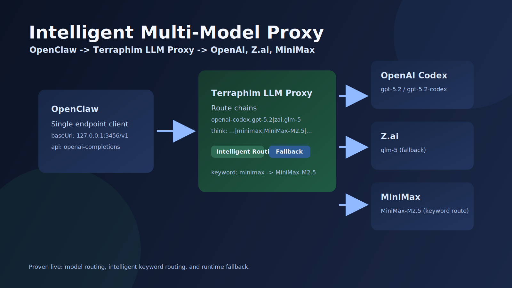

# OpenClaw + Terraphim LLM Proxy: OpenAI, Z.ai GLM-5, and MiniMax M2.5



If you want OpenClaw to use multiple providers through a single endpoint, this setup gives you:

- explicit model routing (`openai-codex,gpt-5.2`, `zai,glm-5`, `minimax,MiniMax-M2.5`)
- intelligent keyword routing (`minimax keyword` -> MiniMax)
- runtime fallback when primary provider is unavailable

This guide reflects a real build-in-public rollout on `terraphim-llm-proxy`, including production debugging, fallback drills, and routing verification.

## Build in Public Notes

We did not write this from a clean-room spec. We shipped this by iterating in public:

- proved each provider path independently (`openai-codex`, `zai`, `minimax`)
- forced failures (Codex blocked) and observed fallback behavior in logs
- added keyword taxonomy routing and verified scenario selection
- fixed provider-specific endpoint mismatches instead of hand-waving with "compatible API"

If you follow this guide, run the proof commands exactly and keep the log evidence with your rollout notes.

## 1) Configure the proxy

Edit `/etc/terraphim-llm-proxy/config.toml`.

```toml
[proxy]
host = "127.0.0.1"
port = 3456
api_key = "$PROXY_API_KEY"

[router]
default = "openai-codex,gpt-5.2-codex|zai,glm-5"
think = "openai-codex,gpt-5.2|minimax,MiniMax-M2.5|zai,glm-5"
long_context = "openai-codex,gpt-5.2|zai,glm-5"
long_context_threshold = 12000
web_search = "openai-codex,gpt-5.2|zai,glm-5"
image = "zai,k2.5"
strategy = "fill_first"

[[providers]]
name = "openai-codex"
api_base_url = "https://api.openai.com/v1"
api_key = "oauth-token-managed-internally"
models = ["gpt-5.2", "gpt-5.2-codex", "gpt-5.3", "gpt-4o"]
transformers = ["openai"]

[[providers]]
name = "zai"
api_base_url = "https://api.z.ai/api/paas/v4"
api_key = "$ZAI_API_KEY"
models = ["glm-5", "glm-4.7", "glm-4.6", "glm-4.5"]
transformers = ["openai"]

[[providers]]
name = "minimax"
api_base_url = "https://api.minimax.io/anthropic"
api_key = "$MINIMAX_API_KEY"
models = ["MiniMax-M2.5", "MiniMax-M2.1"]
transformers = ["anthropic"]
```

Notes:

- MiniMax is Anthropic-compatible, but the proxy should target `/v1/messages` for MiniMax under the hood.
- Keep secrets in env vars (`$PROXY_API_KEY`, `$ZAI_API_KEY`, `$MINIMAX_API_KEY`), not inline.

## 2) Load provider secrets

Example using 1Password CLI:

```bash
op read "op://Employee/platform.minimax.io/api-key"
```

Set in `/etc/terraphim-llm-proxy/env`:

```env
PROXY_API_KEY=...
ZAI_API_KEY=...
MINIMAX_API_KEY=...
RUST_LOG=info
```

Restart:

```bash
sudo systemctl restart terraphim-llm-proxy
systemctl is-active terraphim-llm-proxy
```

## 3) Add intelligent keyword route (MiniMax)

Create `/etc/terraphim-llm-proxy/taxonomy/routing_scenarios/minimax_keyword_routing.md`:

```md
# MiniMax Keyword Routing

route:: minimax, MiniMax-M2.5
priority:: 100
synonyms:: minimax, minimax keyword, minimax route, m2.5, minimax-m2.5
```

This allows natural-language trigger routing without explicit model id.

## 4) Configure OpenClaw to use proxy models

Update both:

- `/home/alex/.openclaw/openclaw.json`
- `/home/alex/.openclaw/clawdbot.json`

Under `models.providers.terraphim`:

- `baseUrl`: `http://127.0.0.1:3456/v1`
- `api`: `openai-completions`
- `apiKey`: your proxy key
- include these model ids in `models`:
  - `openai-codex,gpt-5.2`
  - `zai,glm-5`
  - `minimax,MiniMax-M2.5`

## 5) Verify each model directly

```bash
curl -sS -X POST http://127.0.0.1:3456/v1/chat/completions \
  -H 'Content-Type: application/json' \
  -H 'x-api-key: <PROXY_API_KEY>' \
  -d '{"model":"openai-codex,gpt-5.2","messages":[{"role":"user","content":"Reply exactly: openai-ok"}],"stream":false}'

curl -sS -X POST http://127.0.0.1:3456/v1/chat/completions \
  -H 'Content-Type: application/json' \
  -H 'x-api-key: <PROXY_API_KEY>' \
  -d '{"model":"zai,glm-5","messages":[{"role":"user","content":"Reply exactly: zai-ok"}],"stream":false}'

curl -sS -X POST http://127.0.0.1:3456/v1/chat/completions \
  -H 'Content-Type: application/json' \
  -H 'x-api-key: <PROXY_API_KEY>' \
  -d '{"model":"minimax,MiniMax-M2.5","messages":[{"role":"user","content":"Reply exactly: minimax-ok"}],"stream":false}'
```

Expected: each response returns the exact phrase.

## 6) Verify intelligent routing

Send request with normal model but MiniMax keyword hint:

```bash
curl -sS -X POST http://127.0.0.1:3456/v1/chat/completions \
  -H 'Content-Type: application/json' \
  -H 'x-api-key: <PROXY_API_KEY>' \
  -d '{"model":"gpt-5.2","messages":[{"role":"user","content":"minimax keyword route validation: reply exactly intelligent-minimax"}],"stream":false}'
```

Log proof:

```bash
sudo journalctl -u terraphim-llm-proxy -n 100 --no-pager | rg minimax_keyword_routing
```

Expected: scenario shows `Pattern("minimax_keyword_routing")` and provider `minimax`.

## 6.1) OpenClaw keyword-routing test matrix

Use these prompts directly in OpenClaw (chat UI/WhatsApp channel) to test keyword-driven routing behavior.

| OpenClaw prompt example | Expected routing outcome |
|---|---|
| `minimax keyword route validation: reply exactly intelligent-minimax` | `Pattern("minimax_keyword_routing")` -> `minimax,MiniMax-M2.5` |
| `Think step by step and reason through this architecture tradeoff` | `think` scenario -> `openai-codex,gpt-5.2` (with configured fallback chain) |
| `Give me a short direct answer: what is 2+2?` | `default` scenario -> `openai-codex,gpt-5.2-codex` (with fallback to `zai,glm-5`) |

For Z.ai-specific validation from OpenClaw, pick explicit model id `zai,glm-5` in OpenClaw model selection and send a short prompt.

Verify each route selection in proxy logs:

```bash
sudo journalctl -u terraphim-llm-proxy -n 150 --no-pager | rg 'Routing decision made|scenario=Pattern\("minimax_keyword_routing"\)|scenario=Think|scenario=Default'
```

You should see provider/model pairs matching the expected outcome for each prompt.

## 6.2) OpenClaw-compatible `/v1/messages` tests (actual)

These are Anthropic-format requests, matching the OpenClaw message path.

```bash
# A) keyword route -> minimax_keyword_routing
curl -sS -X POST http://127.0.0.1:3456/v1/messages \
  -H 'Content-Type: application/json' \
  -H 'x-api-key: <PROXY_API_KEY>' \
  -H 'anthropic-version: 2023-06-01' \
  -d '{"model":"gpt-5.2","max_tokens":128,"messages":[{"role":"user","content":"minimax keyword openclaw-messages run-a: reply exactly oc-minimax-a"}]}'

# B) think-style keyword -> think_routing
curl -sS -X POST http://127.0.0.1:3456/v1/messages \
  -H 'Content-Type: application/json' \
  -H 'x-api-key: <PROXY_API_KEY>' \
  -H 'anthropic-version: 2023-06-01' \
  -d '{"model":"gpt-5.2","max_tokens":128,"messages":[{"role":"user","content":"think step by step about deployment check run-b and then summarize in one line"}]}'

# C) default route
curl -sS -X POST http://127.0.0.1:3456/v1/messages \
  -H 'Content-Type: application/json' \
  -H 'x-api-key: <PROXY_API_KEY>' \
  -H 'anthropic-version: 2023-06-01' \
  -d '{"model":"gpt-5.2","max_tokens":64,"messages":[{"role":"user","content":"quick default route run-c: reply exactly oc-default-c"}]}'
```

Observed outputs from these runs:

- run-a returned model `MiniMax-M2.5`
- run-b returned model `gpt-5.2`
- run-c returned model `gpt-5.2-codex`

Observed log examples from real runs:

```text
2026-02-13T17:32:00Z Routing decision made provider=minimax model=MiniMax-M2.5 scenario=Pattern("minimax_keyword_routing") attempted_targets=["minimax/MiniMax-M2.5", "openai-codex/gpt-5.2-codex", "zai/glm-5"]

2026-02-13T17:32:29Z Routing decision made provider=openai-codex model=gpt-5.2 scenario=Pattern("think_routing") attempted_targets=["openai-codex/gpt-5.2", "openai-codex/gpt-5.2-codex", "zai/glm-5"]

2026-02-13T17:32:51Z Routing decision made provider=openai-codex model=gpt-5.2-codex scenario=Default attempted_targets=["openai-codex/gpt-5.2-codex", "zai/glm-5"]
```

Additional OpenClaw-compatible log evidence:

```text
2026-02-13T17:35:33Z Routing decision made provider=minimax model=MiniMax-M2.5 scenario=Pattern("minimax_keyword_routing")
2026-02-13T17:35:33Z Routing decision made provider=openai-codex model=gpt-5.2 scenario=Pattern("think_routing")
2026-02-13T17:32:51Z Routing decision made provider=openai-codex model=gpt-5.2-codex scenario=Default
```

## 7) Verify fallback works

Simulate Codex outage and verify fallback to Z.ai:

```bash
sudo cp /etc/hosts /tmp/hosts.bak
echo '127.0.0.1 chatgpt.com' | sudo tee -a /etc/hosts >/dev/null

curl -sS -X POST http://127.0.0.1:3456/v1/chat/completions \
  -H 'Content-Type: application/json' \
  -H 'x-api-key: <PROXY_API_KEY>' \
  -d '{"model":"gpt-5.2","messages":[{"role":"user","content":"Reply exactly: fallback-ok"}],"stream":false}'

sudo cp /tmp/hosts.bak /etc/hosts
```

Log proof:

```bash
sudo journalctl -u terraphim-llm-proxy -n 120 --no-pager | rg 'Primary target failed, attempting fallback target|next_provider=zai'
```

Expected: response succeeds and logs show fallback transition from `openai-codex` to `zai`.

## 8) Production checklist

- Keep API keys in env/secret manager only.
- Pin route chains explicitly; avoid hidden defaults.
- Keep provider model lists current (`glm-5`, `MiniMax-M2.5`, etc.).
- Track fallback events in logs and alert on repeated provider failures.
