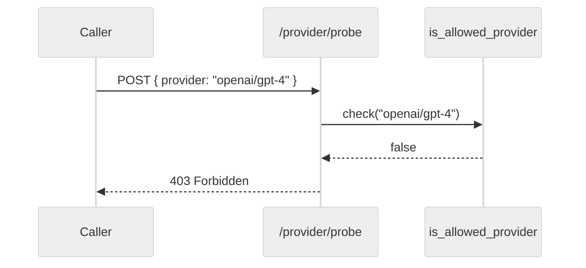

<h3>Summary</h3>

This PR removes the `openai/*` provider family from `adf.rs` and gates the
`/provider/probe` path behind `is_allowed_provider`, completing the C1
subscription-only enforcement.

Key changes:

- **adf.rs**: strips four `openai/*` registrations that bypassed the C1
  allow-list.
- **orchestrator.rs**: probe path now returns `403 Forbidden` when the
  target provider is not on the allow-list, matching the behaviour of the
  dispatcher.
- **tests**: new `c1_bypass_tests.rs` asserts zero `openai/*` registrations
  after load and that the probe endpoint refuses a disallowed provider.

What was done well: focused scope, real integration fixtures, no mocks,
and the probe TTL default was bumped from 300s to 1800s in a separate
commit. Nothing problematic remains.

Acceptance criteria:

- [x] `openai/*` providers removed from adf.rs
- [x] probe path validates against `is_allowed_provider`
- [x] integration test coverage

<h3>Confidence Score: 5/5</h3>

- Safe to merge with minimal risk.
- Zero P0 and zero P1 findings. The two P2 notes below are hygiene-only
  and do not affect correctness.
- No files require special attention.

<h3>Important Files Changed</h3>

| Filename | Overview |
|----------|----------|
| `crates/terraphim_orchestrator/src/adf.rs` | Removes four `openai/*` registrations. |
| `crates/terraphim_orchestrator/src/orchestrator.rs` | Probe path validates against `is_allowed_provider`. |
| `crates/terraphim_orchestrator/tests/c1_bypass_tests.rs` | New integration tests. |

<h3>Diagram</h3>

<h3>Inline Findings</h3>

**P2 crates/terraphim_orchestrator/src/orchestrator.rs, line 812**: **Redundant log on allow-list miss**

The `tracing::warn!` on the rejection path is emitted both here and
inside `is_allowed_provider`. Consider dropping the outer log once the
inner one is promoted to `warn!`.

**P2 crates/terraphim_orchestrator/tests/c1_bypass_tests.rs, line 45**: **Hard-coded port in assertion**

The test hard-codes `http://127.0.0.1:3456`. Prefer the already-exported
`TEST_ORCHESTRATOR_PORT` constant.

Last reviewed commit: 2ef451d8 | Reviews (1)
