# Terraphim AI Component Architecture

This diagram shows the component architecture of the Terraphim AI repository, highlighting the core Terraphim crates and their relationships.

```mermaid
graph TB
    %% External Systems
    subgraph "External Systems"
        ATOMIC[Atomic Server<br/>localhost:9883]
        GITHUB[GitHub Repositories]
        S3[S3 Storage<br/>staging-storage.terraphim.io]
        OPENROUTER[OpenRouter AI API]
    end

    %% Core Terraphim Crates (Highlighted)
    subgraph "Core Terraphim Crates" ["🟢 Core Terraphim Crates"]
        TYPES[terraphim_types<br/>📦 Shared Types & Data Structures]
        CONFIG[terraphim_config<br/>⚙️ Configuration Management]
        SETTINGS[terraphim_settings<br/>🔧 Settings & Environment]
        PERSISTENCE[terraphim_persistence<br/>💾 Data Persistence Layer]

        AUTOMATA[terraphim_automata<br/>🤖 FST-based Autocomplete & Matching]
        ROLEGRAPH[terraphim_rolegraph<br/>🕸️ Knowledge Graph & Role-based Search]
        MIDDLEWARE[terraphim_middleware<br/>🔗 Integration & Indexing Services]
        SERVICE[terraphim_service<br/>🎯 Core Business Logic & Search]

        ATOMIC_CLIENT[terraphim_atomic_client<br/>🔌 Atomic Server Integration]
        MCP_SERVER[terraphim_mcp_server<br/>🤝 MCP Protocol Server]
        BUILD_ARGS[terraphim_build_args<br/>🔨 Build-time Configuration]
        MARKDOWN_PARSER[terraphim-markdown-parser<br/>📝 Markdown Processing]

        ONEPASSWORD[terraphim_onepassword_cli<br/>🔐 1Password CLI Integration]
        MULTI_AGENT[terraphim_multi_agent<br/>🤖 Multi-Agent System with VM Execution]
    end

    %% VM Execution Layer
    subgraph "VM Execution" ["🔥 VM Execution Infrastructure"]
        FCCTL_WEB[fcctl-web<br/>🌐 Firecracker Control Web API]
        FCCTL_REPL[fcctl-repl<br/>💻 VM Session Management]
        FIRECRACKER[Firecracker VMs<br/>🔒 Isolated Code Execution]
    end

    %% Applications
    subgraph "Applications" ["📱 Applications"]
        DESKTOP[Desktop App<br/>Tauri + Svelte]
        SERVER[Web Server<br/>Axum + Rust]
        NODEJS[NODE.js Bindings<br/>NAPI Integration]
        VSCODE[VS Code Extension<br/>TypeScript]
    end

    %% Frontend Components
    subgraph "Frontend" ["🌐 Frontend"]
        SVELTE[Svelte Components<br/>Search, Config, UI]
        TAURI[Tauri Backend<br/>Desktop Integration]
    end

    %% Data & Storage
    subgraph "Data & Storage" ["💾 Data & Storage"]
        KG[Knowledge Graph<br/>Markdown + JSON]
        HAYSTACK[Haystack Index<br/>Ripgrep + Atomic]
        THESAURUS[Thesaurus<br/>Normalized Terms]
        INDEX[Document Index<br/>AHashMap Storage]
    end

    %% External Dependencies
    subgraph "External Dependencies" ["📚 External Dependencies"]
        TOKIO[Tokio Runtime<br/>Async Runtime]
        SERDE[Serde<br/>Serialization]
        AXUM[Axum<br/>Web Framework]
        FST[FST<br/>Finite State Transducers]
        AHO_CORASICK[Aho-Corasick<br/>String Matching]
    end

    %% Relationships - Core Dependencies
    TYPES --> CONFIG
    TYPES --> SERVICE
    TYPES --> ROLEGRAPH
    TYPES --> MIDDLEWARE
    TYPES --> AUTOMATA
    TYPES --> ATOMIC_CLIENT
    TYPES --> MCP_SERVER
    TYPES --> NODEJS
    TYPES --> DESKTOP
    TYPES --> SERVER

    CONFIG --> SERVICE
    CONFIG --> MIDDLEWARE
    CONFIG --> MCP_SERVER
    CONFIG --> DESKTOP
    CONFIG --> SERVER

    SETTINGS --> CONFIG
    SETTINGS --> SERVICE
    SETTINGS --> DESKTOP
    SETTINGS --> SERVER

    PERSISTENCE --> SERVICE
    PERSISTENCE --> MIDDLEWARE
    PERSISTENCE --> DESKTOP
    PERSISTENCE --> SERVER

    AUTOMATA --> ROLEGRAPH
    AUTOMATA --> MIDDLEWARE
    AUTOMATA --> SERVICE
    AUTOMATA --> DESKTOP
    AUTOMATA --> NODEJS

    ROLEGRAPH --> SERVICE
    ROLEGRAPH --> MIDDLEWARE
    ROLEGRAPH --> DESKTOP
    ROLEGRAPH --> SERVER

    MIDDLEWARE --> SERVICE
    MIDDLEWARE --> DESKTOP
    MIDDLEWARE --> SERVER

    SERVICE --> DESKTOP
    SERVICE --> SERVER
    SERVICE --> NODEJS

    ATOMIC_CLIENT --> MIDDLEWARE
    ATOMIC_CLIENT --> SERVICE
    ATOMIC_CLIENT --> DESKTOP

    MCP_SERVER --> DESKTOP
    MCP_SERVER --> SERVICE

    BUILD_ARGS --> DESKTOP
    BUILD_ARGS --> SERVER

    MARKDOWN_PARSER --> AUTOMATA
    MARKDOWN_PARSER --> MIDDLEWARE

    ONEPASSWORD --> SERVICE

    %% Application Dependencies
    DESKTOP --> TAURI
    DESKTOP --> SVELTE
    SERVER --> SVELTE

    %% Data Flow
    KG --> AUTOMATA
    KG --> ROLEGRAPH
    HAYSTACK --> MIDDLEWARE
    THESAURUS --> ROLEGRAPH
    THESAURUS --> AUTOMATA
    INDEX --> SERVICE
    INDEX --> ROLEGRAPH

    %% External System Connections
    ATOMIC --> ATOMIC_CLIENT
    GITHUB --> MIDDLEWARE
    S3 --> SERVICE
    S3 --> CONFIG
    OPENROUTER --> SERVICE

    %% VM Execution Connections
    MULTI_AGENT --> FCCTL_WEB
    FCCTL_WEB --> FCCTL_REPL
    FCCTL_REPL --> FIRECRACKER
    SERVICE --> MULTI_AGENT

    %% External Dependencies
    TOKIO --> SERVICE
    TOKIO --> ROLEGRAPH
    TOKIO --> MIDDLEWARE
    TOKIO --> MCP_SERVER
    TOKIO --> DESKTOP
    TOKIO --> SERVER

    SERDE --> TYPES
    SERDE --> CONFIG
    SERDE --> SERVICE
    SERDE --> ROLEGRAPH

    AXUM --> SERVER
    FST --> AUTOMATA
    AHO_CORASICK --> ROLEGRAPH

    %% Styling
    classDef terraphimCrate fill:#90EE90,stroke:#228B22,stroke-width:3px,color:#000
    classDef application fill:#87CEEB,stroke:#4682B4,stroke-width:2px,color:#000
    classDef external fill:#F0E68C,stroke:#DAA520,stroke-width:2px,color:#000
    classDef data fill:#DDA0DD,stroke:#9932CC,stroke-width:2px,color:#000
    classDef dependency fill:#F5F5DC,stroke:#8B7355,stroke-width:1px,color:#000

    class TYPES,CONFIG,SETTINGS,PERSISTENCE,AUTOMATA,ROLEGRAPH,MIDDLEWARE,SERVICE,ATOMIC_CLIENT,MCP_SERVER,BUILD_ARGS,MARKDOWN_PARSER,ONEPASSWORD terraphimCrate
    class DESKTOP,SERVER,NODEJS,VSCODE,SVELTE,TAURI application
    class ATOMIC,GITHUB,S3,OPENROUTER external
    class KG,HAYSTACK,THESAURUS,INDEX data
    class TOKIO,SERDE,AXUM,FST,AHO_CORASICK dependency
```

## Component Descriptions

### Core Terraphim Crates (🟢)

- **terraphim_types**: Shared data structures and types used across all components
- **terraphim_config**: Configuration management with role-based settings
- **terraphim_settings**: Environment and settings management
- **terraphim_persistence**: Data persistence layer for documents and state
- **terraphim_automata**: FST-based autocomplete and string matching
- **terraphim_rolegraph**: Knowledge graph implementation with role-based search
- **terraphim_middleware**: Integration services and document indexing
- **terraphim_service**: Core business logic and search functionality
- **terraphim_atomic_client**: Atomic server integration client
- **terraphim_mcp_server**: Model Context Protocol server implementation
- **terraphim_build_args**: Build-time configuration management
- **terraphim-markdown-parser**: Markdown document processing
- **terraphim_onepassword_cli**: 1Password CLI integration

### Applications (📱)

- **Desktop App**: Tauri-based desktop application with Svelte frontend
- **Web Server**: Axum-based web server for API and web interface
- **Node.js Bindings**: NAPI-based Node.js integration
- **VS Code Extension**: TypeScript-based VS Code extension

### Data & Storage (💾)

- **Knowledge Graph**: Markdown and JSON-based knowledge representation
- **Haystack Index**: Ripgrep and Atomic server-based document indexing
- **Thesaurus**: Normalized terms and concept mapping
- **Document Index**: In-memory document storage and retrieval

### External Systems (🌐)

- **Atomic Server**: External knowledge management system
- **GitHub**: Source code and documentation repositories
- **S3 Storage**: Cloud storage for configurations and data
- **OpenRouter**: AI API integration for document enhancement

## Key Relationships

1. **Type System**: `terraphim_types` serves as the foundation for all other components
2. **Configuration Flow**: `terraphim_config` and `terraphim_settings` manage application state
3. **Search Pipeline**: `terraphim_automata` → `terraphim_rolegraph` → `terraphim_service`
4. **Integration Layer**: `terraphim_middleware` connects external systems to core services
5. **Application Integration**: All applications depend on core Terraphim crates for functionality

## Architecture Patterns

- **Modular Design**: Each crate has a specific responsibility
- **Type Safety**: Shared types ensure consistency across components
- **Async Runtime**: Tokio-based async operations throughout
- **Cross-Platform**: Support for desktop, web, and Node.js environments
- **Extensible**: Plugin-based architecture with MCP server support
