# Terraphim GitHub Runner - Architecture Documentation

## Overview

The Terraphim GitHub Runner is a webhook-based CI/CD system that executes GitHub Actions workflows in isolated Firecracker microVMs with LLM-based workflow understanding.

## Table of Contents

- [Architecture Overview](#architecture-overview)
- [Components](#components)
- [Data Flow](#data-flow)
- [LLM Integration](#llm-integration)
- [Firecracker VM Integration](#firecracker-vm-integration)
- [Security](#security)
- [Configuration](#configuration)
- [API Reference](#api-reference)

## Architecture Overview


## Components

### 1. HTTP Server (`terraphim_github_runner_server`)

**Framework**: Salvo (async Rust web framework)

**Endpoint**: `POST /webhook`

**Responsibilities**:
- Receive GitHub webhooks
- Verify HMAC-SHA256 signatures
- Parse webhook payloads
- Route events to workflow executor

**Example Request**:
```bash
curl -X POST http://localhost:3000/webhook \
  -H "Content-Type: application/json" \
  -H "X-Hub-Signature-256: sha256=<signature>" \
  -d '{"action":"opened","number":123,...}'
```

### 2. Workflow Discovery

**Location**: `.github/workflows/*.yml`

**Trigger Matching**:


**Discovery Process**:
1. Scan `.github/workflows/` directory
2. Parse YAML frontmatter (triggers, branches)
3. Match webhook event to workflow triggers
4. Return list of workflows to execute

### 3. LLM Integration (`terraphim_service::llm`)

**Supported Providers**:
- **Ollama**: Local LLM (default)
- **OpenRouter**: Cloud LLM API (optional)

**LLM Workflow Parser**:


**System Prompt**:
```
You are an expert GitHub Actions workflow parser.
Your task is to analyze GitHub Actions workflows and translate them
into executable shell commands.

Output format (JSON):
{
  "name": "workflow name",
  "trigger": "push|pull_request",
  "environment": {"VAR": "value"},
  "setup_commands": ["commands"],
  "steps": [
    {
      "name": "step name",
      "command": "shell command",
      "working_dir": "/workspace",
      "continue_on_error": false,
      "timeout_seconds": 300
    }
  ],
  "cleanup_commands": ["commands"],
  "cache_paths": ["paths"]
}
```

### 4. Firecracker VM Integration

**VM Lifecycle**:


**VM Provider Trait**:
```rust
#[async_trait]
pub trait VmProvider: Send + Sync {
    async fn allocate(&self, vm_type: &str) -> Result<(String, Duration)>;
    async fn release(&self, vm_id: &str) -> Result<()>;
}
```

**Command Execution**:


### 5. Learning Coordinator

**Pattern Tracking**:


**Learning Metrics**:
- Success rate by command type
- Average execution time
- Common failure patterns
- Optimal cache paths
- Timeout recommendations

## Data Flow

### Complete Webhook to VM Execution Flow

```mermaid
flowchart TD
    Start([GitHub Webhook]) --> Verify[Verify HMAC-SHA256 Signature]
    Verify -->|Invalid| Error[Return 403 Forbidden]
    Verify -->|Valid| Parse[Parse Webhook Payload]
    Parse --> Type{Event Type}

    Type -->|pull_request| PR[PR Event]
    Type -->|push| Push[Push Event]
    Type -->|Unknown| Other[Acknowledge]

    PR --> Discover[Discover Matching Workflows]
    Push --> Discover
    Other --> End([End])

    Discover --> Found{Workflows Found?}
    Found -->|No| End
    Found -->|Yes| LLM{USE_LLM_PARSER?}

    LLM -->|true| ParseLLM[🤖 Parse with LLM]
    LLM -->|false| ParseSimple[📋 Parse Simple YAML]

    ParseLLM --> Extract[Extract Steps]
    ParseSimple --> Extract
    Extract --> ForEach[For Each Workflow]

    ForEach --> InitVM[🔧 Initialize Firecracker VM Provider]
    InitVM --> AllocVM[Allocate VM: fc-vm-UUID]
    AllocVM --> CreateExec[⚡ Create VmCommandExecutor]
    CreateExec --> CreateLearn[🧠 Create LearningCoordinator]
    CreateLearn --> CreateSession[🎯 Create SessionManager]

    CreateSession --> ExecSteps[Execute Steps]
    ExecSteps --> VMExec[Executing in Firecracker VM]
    VMExec --> Success{All Steps Passed?}

    Success -->|Yes| Record[Record Success Pattern]
    Success -->|No| RecordFail[Record Failure Pattern]

    Record --> Release[Release VM]
    RecordFail --> Release
    Release --> Next{More Workflows?}
    Next -->|Yes| ForEach
    Next -->|No| Comment[Post PR Comment]
    Comment --> End
```



### Per-Workflow Execution Flow


## Security

### Webhook Signature Verification

**Algorithm**: HMAC-SHA256

**Implementation**:
```rust
use hmac::{Hmac, Mac};
use sha2::Sha256;

pub async fn verify_signature(
    secret: &str,
    signature: &str,
    body: &[u8]
) -> Result<bool> {
    let signature = signature.replace("sha256=", "");
    let mut mac = Hmac::<Sha256>::new_from_slice(secret.as_bytes())?;
    mac.update(body);
    let result = mac.finalize().into_bytes();
    let hex_signature = hex::encode(result);

    Ok(hex_signature == signature)
}
```

**Verification Flow**:


### VM Isolation

**Firecracker MicroVM Features**:
- Kernel isolation (separate Linux kernel per VM)
- Resource limits (CPU, memory)
- Network isolation (no network access by default)
- Snapshot/restore for rollback
- Sub-2 second boot times

**Security Boundaries**:


## Configuration

### Environment Variables

```bash
# Server Configuration
PORT=3000                                    # Server port (default: 3000)
HOST=127.0.0.1                                # Server host (default: 127.0.0.1)

# GitHub Integration
GITHUB_WEBHOOK_SECRET=your_secret_here      # Required: Webhook signing secret
GITHUB_TOKEN=ghp_your_token_here              # Optional: For PR comments

# Firecracker Integration
FIRECRACKER_API_URL=http://127.0.0.1:8080     # Firecracker API endpoint
FIRECRACKER_AUTH_TOKEN=your_jwt_token         # Optional: JWT for API auth

# LLM Configuration
USE_LLM_PARSER=true                           # Enable LLM parsing
OLLAMA_BASE_URL=http://127.0.0.1:11434        # Ollama endpoint
OLLAMA_MODEL=gemma3:4b                        # Model name
# OR
OPENROUTER_API_KEY=your_key_here              # OpenRouter API key
OPENROUTER_MODEL=openai/gpt-3.5-turbo         # Model name

# Repository
REPOSITORY_PATH=/path/to/repo                 # Repository root
```

### Role Configuration Example

```json
{
  "name": "github-runner",
  "relevance_function": "TitleScorer",
  "theme": "default",
  "haystacks": [],
  "llm_enabled": true,
  "llm_provider": "ollama",
  "ollama_base_url": "http://127.0.0.1:11434",
  "ollama_model": "gemma3:4b",
  "extra": {
    "llm_provider": "ollama",
    "ollama_base_url": "http://127.0.0.1:11434",
    "ollama_model": "gemma3:4b"
  }
}
```

## API Reference

### Webhook Endpoint

**URL**: `/webhook`

**Method**: `POST`

**Headers**:
- `Content-Type: application/json`
- `X-Hub-Signature-256: sha256=<signature>`

**Request Body**: GitHub webhook payload (varies by event type)

**Response**:
```json
{
  "message": "Pull request webhook received and workflow execution started",
  "status": "success"
}
```

**Status Codes**:
- `200 OK`: Webhook received and processing
- `403 Forbidden`: Invalid signature
- `500 Internal Server Error`: Processing error

### Workflow Execution API

**Function**: `execute_workflow_in_vm`

**Parameters**:
```rust
pub async fn execute_workflow_in_vm(
    workflow_path: &Path,                    // Path to workflow YAML
    gh_event: &GitHubEvent,                 // GitHub event details
    firecracker_api_url: &str,              // Firecracker API endpoint
    firecracker_auth_token: Option<&str>,   // JWT token
    llm_parser: Option<&WorkflowParser>,     // LLM parser (optional)
) -> Result<String>                         // Execution output
```

**Returns**:
- Success: Formatted output with step results
- Failure: Error with context

## Performance Characteristics

### VM Allocation
- **Time**: ~100ms per VM
- **Throughput**: 10 VMs/second
- **Overhead**: Minimal (microVM kernel)

### Workflow Execution
- **Parsing**:
  - Simple parser: ~1ms
  - LLM parser: ~500-2000ms (depends on model)
- **Setup**: ~50ms per workflow
- **Per-step**: Variable (depends on command)

### Scaling
- **Horizontal**: Multiple server instances
- **Vertical**: More powerful Firecracker host
- **Optimization**: VM pooling (future)

## Troubleshooting

### Common Issues

**1. "Invalid webhook signature"**
- Check `GITHUB_WEBHOOK_SECRET` matches GitHub repo settings
- Verify signature calculation includes full body

**2. "Model not found" (Ollama)**
- Pull model: `ollama pull gemma3:4b`
- Check `OLLAMA_BASE_URL` is correct

**3. "Firecracker API unreachable"**
- Verify Firecracker is running: `curl http://127.0.0.1:8080/health`
- Check `FIRECRACKER_API_URL` configuration

**4. "VM allocation failed"**
- Check Firecracker resources (CPU, memory)
- Verify JWT token if auth enabled

### Debug Logging

```bash
# Enable debug logging
RUST_LOG=debug ./target/release/terraphim_github_runner_server

# Filter logs
RUST_LOG=terraphim_github_runner_server=debug ./target/release/terraphim_github_runner_server
```

## Development

### Building

```bash
# Build without LLM features
cargo build -p terraphim_github_runner_server

# Build with Ollama support
cargo build -p terraphim_github_runner_server --features ollama

# Build with OpenRouter support
cargo build -p terraphim_github_runner_server --features openrouter

# Build release version
cargo build -p terraphim_github_runner_server --release
```

### Testing

```bash
# Run unit tests
cargo test -p terraphim_github_runner_server

# Run integration tests
cargo test -p terraphim_github_runner_server --test integration_test

# Run with LLM tests
cargo test -p terraphim_github_runner_server --features ollama
```

### Project Structure

```
crates/terraphim_github_runner_server/
├── Cargo.toml                    # Dependencies and features
├── src/
│   ├── main.rs                  # Entry point, HTTP server
│   ├── config/
│   │   └── mod.rs               # Settings management
│   ├── github/
│   │   └── mod.rs               # GitHub API client
│   ├── webhook/
│   │   ├── mod.rs               # Webhook handling
│   │   └── signature.rs         # Signature verification
│   └── workflow/
│       ├── mod.rs               # Module exports
│       ├── discovery.rs         # Workflow discovery
│       └── execution.rs         # VM execution logic
└── tests/
    └── integration_test.rs     # Integration tests
```

## Contributing

See [CONTRIBUTING.md](../../CONTRIBUTING.md) for guidelines.

## License

See [LICENSE](../../LICENSE) for details.
