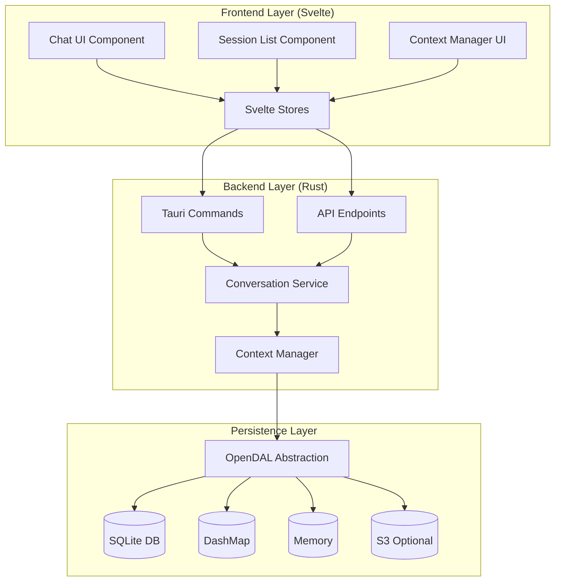

# Chat and Session History Specification

**Version**: 1.0.0  
**Date**: 2025-10-05  
**Status**: Draft

## Table of Contents

1. [Executive Summary](#executive-summary)
2. [System Architecture](#system-architecture)
3. [Backend Specification](#backend-specification)
4. [Frontend Specification](#frontend-specification)
5. [Data Models](#data-models)
6. [API Specification](#api-specification)
7. [Persistence Strategy](#persistence-strategy)
8. [Implementation Roadmap](#implementation-roadmap)
9. [Testing Strategy](#testing-strategy)

---

## Executive Summary

### Objectives

Design and implement a comprehensive chat and session history system for Terraphim AI that:

1. **Persists conversations** across sessions with full message history and context
2. **Enables session management** with create, read, update, delete (CRUD) operations
3. **Maintains context continuity** by preserving global and message-specific context items
4. **Provides efficient retrieval** with pagination, search, and filtering capabilities
5. **Supports multi-device sync** through the existing OpenDAL persistence layer
6. **Optimizes for performance** with intelligent caching and lazy loading

### Key Features

- ✅ **Persistent conversation storage** with SQLite, DashMap, and optional cloud backends
- ✅ **Rich conversation metadata** including creation time, update time, role, and custom tags
- ✅ **Context tracking** for KG terms, documents, and search results within conversations
- ✅ **Session list UI** with preview, timestamps, and quick navigation
- ✅ **Auto-save functionality** preventing data loss
- ✅ **Export/Import capabilities** for conversation backup and sharing
- ✅ **Search and filtering** across conversation history

---

## System Architecture

### High-Level Architecture



### Data Flow

1. **User Input Flow**:
   - User enters message → Frontend validates → Store updates → Backend processes → LLM generates response → Store updates → UI refreshes
   
2. **Session Load Flow**:
   - User selects session → Frontend requests → Backend loads from persistence → Deserializes conversation → Returns to frontend → UI renders

3. **Auto-Save Flow**:
   - User types/receives message → Debounced save trigger → Backend persists → Confirmation returned → UI indicates saved state

---

## Backend Specification

### 1. Core Types (Already Exist in `terraphim_types`)

#### Conversation
```rust
pub struct Conversation {
    pub id: ConversationId,
    pub title: String,
    pub messages: Vec<ChatMessage>,
    pub global_context: Vec<ContextItem>,
    pub role: RoleName,
    pub created_at: DateTime<Utc>,
    pub updated_at: DateTime<Utc>,
    pub metadata: AHashMap<String, String>,
}
```

#### ChatMessage
```rust
pub struct ChatMessage {
    pub id: MessageId,
    pub role: String, // "system" | "user" | "assistant"
    pub content: String,
    pub context_items: Vec<ContextItem>,
    pub created_at: DateTime<Utc>,
    pub token_count: Option<u32>,
    pub model: Option<String>,
}
```

#### ContextItem
```rust
pub struct ContextItem {
    pub id: String,
    pub context_type: ContextType,
    pub title: String,
    pub summary: Option<String>,
    pub content: String,
    pub metadata: AHashMap<String, String>,
    pub created_at: DateTime<Utc>,
    pub relevance_score: Option<f64>,
}
```

### 2. New Service Layer Components

#### ConversationService

**Location**: `crates/terraphim_service/src/conversation_service.rs`

```rust
pub struct ConversationService {
    persistence: Arc<Mutex<ConversationPersistence>>,
    context_manager: Arc<Mutex<ContextManager>>,
    cache: LruCache<ConversationId, Conversation>,
}

impl ConversationService {
    /// Create a new conversation
    pub async fn create_conversation(
        &mut self,
        title: String,
        role: RoleName,
    ) -> Result<Conversation>;
    
    /// Load a conversation by ID
    pub async fn get_conversation(
        &mut self,
        id: &ConversationId,
    ) -> Result<Conversation>;
    
    /// Update an existing conversation
    pub async fn update_conversation(
        &mut self,
        conversation: &Conversation,
    ) -> Result<()>;
    
    /// Delete a conversation
    pub async fn delete_conversation(
        &mut self,
        id: &ConversationId,
    ) -> Result<()>;
    
    /// List all conversations with optional filtering
    pub async fn list_conversations(
        &self,
        filter: ConversationFilter,
    ) -> Result<Vec<ConversationSummary>>;
    
    /// Search conversations by content
    pub async fn search_conversations(
        &self,
        query: &str,
        limit: usize,
    ) -> Result<Vec<ConversationSummary>>;
    
    /// Export conversation to JSON
    pub async fn export_conversation(
        &self,
        id: &ConversationId,
    ) -> Result<String>;
    
    /// Import conversation from JSON
    pub async fn import_conversation(
        &mut self,
        json_data: &str,
    ) -> Result<Conversation>;
    
    /// Get conversation statistics
    pub fn get_statistics(&self) -> ConversationStatistics;
}
```

#### ConversationPersistence

**Location**: `crates/terraphim_persistence/src/conversation.rs`

```rust
use async_trait::async_trait;

#[async_trait]
pub trait ConversationPersistence {
    /// Save a conversation
    async fn save(&self, conversation: &Conversation) -> Result<()>;
    
    /// Load a conversation
    async fn load(&self, id: &ConversationId) -> Result<Conversation>;
    
    /// Delete a conversation
    async fn delete(&self, id: &ConversationId) -> Result<()>;
    
    /// List all conversation IDs
    async fn list_ids(&self) -> Result<Vec<ConversationId>>;
    
    /// Check if a conversation exists
    async fn exists(&self, id: &ConversationId) -> Result<bool>;
}

/// Implementation using OpenDAL
pub struct OpenDALConversationPersistence {
    storage: DeviceStorage,
    cache_ttl: Duration,
}

impl OpenDALConversationPersistence {
    pub fn new() -> Result<Self>;
    
    fn conversation_key(id: &ConversationId) -> String {
        format!("conversations/{}.json", id.as_str())
    }
    
    fn index_key() -> String {
        "conversations/index.json".to_string()
    }
}

#[async_trait]
impl ConversationPersistence for OpenDALConversationPersistence {
    async fn save(&self, conversation: &Conversation) -> Result<()> {
        // Serialize conversation
        let json = serde_json::to_string(conversation)?;
        let key = Self::conversation_key(&conversation.id);
        
        // Save to all operators
        let storage = DeviceStorage::instance().await?;
        for (op, _time) in storage.ops.values() {
            op.write(&key, json.clone()).await?;
        }
        
        // Update index
        self.update_index(conversation).await?;
        
        Ok(())
    }
    
    async fn load(&self, id: &ConversationId) -> Result<Conversation> {
        let key = Self::conversation_key(id);
        let storage = DeviceStorage::instance().await?;
        
        // Load from fastest operator
        let data = storage.fastest_op.read(&key).await?;
        let conversation = serde_json::from_slice(&data)?;
        
        Ok(conversation)
    }
    
    // ... other implementations
}
```

### 3. Enhanced ContextManager

**Location**: `crates/terraphim_service/src/context_manager.rs` (existing)

**New Methods**:
```rust
impl ContextManager {
    /// Archive old conversations
    pub async fn archive_conversation(
        &mut self,
        id: &ConversationId,
    ) -> Result<()>;
    
    /// Restore archived conversation
    pub async fn restore_conversation(
        &mut self,
        id: &ConversationId,
    ) -> Result<()>;
    
    /// Get conversation by date range
    pub async fn get_conversations_by_date(
        &self,
        start: DateTime<Utc>,
        end: DateTime<Utc>,
    ) -> Result<Vec<ConversationSummary>>;
    
    /// Clone conversation for branching
    pub async fn clone_conversation(
        &mut self,
        id: &ConversationId,
        new_title: Option<String>,
    ) -> Result<Conversation>;
}
```

### 4. API Endpoints

**Location**: `terraphim_server/src/api.rs` (existing)

#### New Endpoints

```rust
// GET /api/conversations
// List all conversations with pagination
pub async fn list_conversations(
    Query(params): Query<ListConversationsParams>,
) -> Result<Json<ListConversationsResponse>>;

// GET /api/conversations/:id
// Get a specific conversation
pub async fn get_conversation(
    Path(id): Path<String>,
) -> Result<Json<GetConversationResponse>>;

// POST /api/conversations
// Create a new conversation
pub async fn create_conversation(
    Json(request): Json<CreateConversationRequest>,
) -> Result<Json<CreateConversationResponse>>;

// PUT /api/conversations/:id
// Update conversation metadata (title, role)
pub async fn update_conversation_metadata(
    Path(id): Path<String>,
    Json(request): Json<UpdateConversationRequest>,
) -> Result<Json<UpdateConversationResponse>>;

// DELETE /api/conversations/:id
// Delete a conversation
pub async fn delete_conversation(
    Path(id): Path<String>,
) -> Result<Json<DeleteConversationResponse>>;

// GET /api/conversations/search
// Search conversations by content
pub async fn search_conversations(
    Query(params): Query<SearchConversationsParams>,
) -> Result<Json<SearchConversationsResponse>>;

// POST /api/conversations/:id/export
// Export conversation to JSON
pub async fn export_conversation(
    Path(id): Path<String>,
) -> Result<Response>;

// POST /api/conversations/import
// Import conversation from JSON
pub async fn import_conversation(
    Json(request): Json<ImportConversationRequest>,
) -> Result<Json<ImportConversationResponse>>;

// POST /api/conversations/:id/archive
// Archive a conversation
pub async fn archive_conversation(
    Path(id): Path<String>,
) -> Result<Json<ArchiveConversationResponse>>;
```

### 5. Tauri Commands

**Location**: `desktop/src-tauri/src/cmd.rs` (existing)

#### New Commands

```rust
/// List all conversations
#[command]
pub async fn list_all_conversations(
    skip: Option<usize>,
    limit: Option<usize>,
    filter: Option<ConversationFilter>,
) -> Result<ListConversationsResponse>;

/// Create a new conversation
#[command]
pub async fn create_new_conversation(
    title: String,
    role: String,
) -> Result<CreateConversationResponse>;

/// Load conversation by ID
#[command]
pub async fn load_conversation(
    conversation_id: String,
) -> Result<GetConversationResponse>;

/// Update conversation metadata
#[command]
pub async fn update_conversation_info(
    conversation_id: String,
    title: Option<String>,
    metadata: Option<HashMap<String, String>>,
) -> Result<UpdateConversationResponse>;

/// Delete conversation
#[command]
pub async fn delete_conversation_by_id(
    conversation_id: String,
) -> Result<DeleteConversationResponse>;

/// Search conversations
#[command]
pub async fn search_conversation_history(
    query: String,
    limit: Option<usize>,
) -> Result<SearchConversationsResponse>;

/// Export conversation
#[command]
pub async fn export_conversation_to_file(
    conversation_id: String,
    file_path: String,
) -> Result<ExportConversationResponse>;

/// Import conversation
#[command]
pub async fn import_conversation_from_file(
    file_path: String,
) -> Result<ImportConversationResponse>;

/// Get conversation statistics
#[command]
pub async fn get_conversation_stats() -> Result<ConversationStatistics>;
```

---

## Frontend Specification

### 1. Store Management

**Location**: `desktop/src/lib/stores.ts` (existing)

#### New Stores

```typescript
import { writable, derived, type Writable } from 'svelte/store';

// Current conversation store
export const currentConversation: Writable<Conversation | null> = writable(null);

// Conversation list store
export const conversationList: Writable<ConversationSummary[]> = writable([]);

// Session history filter
export const sessionFilter: Writable<SessionFilter> = writable({
  role: null,
  dateRange: null,
  searchQuery: '',
  showArchived: false,
});

// Loading states
export const loadingConversations = writable(false);
export const savingConversation = writable(false);

// Derived store for filtered conversations
export const filteredConversations = derived(
  [conversationList, sessionFilter],
  ([$list, $filter]) => {
    let filtered = [...$list];
    
    // Filter by role
    if ($filter.role) {
      filtered = filtered.filter(c => c.role === $filter.role);
    }
    
    // Filter by date range
    if ($filter.dateRange) {
      filtered = filtered.filter(c => {
        const date = new Date(c.updated_at);
        return date >= $filter.dateRange.start && date <= $filter.dateRange.end;
      });
    }
    
    // Filter by search query
    if ($filter.searchQuery) {
      const query = $filter.searchQuery.toLowerCase();
      filtered = filtered.filter(c => 
        c.title.toLowerCase().includes(query) ||
        c.preview?.toLowerCase().includes(query)
      );
    }
    
    return filtered;
  }
);

// Auto-save functionality
export function setupAutoSave() {
  let saveTimeout: NodeJS.Timeout;
  
  currentConversation.subscribe(conversation => {
    if (conversation) {
      clearTimeout(saveTimeout);
      saveTimeout = setTimeout(async () => {
        await saveConversation(conversation);
      }, 2000); // Debounce 2 seconds
    }
  });
}

async function saveConversation(conversation: Conversation) {
  savingConversation.set(true);
  try {
    if (get(is_tauri)) {
      await invoke('update_conversation', { conversation });
    } else {
      await fetch(`${CONFIG.ServerURL}/conversations/${conversation.id}`, {
        method: 'PUT',
        headers: { 'Content-Type': 'application/json' },
        body: JSON.stringify(conversation),
      });
    }
  } catch (error) {
    console.error('Failed to save conversation:', error);
  } finally {
    savingConversation.set(false);
  }
}
```

### 2. Session List Component

**Location**: `desktop/src/lib/Chat/SessionList.svelte` (new)

```svelte
<script lang="ts">
  import { invoke } from '@tauri-apps/api/tauri';
  import { is_tauri } from '../stores';
  import { 
    conversationList, 
    currentConversation,
    filteredConversations,
    sessionFilter,
    loadingConversations 
  } from '../stores';
  import { CONFIG } from '../../config';
  
  let showArchived = false;
  let searchQuery = '';
  let selectedRole: string | null = null;
  
  // Load conversations on mount
  onMount(async () => {
    await loadConversations();
  });
  
  async function loadConversations() {
    loadingConversations.set(true);
    try {
      let response;
      if ($is_tauri) {
        response = await invoke('list_all_conversations', {
          skip: 0,
          limit: 100,
          filter: { showArchived }
        });
      } else {
        const res = await fetch(
          `${CONFIG.ServerURL}/conversations?limit=100&archived=${showArchived}`
        );
        response = await res.json();
      }
      conversationList.set(response.conversations);
    } catch (error) {
      console.error('Failed to load conversations:', error);
    } finally {
      loadingConversations.set(false);
    }
  }
  
  async function selectConversation(id: string) {
    try {
      let response;
      if ($is_tauri) {
        response = await invoke('load_conversation', { 
          conversation_id: id 
        });
      } else {
        const res = await fetch(`${CONFIG.ServerURL}/conversations/${id}`);
        response = await res.json();
      }
      currentConversation.set(response.conversation);
    } catch (error) {
      console.error('Failed to load conversation:', error);
    }
  }
  
  async function createNewConversation() {
    try {
      let response;
      if ($is_tauri) {
        response = await invoke('create_new_conversation', {
          title: 'New Conversation',
          role: $currentRole
        });
      } else {
        const res = await fetch(`${CONFIG.ServerURL}/conversations`, {
          method: 'POST',
          headers: { 'Content-Type': 'application/json' },
          body: JSON.stringify({
            title: 'New Conversation',
            role: $currentRole
          })
        });
        response = await res.json();
      }
      currentConversation.set(response.conversation);
      await loadConversations();
    } catch (error) {
      console.error('Failed to create conversation:', error);
    }
  }
  
  async function deleteConversation(id: string) {
    if (!confirm('Are you sure you want to delete this conversation?')) {
      return;
    }
    
    try {
      if ($is_tauri) {
        await invoke('delete_conversation_by_id', { 
          conversation_id: id 
        });
      } else {
        await fetch(`${CONFIG.ServerURL}/conversations/${id}`, {
          method: 'DELETE'
        });
      }
      await loadConversations();
      if ($currentConversation?.id.0 === id) {
        currentConversation.set(null);
      }
    } catch (error) {
      console.error('Failed to delete conversation:', error);
    }
  }
  
  function formatDate(dateString: string): string {
    const date = new Date(dateString);
    const now = new Date();
    const diffMs = now.getTime() - date.getTime();
    const diffMins = Math.floor(diffMs / 60000);
    const diffHours = Math.floor(diffMs / 3600000);
    const diffDays = Math.floor(diffMs / 86400000);
    
    if (diffMins < 60) return `${diffMins}m ago`;
    if (diffHours < 24) return `${diffHours}h ago`;
    if (diffDays < 7) return `${diffDays}d ago`;
    return date.toLocaleDateString();
  }
</script>

<div class="session-list">
  <div class="session-list-header">
    <h3>Conversations</h3>
    <button 
      class="button is-primary is-small" 
      on:click={createNewConversation}
    >
      <span class="icon"><i class="fas fa-plus"></i></span>
      <span>New</span>
    </button>
  </div>
  
  <div class="session-filters">
    <div class="field">
      <div class="control has-icons-left">
        <input 
          class="input is-small" 
          type="text" 
          placeholder="Search conversations..."
          bind:value={searchQuery}
          on:input={() => sessionFilter.update(f => ({ ...f, searchQuery }))}
        />
        <span class="icon is-small is-left">
          <i class="fas fa-search"></i>
        </span>
      </div>
    </div>
    
    <div class="field">
      <label class="checkbox">
        <input type="checkbox" bind:checked={showArchived} on:change={loadConversations} />
        Show archived
      </label>
    </div>
  </div>
  
  {#if $loadingConversations}
    <div class="loading-spinner">
      <span class="icon">
        <i class="fas fa-spinner fa-pulse"></i>
      </span>
      Loading conversations...
    </div>
  {:else if $filteredConversations.length === 0}
    <div class="empty-state">
      <p>No conversations yet</p>
      <button class="button is-primary" on:click={createNewConversation}>
        Start a conversation
      </button>
    </div>
  {:else}
    <div class="session-items">
      {#each $filteredConversations as conversation (conversation.id.0)}
        <div 
          class="session-item" 
          class:active={$currentConversation?.id.0 === conversation.id.0}
          on:click={() => selectConversation(conversation.id.0)}
          on:keydown={(e) => e.key === 'Enter' && selectConversation(conversation.id.0)}
          role="button"
          tabindex="0"
        >
          <div class="session-item-content">
            <div class="session-title">{conversation.title}</div>
            <div class="session-preview">{conversation.preview || 'No messages yet'}</div>
            <div class="session-meta">
              <span class="session-role">
                <i class="fas fa-user-tag"></i>
                {conversation.role}
              </span>
              <span class="session-date">
                <i class="fas fa-clock"></i>
                {formatDate(conversation.updated_at)}
              </span>
              <span class="session-count">
                <i class="fas fa-comment"></i>
                {conversation.message_count}
              </span>
            </div>
          </div>
          <div class="session-actions">
            <button 
              class="button is-small is-danger is-outlined"
              on:click|stopPropagation={() => deleteConversation(conversation.id.0)}
              title="Delete conversation"
            >
              <span class="icon is-small">
                <i class="fas fa-trash"></i>
              </span>
            </button>
          </div>
        </div>
      {/each}
    </div>
  {/if}
</div>

<style>
  .session-list {
    display: flex;
    flex-direction: column;
    height: 100%;
    border-right: 1px solid var(--border-color);
    background: var(--background);
  }
  
  .session-list-header {
    display: flex;
    justify-content: space-between;
    align-items: center;
    padding: 1rem;
    border-bottom: 1px solid var(--border-color);
  }
  
  .session-filters {
    padding: 0.75rem 1rem;
    border-bottom: 1px solid var(--border-color);
  }
  
  .session-items {
    flex: 1;
    overflow-y: auto;
    padding: 0.5rem;
  }
  
  .session-item {
    display: flex;
    align-items: center;
    padding: 0.75rem;
    margin-bottom: 0.5rem;
    border-radius: 6px;
    cursor: pointer;
    transition: background-color 0.2s;
    border: 1px solid var(--border-color);
  }
  
  .session-item:hover {
    background-color: var(--hover-background);
  }
  
  .session-item.active {
    background-color: var(--primary-light);
    border-color: var(--primary);
  }
  
  .session-item-content {
    flex: 1;
    min-width: 0;
  }
  
  .session-title {
    font-weight: 600;
    font-size: 0.95rem;
    margin-bottom: 0.25rem;
    white-space: nowrap;
    overflow: hidden;
    text-overflow: ellipsis;
  }
  
  .session-preview {
    font-size: 0.85rem;
    color: var(--text-light);
    white-space: nowrap;
    overflow: hidden;
    text-overflow: ellipsis;
    margin-bottom: 0.5rem;
  }
  
  .session-meta {
    display: flex;
    gap: 0.75rem;
    font-size: 0.75rem;
    color: var(--text-light);
  }
  
  .session-meta span {
    display: flex;
    align-items: center;
    gap: 0.25rem;
  }
  
  .session-actions {
    margin-left: 0.5rem;
  }
  
  .empty-state {
    display: flex;
    flex-direction: column;
    align-items: center;
    justify-content: center;
    padding: 2rem;
    text-align: center;
    color: var(--text-light);
  }
  
  .loading-spinner {
    display: flex;
    align-items: center;
    justify-content: center;
    padding: 2rem;
    color: var(--text-light);
  }
</style>
```

### 3. Enhanced Chat Component

**Location**: `desktop/src/lib/Chat/Chat.svelte` (existing - enhance)

**Key Enhancements**:
```svelte
<script lang="ts">
  // ... existing imports
  import SessionList from './SessionList.svelte';
  import { currentConversation, setupAutoSave } from '../stores';
  
  // Setup auto-save on mount
  onMount(() => {
    setupAutoSave();
    // ... existing mount logic
  });
  
  // Load from current conversation if set
  $: if ($currentConversation) {
    conversationId = $currentConversation.id.0;
    messages = $currentConversation.messages.map(m => ({
      role: m.role,
      content: m.content
    }));
    contextItems = $currentConversation.global_context;
  }
</script>

<div class="chat-container">
  <!-- Session list sidebar -->
  <div class="session-sidebar" class:hidden={!showSessions}>
    <SessionList />
  </div>
  
  <!-- Main chat area -->
  <div class="chat-main">
    <!-- Toggle session list button -->
    <button 
      class="button is-small session-toggle"
      on:click={() => showSessions = !showSessions}
    >
      <span class="icon">
        <i class="fas fa-bars"></i>
      </span>
    </button>
    
    <!-- Existing chat UI -->
    <!-- ... -->
  </div>
</div>

<style>
  .chat-container {
    display: flex;
    height: 100%;
  }
  
  .session-sidebar {
    width: 300px;
    transition: transform 0.3s ease;
  }
  
  .session-sidebar.hidden {
    transform: translateX(-100%);
    width: 0;
  }
  
  .chat-main {
    flex: 1;
    display: flex;
    flex-direction: column;
    position: relative;
  }
  
  .session-toggle {
    position: absolute;
    top: 1rem;
    left: 1rem;
    z-index: 10;
  }
</style>
```

---

## Data Models

### Request/Response Types

```typescript
// List Conversations
interface ListConversationsParams {
  skip?: number;
  limit?: number;
  role?: string;
  showArchived?: boolean;
  sortBy?: 'created_at' | 'updated_at' | 'title';
  sortOrder?: 'asc' | 'desc';
}

interface ListConversationsResponse {
  conversations: ConversationSummary[];
  total: number;
  skip: number;
  limit: number;
}

// Create Conversation
interface CreateConversationRequest {
  title: string;
  role: string;
  metadata?: Record<string, string>;
}

interface CreateConversationResponse {
  status: 'success' | 'error';
  conversation?: Conversation;
  error?: string;
}

// Update Conversation
interface UpdateConversationRequest {
  title?: string;
  role?: string;
  metadata?: Record<string, string>;
}

interface UpdateConversationResponse {
  status: 'success' | 'error';
  conversation?: Conversation;
  error?: string;
}

// Search Conversations
interface SearchConversationsParams {
  query: string;
  limit?: number;
  role?: string;
}

interface SearchConversationsResponse {
  conversations: ConversationSummary[];
  total: number;
}

// Conversation Statistics
interface ConversationStatistics {
  total_conversations: number;
  total_messages: number;
  total_context_items: number;
  conversations_by_role: Record<string, number>;
  average_messages_per_conversation: number;
  most_active_day: string;
}

// Session Filter
interface SessionFilter {
  role: string | null;
  dateRange: { start: Date; end: Date } | null;
  searchQuery: string;
  showArchived: boolean;
}
```

---

## Persistence Strategy

### Storage Structure

```
conversations/
  index.json                 # Index of all conversation IDs with metadata
  {conversation-id}.json     # Individual conversation files
  archive/
    {conversation-id}.json   # Archived conversations
```

### Index File Format

```json
{
  "version": "1.0.0",
  "updated_at": "2025-10-05T12:00:00Z",
  "conversations": [
    {
      "id": "uuid-1",
      "title": "Machine Learning Discussion",
      "role": "Terraphim Engineer",
      "message_count": 15,
      "created_at": "2025-10-05T10:00:00Z",
      "updated_at": "2025-10-05T11:30:00Z",
      "archived": false
    }
  ]
}
```

### Conversation File Format

```json
{
  "id": "uuid-1",
  "title": "Machine Learning Discussion",
  "role": "Terraphim Engineer",
  "messages": [
    {
      "id": "msg-uuid-1",
      "role": "user",
      "content": "What is gradient descent?",
      "context_items": [],
      "created_at": "2025-10-05T10:00:00Z",
      "token_count": null,
      "model": null
    },
    {
      "id": "msg-uuid-2",
      "role": "assistant",
      "content": "Gradient descent is an optimization algorithm...",
      "context_items": [
        {
          "id": "ctx-1",
          "context_type": "KGTermDefinition",
          "title": "gradient descent",
          "content": "...",
          "created_at": "2025-10-05T10:00:05Z"
        }
      ],
      "created_at": "2025-10-05T10:00:10Z",
      "token_count": 150,
      "model": "gpt-4"
    }
  ],
  "global_context": [],
  "created_at": "2025-10-05T10:00:00Z",
  "updated_at": "2025-10-05T11:30:00Z",
  "metadata": {
    "tags": "ml, optimization",
    "starred": "false"
  }
}
```

### Caching Strategy

1. **In-Memory LRU Cache**:
   - Keep last 10 accessed conversations in memory
   - Cache TTL: 5 minutes
   - Evict least recently used when limit reached

2. **Index Caching**:
   - Cache conversation index in memory
   - Refresh on create/delete operations
   - Lazy load individual conversations

3. **Auto-Save Debouncing**:
   - Debounce saves for 2 seconds
   - Queue pending saves
   - Immediate save on navigate away

---

## Implementation Roadmap

### Phase 1: Backend Foundation (Week 1-2)
- ✅ Already have: Core types in `terraphim_types`
- [ ] Implement `ConversationPersistence` trait
- [ ] Implement `OpenDALConversationPersistence`
- [ ] Create `ConversationService` with CRUD operations
- [ ] Add new API endpoints to `terraphim_server`
- [ ] Add new Tauri commands to `desktop/src-tauri`
- [ ] Write unit tests for persistence layer

### Phase 2: Frontend UI (Week 3-4)
- [ ] Create `SessionList.svelte` component
- [ ] Add conversation stores to `stores.ts`
- [ ] Implement auto-save functionality
- [ ] Enhance `Chat.svelte` with session management
- [ ] Add session sidebar toggle
- [ ] Create conversation metadata editor
- [ ] Write component tests

### Phase 3: Search & Filtering (Week 5)
- [ ] Implement full-text search in backend
- [ ] Add filtering by role, date, tags
- [ ] Create search UI components
- [ ] Add keyboard shortcuts for navigation
- [ ] Implement conversation starring/pinning

### Phase 4: Import/Export (Week 6)
- [ ] Implement JSON export functionality
- [ ] Implement JSON import with validation
- [ ] Add bulk export (all conversations)
- [ ] Create export format documentation
- [ ] Add import conflict resolution

### Phase 5: Polish & Optimization (Week 7-8)
- [ ] Performance optimization for large histories
- [ ] Add pagination for message loading
- [ ] Implement virtual scrolling for long conversations
- [ ] Add conversation analytics dashboard
- [ ] Create user documentation
- [ ] Comprehensive end-to-end testing

---

## Testing Strategy

### Backend Tests

```rust
// tests/conversation_persistence_test.rs
#[tokio::test]
async fn test_save_and_load_conversation() {
    let persistence = OpenDALConversationPersistence::new().unwrap();
    let conversation = create_test_conversation();
    
    // Save
    persistence.save(&conversation).await.unwrap();
    
    // Load
    let loaded = persistence.load(&conversation.id).await.unwrap();
    assert_eq!(conversation.id, loaded.id);
    assert_eq!(conversation.messages.len(), loaded.messages.len());
}

#[tokio::test]
async fn test_list_conversations() {
    let service = ConversationService::new().await.unwrap();
    
    // Create multiple conversations
    for i in 0..5 {
        service.create_conversation(
            format!("Test {}", i),
            RoleName::new("Test Role"),
        ).await.unwrap();
    }
    
    // List
    let list = service.list_conversations(
        ConversationFilter::default()
    ).await.unwrap();
    
    assert_eq!(list.len(), 5);
}

#[tokio::test]
async fn test_search_conversations() {
    let service = ConversationService::new().await.unwrap();
    
    // Search
    let results = service.search_conversations(
        "machine learning",
        10,
    ).await.unwrap();
    
    assert!(results.len() > 0);
}
```

### Frontend Tests

```typescript
// tests/SessionList.test.ts
import { render, fireEvent, waitFor } from '@testing-library/svelte';
import SessionList from '../src/lib/Chat/SessionList.svelte';

describe('SessionList', () => {
  it('loads conversations on mount', async () => {
    const { getByText } = render(SessionList);
    
    await waitFor(() => {
      expect(getByText(/Test Conversation/)).toBeInTheDocument();
    });
  });
  
  it('creates new conversation', async () => {
    const { getByText } = render(SessionList);
    const newButton = getByText(/New/);
    
    await fireEvent.click(newButton);
    
    await waitFor(() => {
      expect(getByText(/New Conversation/)).toBeInTheDocument();
    });
  });
  
  it('filters conversations by search', async () => {
    const { getByPlaceholderText, queryByText } = render(SessionList);
    const search = getByPlaceholderText(/Search conversations/);
    
    await fireEvent.input(search, { target: { value: 'machine learning' } });
    
    expect(queryByText(/Machine Learning Discussion/)).toBeInTheDocument();
    expect(queryByText(/Rust Tutorial/)).not.toBeInTheDocument();
  });
});
```

---

## Appendix

### A. File Structure

```
terraphim-ai/
├── crates/
│   ├── terraphim_types/
│   │   └── src/
│   │       └── lib.rs              # Already has Conversation types
│   ├── terraphim_persistence/
│   │   └── src/
│   │       ├── conversation.rs      # NEW: Conversation persistence
│   │       └── lib.rs
│   └── terraphim_service/
│       └── src/
│           ├── conversation_service.rs  # NEW: Service layer
│           ├── context_manager.rs       # ENHANCE: Add new methods
│           └── lib.rs
├── desktop/
│   ├── src/
│   │   └── lib/
│   │       ├── Chat/
│   │       │   ├── Chat.svelte          # ENHANCE: Add session UI
│   │       │   ├── SessionList.svelte   # NEW: Session list
│   │       │   └── SessionItem.svelte   # NEW: Session item
│   │       └── stores.ts                # ENHANCE: Add conversation stores
│   └── src-tauri/
│       └── src/
│           └── cmd.rs                   # ENHANCE: Add commands
├── terraphim_server/
│   └── src/
│       └── api.rs                       # ENHANCE: Add API endpoints
├── docs/
│   └── specifications/
│       └── chat-session-history-spec.md # THIS DOCUMENT
└── tests/
    ├── conversation_persistence_test.rs # NEW: Backend tests
    └── session_list_test.ts             # NEW: Frontend tests
```

### B. Dependencies

**Rust**:
```toml
# No new dependencies required - using existing:
# - opendal for persistence
# - serde/serde_json for serialization
# - chrono for timestamps
# - tokio for async
# - uuid for IDs
```

**TypeScript/JavaScript**:
```json
// No new dependencies required - using existing:
// - svelte for UI
// - @tauri-apps/api for Tauri commands
// - bulma for styling
```

### C. Migration Strategy

For users with existing conversations:

1. **Backward Compatibility**: Maintain support for old localStorage format
2. **Automatic Migration**: On first load, detect old format and migrate to new structure
3. **Migration Script**: Provide `migrate_conversations` command
4. **Backup**: Create backup before migration

### D. Future Enhancements

- **Real-time Sync**: WebSocket-based real-time updates across devices
- **Conversation Branching**: Create branches from any message point
- **Collaborative Sessions**: Share conversations with others
- **Voice Input/Output**: Integration with speech recognition/synthesis
- **Advanced Analytics**: Conversation insights, topic modeling, sentiment analysis
- **AI-Powered Search**: Semantic search across all conversations
- **Conversation Templates**: Pre-configured conversation starters
- **Export Formats**: PDF, Markdown, HTML in addition to JSON

---

## Conclusion

This specification provides a comprehensive blueprint for implementing robust chat and session history functionality in Terraphim AI. The design leverages existing infrastructure (OpenDAL, Svelte, Tauri) while adding minimal new dependencies. The phased implementation approach ensures steady progress with testable milestones.

**Next Steps**:
1. Review and approve this specification
2. Create GitHub issues for each phase
3. Begin Phase 1: Backend Foundation
4. Set up CI/CD for automated testing
5. Document implementation progress

---

**Document Version**: 1.0.0  
**Last Updated**: 2025-10-05  
**Status**: Ready for Review
