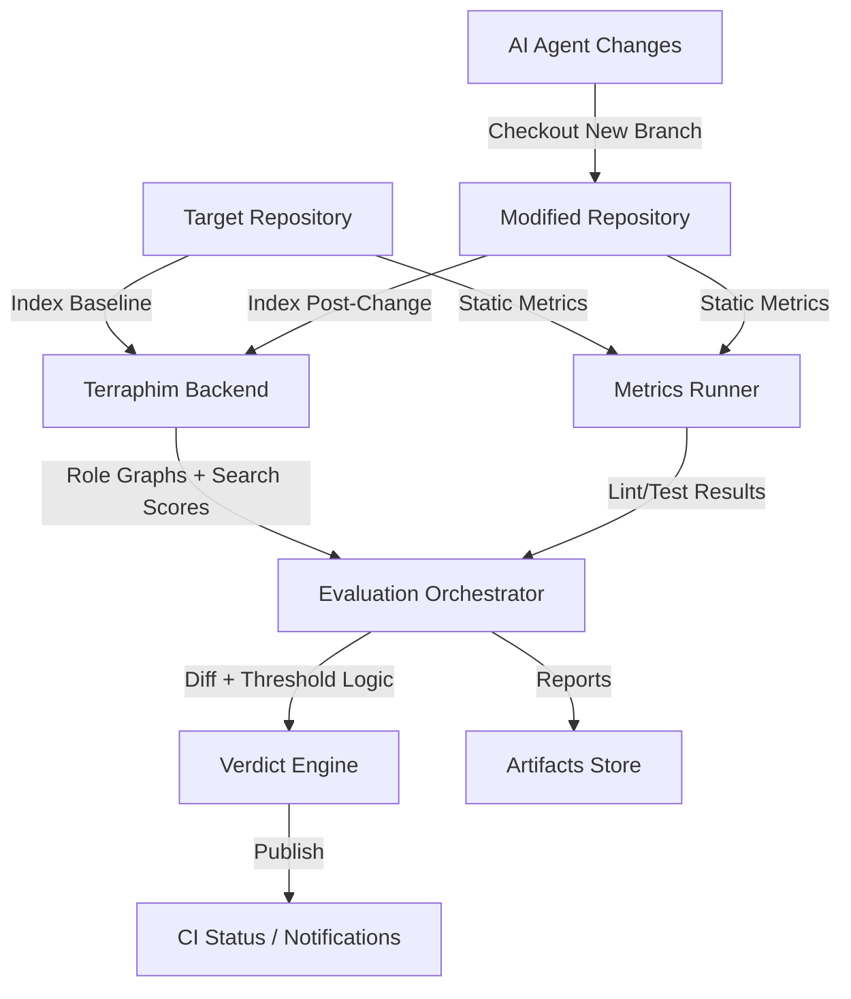

# Terraphim-Based Codebase Evaluation Check

## Purpose and Scope
- Establish a deterministic, repeatable process for assessing whether an AI agent improves or degrades a codebase.
- Use Terraphim AI's local knowledge graphs, deterministic search, and metrics aggregation to provide quantitative and qualitative comparisons of "before" and "after" states.
- Integrate with existing CI/CD pipelines so that evaluation results can gate merges or trigger alerts.

## Architectural Overview

### Key Subsystems
1. **Terraphim Backend Services**
   - Provides haystack indexing, rolegraph construction, and deterministic query scoring.
   - Runs via `cargo run` or containerized deployment (from `release/v0.2.3/docker-run.sh`).
   - Exposes REST/WebSocket APIs consumed by the orchestrator.

2. **Evaluation Orchestrator**
   - Automation layer (Rust, Python, or shell) that coordinates repository cloning, Terraphim API calls, metrics execution, and result comparison.
   - Maintains run manifests (JSON/YAML) describing haystacks, roles, queries, and thresholds.
   - Emits structured reports (Markdown/JSON) for downstream analysis.

3. **Metrics Runner**
   - Executes supplemental tooling: `cargo clippy`, `cargo test`, coverage tools, `tokei`, etc.
   - Normalizes outputs into comparable metrics (counts, pass/fail, severity levels).

4. **Verdict Engine**
   - Applies scoring heuristics, weights, and thresholds to classify outcomes as **Improved**, **Degraded**, or **Neutral**.
   - Supports pluggable strategies (e.g., weighted averages, scorecards, rule-based gates).

5. **Artifacts Store**
   - Local directory or S3 bucket configured via Terraphim's storage adapters.
   - Stores baseline/post-change indices, knowledge graph snapshots, reports, and raw logs.

6. **User Interfaces**
   - **TUI** (`cargo build -p terraphim_tui --features repl-full --release`) for exploratory analysis and manual confirmation.
   - **CI Integration** (GitHub Actions, GitLab, Jenkins) for automated gating.

## Data Model
- **Haystack Descriptor**
  - `id`, `path`, `commit_sha`, `metadata` (branch, timestamp, agent info).
- **Role Definition**
  - `role_id`, `description`, `term_sets` (Aho-Corasick dictionaries), `scoring_weights`.
- **Query Spec**
  - `query_text`, `role_id`, `expected_signal` (increase/decrease), `confidence_threshold`.
- **Metric Record**
  - `metric_id`, `tool`, `value_before`, `value_after`, `delta`, `pass_fail`.
- **Evaluation Report**
  - Aggregates per-role scores, metrics deltas, verdict, and narrative summary.

## Workflow Breakdown

### 1. Environment Provisioning
- Install Terraphim backend using bundled scripts (`install.sh` or Docker).
- Configure environment variables (`LOG_LEVEL`, `TERRAPHIM_DATA_PATH`, optional S3 credentials).
- Start backend server and ensure orchestrator credentials (API token) are available.

### 2. Baseline Capture
- Checkout target repository at baseline commit/branch.
- Register haystack via Terraphim API with metadata `state: baseline`.
- Execute indexing and rolegraph creation for predefined roles.
- Run baseline metrics suite; persist raw outputs.

### 3. Post-Change Capture
- Apply AI agent modifications (pull request branch, patch, or generated files).
- Register new haystack with metadata `state: candidate` referencing baseline ID.
- Rebuild knowledge graphs and rerun identical queries/metrics.

### 4. Comparative Analysis
- Compute deltas for:
  - Rolegraph scores (Aho-Corasick matches, graph density, entity counts).
  - Static metrics (lint warnings, test failures, LOC changes, coverage shifts).
  - Optional runtime benchmarks (via Firecracker VM integration).
- Normalize to percentage or categorical outcomes (improved/regressed/no change).

### 5. Verdict Determination
- Example rule set:
  - **Critical regressions** (new test failures, security alerts) → immediate **Degraded**.
  - Weighted score increase ≥ 10% with no critical regressions → **Improved**.
  - Score decrease ≤ 5% or mixed signals → **Neutral** pending review.
- Provide detailed rationale referencing metric IDs and query outputs.

### 6. Reporting & Publishing
- Generate Markdown/JSON summary containing:
  - Metadata (repository, commits, agent identity, run timestamps).
  - Table of metrics with before/after/delta columns.
  - Knowledge graph statistics per role.
  - Natural-language assessment produced via TUI chat (optional) for context.
- Publish artifacts to CI pipelines, chat notifications, or dashboards.

## Roles and Queries Library
| Role | Focus Area | Sample Queries | Metrics Alignment |
|------|------------|----------------|-------------------|
| Code Reviewer | Bug detection, maintainability | "highlight potential bugs", "areas needing refactor" | `cargo clippy`, TODO count, cyclomatic complexity |
| Performance Analyst | Efficiency & scaling | "find performance bottlenecks", "hot path optimization" | Benchmark suite, profiling data |
| Security Auditor | Vulnerability surface | "authentication weaknesses", "injection risks" | Static analyzers, dependency checks |
| Documentation Steward | Knowledge transfer | "missing docs", "outdated comments" | Documentation coverage, README diff |

- Roles stored as YAML under `terraphim_settings/roles/` to enable reuse.
- Query expectations include directionality (increase desired vs. decrease desired) for verdict logic.

## Automation Blueprint
1. **CLI Wrapper**
   - Provide `scripts/evaluate-agent.sh` encapsulating orchestration logic.
   - Flags for baseline ref, candidate ref, agent label, and output directory.

2. **CI Job**
   - Step 1: Checkout baseline and run wrapper with `--mode baseline` caching artifacts.
   - Step 2: Checkout PR branch, run wrapper with `--mode candidate` referencing baseline cache.
   - Step 3: Upload report, set commit status (success/failure) based on verdict.

3. **TUI Session Template**
   - Provide `.tui` script with `/search`, `/chat`, `/commands` steps for manual auditors.

## Security & Compliance Considerations
- All processing remains local; no external LLM calls unless explicitly enabled.
- Leverage Terraphim role-based access controls to restrict haystack visibility.
- Sanitize logs to avoid leaking proprietary code snippets; store reports in encrypted volumes or secured S3 buckets.
- Validate agent provenance and sign evaluation reports to prevent tampering.

## Extensibility Roadmap
- **Graph Analytics**: Integrate additional graph metrics (centrality, clustering coefficient) to detect structural changes.
- **Machine Learning Scorers**: Optional plugin to learn weighted heuristics from historical evaluations.
- **Multi-Agent Scenarios**: Compare multiple candidate branches in parallel and recommend best-performing change.
- **IDE Feedback Loop**: Surface evaluation insights directly within developer IDEs via Terraphim's API.
- **Historical Trends Dashboard**: Persist evaluation history for regression detection over time.

## Implementation Phases
1. **Prototype**
   - Manual scripts leveraging Terraphim CLI/TUI.
   - Limited role set (Reviewer, Security) and core metrics.
2. **Automation**
   - Build orchestrator service, integrate CI, and establish artifact storage conventions.
3. **Scaling**
   - Add role/metric customization UI, extend to multiple repositories, and enable multi-tenant storage.

## Open Questions
- How to calibrate score thresholds across heterogeneous repositories?
- Should certain file types (generated assets) be excluded from haystack indexing by default?
- What governance model determines acceptance criteria for high-risk domains (security, compliance)?
