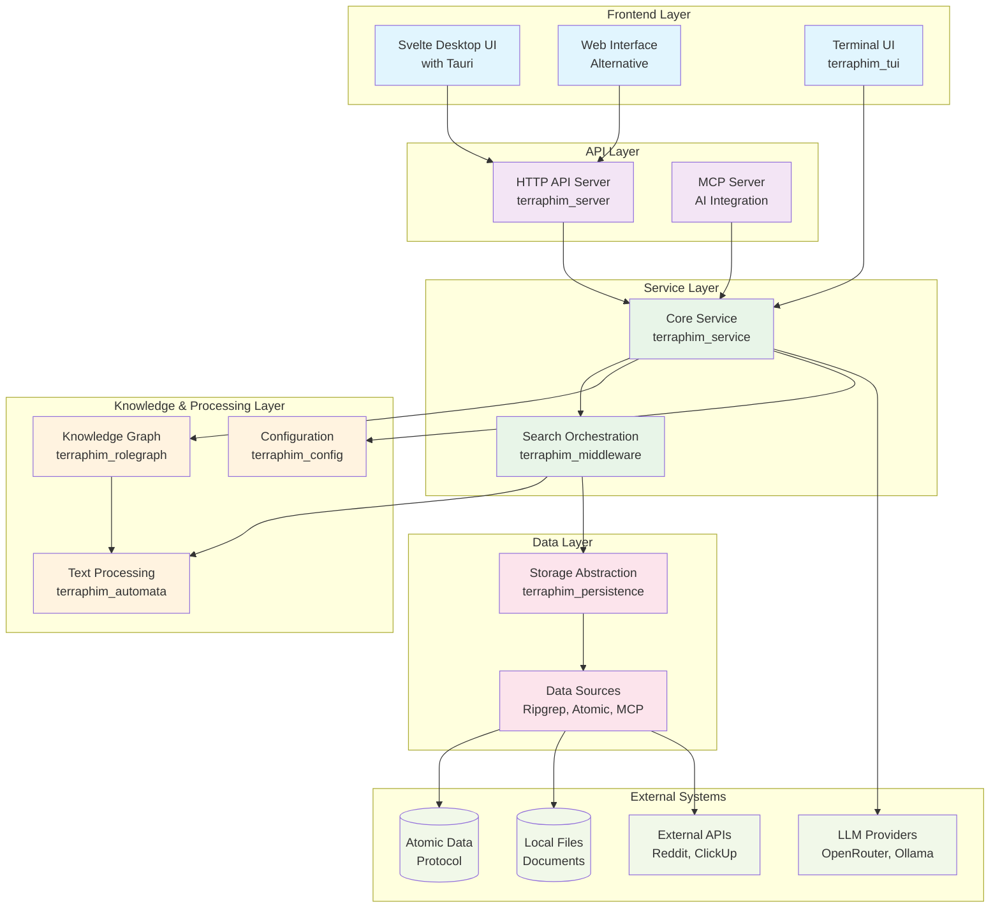
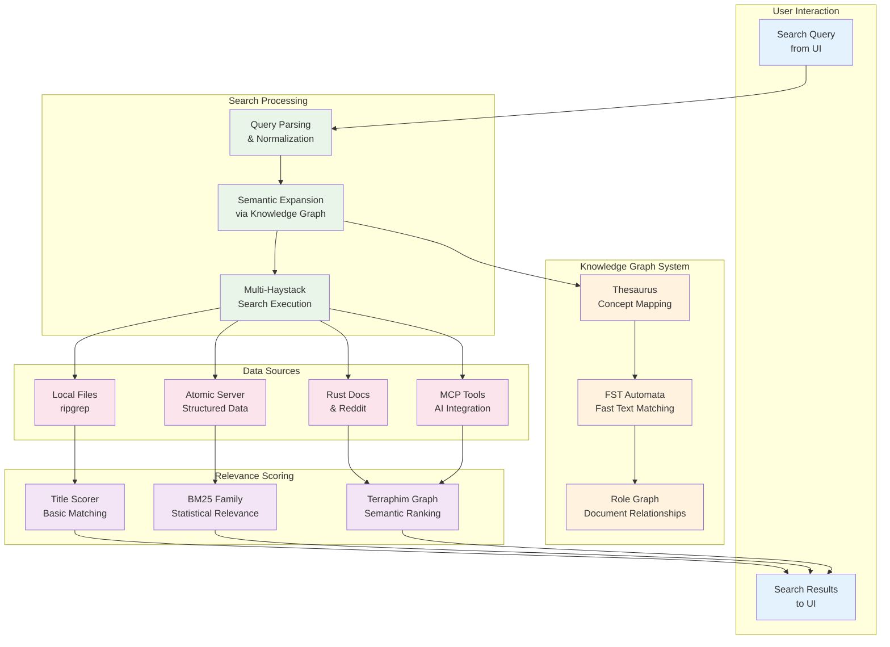
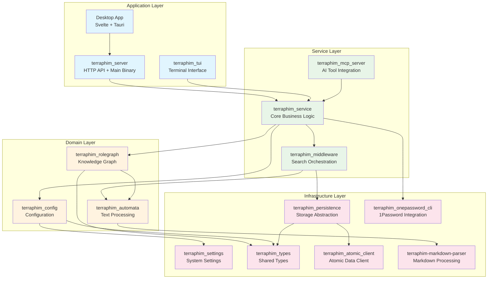
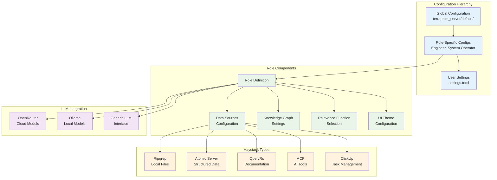
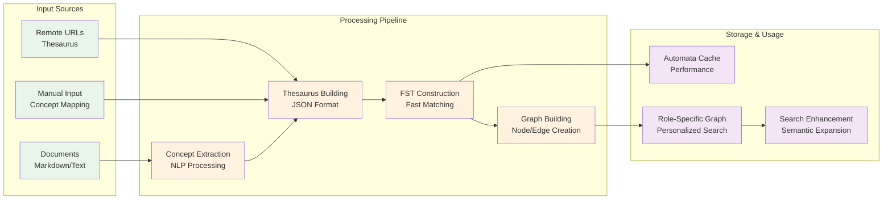
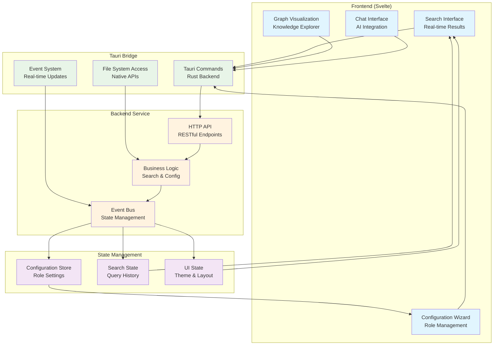
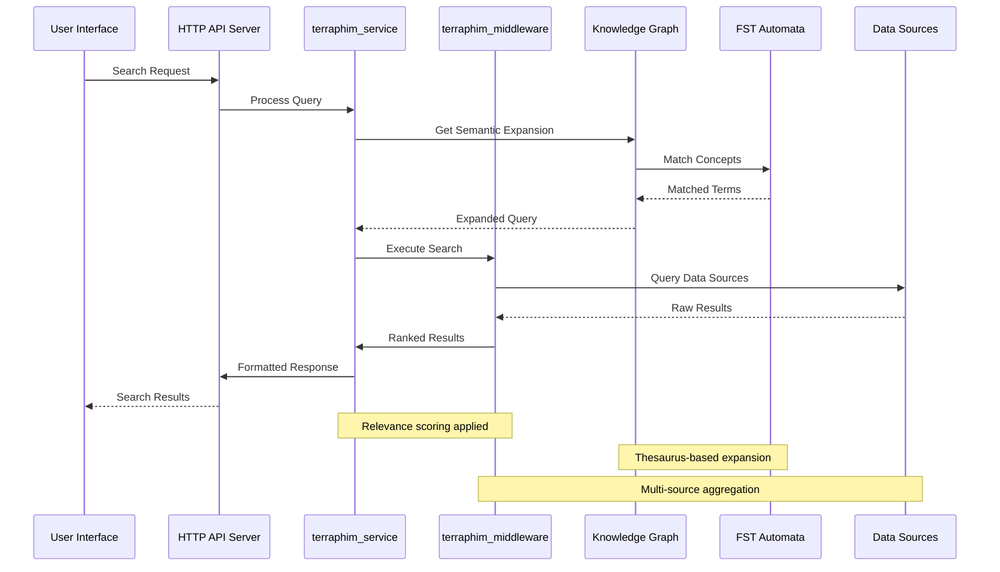
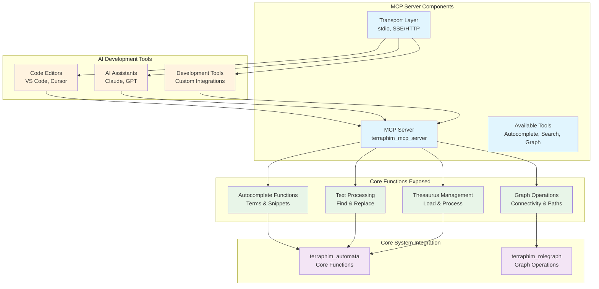

# Terraphim AI Architecture

This document provides a comprehensive architectural overview of Terraphim AI, a privacy-first AI assistant that operates locally, providing semantic search across multiple knowledge repositories.

## Overall System Architecture

The system follows a multi-layered architecture with clear separation of concerns:

## Core Components Architecture

### Search and Knowledge Processing Flow

## Crate Dependency Architecture

## Configuration and Role System

## Knowledge Graph Processing Pipeline

## Desktop Application Architecture

## Data Flow Architecture

## MCP (Model Context Protocol) Integration

## Performance and Scalability Considerations

### Memory Management
- **Automata Caching**: FST structures cached in memory for fast access
- **Bounded Channels**: Backpressure management for async operations
- **Lazy Loading**: Knowledge graphs loaded on demand

### Concurrency Architecture
- **tokio Runtime**: Async/await pattern throughout
- **Structured Concurrency**: Scoped tasks with proper cancellation
- **Channel-based Communication**: mpsc, broadcast, oneshot patterns

### Optimization Strategies
- **Multi-source Search**: Parallel haystack querying
- **Relevance Function Selection**: Performance vs. accuracy tradeoffs
- **Progressive Timeouts**: Quick health checks, longer searches
- **Resource Limits**: Configurable limits for responsive UI

## Security Architecture

### Privacy-First Design
- **Local Processing**: All AI operations can run locally
- **No Data Transmission**: Optional cloud features only
- **Secure Storage**: Encrypted configuration options
- **Access Control**: Role-based permission system

### Authentication & Authorization
- **Atomic Server**: Base64 encoded secrets
- **API Keys**: Secure storage for external services
- **1Password Integration**: Credential management
- **OAuth Support**: Token-based authentication

## Deployment Architecture

### Desktop Deployment
- **Tauri Application**: Native desktop with web frontend
- **Embedded Server**: HTTP server runs in background
- **Auto-updates**: Built-in update mechanism
- **Cross-platform**: Windows, macOS, Linux support

### Development Environment
- **Rust Workspace**: Multi-crate project structure
- **Hot Reload**: Frontend development with Vite
- **Testing Strategy**: Unit, integration, and E2E tests
- **CI/CD Pipeline**: Automated builds and releases

This architecture provides a comprehensive view of the Terraphim AI system, showing how components interact to deliver a privacy-first, locally-operated AI assistant with advanced semantic search capabilities.
