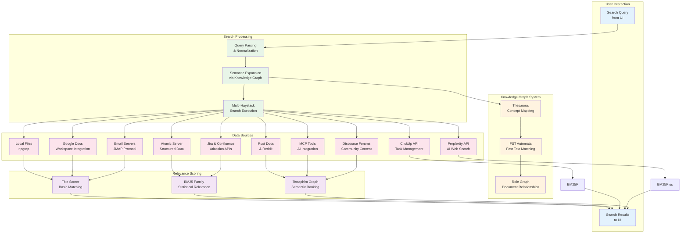
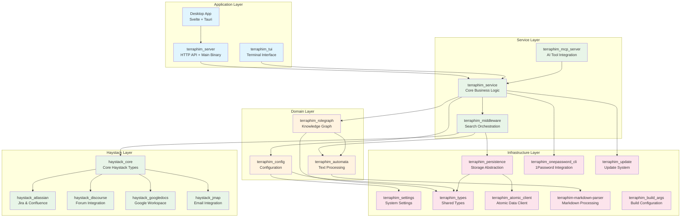
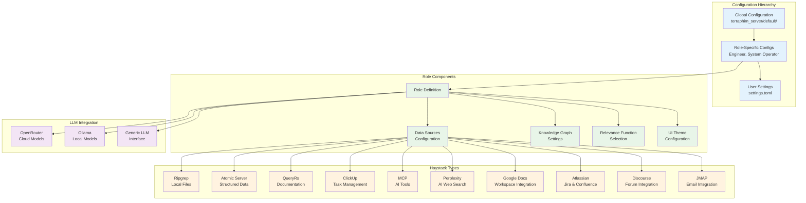
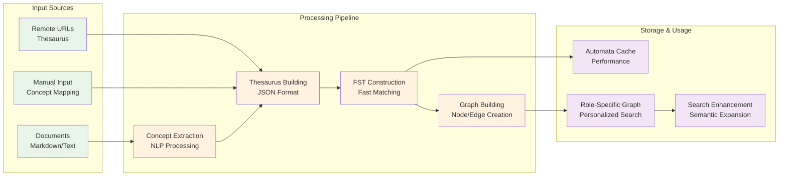
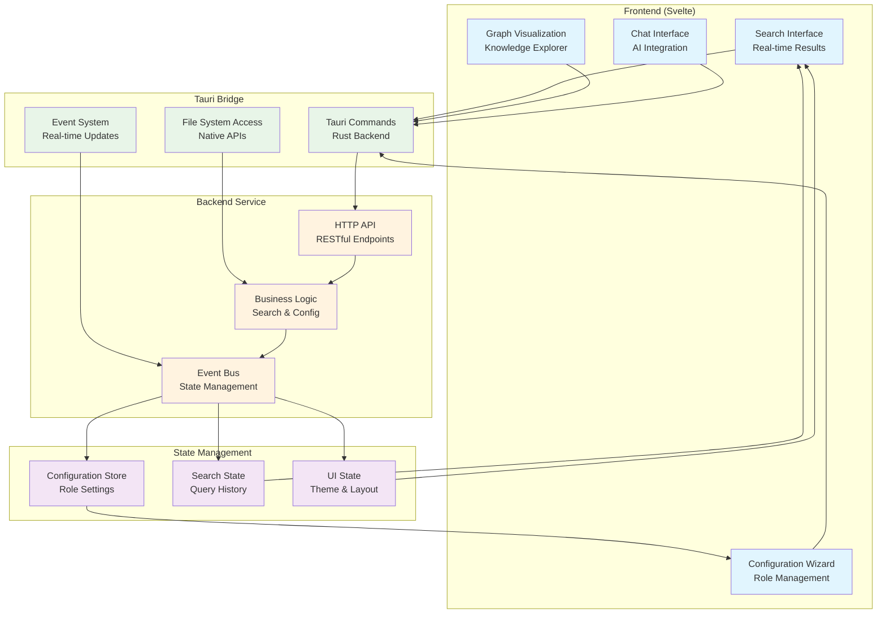
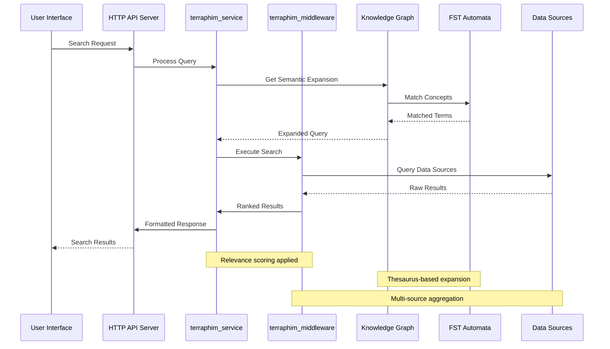
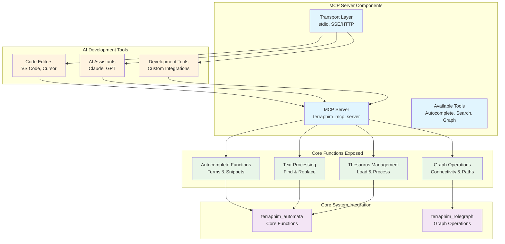

# Terraphim AI Architecture

This document provides a comprehensive architectural overview of Terraphim AI, a privacy-first AI assistant that operates locally, providing semantic search across multiple knowledge repositories.

## Overall System Architecture

The system follows a multi-layered architecture with clear separation of concerns:

```mermaid
graph TB
    subgraph "Frontend Layer"
        UI[Svelte Desktop UI<br/>with Tauri]
        WebUI[Web Interface<br/>Alternative]
        TUI[Terminal UI<br/>terraphim_tui]
        VSCODE[VS Code Extension<br/>TypeScript]
        NODEJS[Node.js Bindings<br/>NAPI Integration]
    end

    subgraph "API Layer"
        HTTP[HTTP API Server<br/>terraphim_server]
        MCP[MCP Server<br/>terraphim_mcp_server]
    end

    subgraph "Service Layer"
        Service[Core Service<br/>terraphim_service]
        Middleware[Search Orchestration<br/>terraphim_middleware]
    end

    subgraph "Knowledge & Processing Layer"
        KG[Knowledge Graph<br/>terraphim_rolegraph]
        Automata[Text Processing<br/>terraphim_automata]
        Config[Configuration<br/>terraphim_config]
        Settings[Settings Management<br/>terraphim_settings]
        MarkdownParser[Markdown Parser<br/>terraphim-markdown-parser]
    end

    subgraph "Data Layer"
        Persistence[Storage Abstraction<br/>terraphim_persistence]
        Types[Shared Types<br/>terraphim_types]
        BuildArgs[Build Configuration<br/>terraphim_build_args]
    end

    subgraph "Haystack Services"
        RipgrepHaystack[Ripgrep Haystack<br/>Local Files]
        AtomicHaystack[Atomic Haystack<br/>Atomic Server]
        QueryRsHaystack[QueryRs Haystack<br/>Rust Docs & Reddit]
        ClickUpHaystack[ClickUp Haystack<br/>Task Management]
        MCPHaystack[MCP Haystack<br/>AI Tools]
        PerplexityHaystack[Perplexity Haystack<br/>AI Web Search]
        GoogleDocsHaystack[Google Docs Haystack<br/>Google Docs API]
        AtlassianHaystack[Atlassian Haystack<br/>Jira & Confluence]
        DiscourseHaystack[Discourse Haystack<br/>Forum Integration]
        JMAPHaystack[JMAP Haystack<br/>Email Integration]
    end

    subgraph "External Integrations"
        AtomicClient[Atomic Client<br/>terraphim_atomic_client]
        OnePassword[1Password CLI<br/>terraphim_onepassword_cli]
        Update[Update System<br/>terraphim_update]
    end

    subgraph "External Systems"
        LLM[LLM Providers<br/>OpenRouter, Ollama]
        AtomicDB[(Atomic Data<br/>Protocol)]
        LocalFS[(Local Files<br/>Documents)]
        GitHub[GitHub Repositories]
        S3[S3 Storage<br/>staging-storage.terraphim.io]
        GoogleAPI[Google APIs<br/>Docs, Drive]
        AtlassianAPI[Atlassian APIs<br/>Jira, Confluence]
        DiscourseAPI[Discourse API<br/>Forum Data]
        EmailAPI[Email APIs<br/>JMAP Protocol]
    end

    UI --> HTTP
    WebUI --> HTTP
    TUI --> Service
    VSCODE --> MCP
    NODEJS --> Service

    HTTP --> Service
    MCP --> Service

    Service --> Middleware
    Service --> KG
    Service --> Config
    Service --> Settings

    Middleware --> Automata
    Middleware --> Persistence
    Middleware --> RipgrepHaystack
    Middleware --> AtomicHaystack
    Middleware --> QueryRsHaystack
    Middleware --> ClickUpHaystack
    Middleware --> MCPHaystack
    Middleware --> PerplexityHaystack

    KG --> Automata
    KG --> Types

    Config --> Types
    Config --> Settings

    Persistence --> Types
    Persistence --> AtomicClient

    Automata --> MarkdownParser

    Service --> OnePassword
    Service --> Update

    RipgrepHaystack --> LocalFS
    AtomicHaystack --> AtomicDB
    QueryRsHaystack --> GitHub
    ClickUpHaystack --> ExternalAPIs
    MCPHaystack --> ExternalAPIs
    PerplexityHaystack --> ExternalAPIs
    GoogleDocsHaystack --> GoogleAPI
    AtlassianHaystack --> AtlassianAPI
    DiscourseHaystack --> DiscourseAPI
    JMAPHaystack --> EmailAPI

    AtomicClient --> AtomicDB
    Service --> LLM

    classDef frontend fill:#e1f5fe
    classDef api fill:#f3e5f5
    classDef service fill:#e8f5e8
    classDef knowledge fill:#fff3e0
    classDef data fill:#fce4ec
    classDef haystack fill:#e8f5e8
    classDef integration fill:#f3e5f5
    classDef external fill:#f1f8e9

    class UI,WebUI,TUI,VSCODE,NODEJS frontend
    class HTTP,MCP api
    class Service,Middleware service
    class KG,Automata,Config,Settings,MarkdownParser knowledge
    class Persistence,Types,BuildArgs data
    class RipgrepHaystack,AtomicHaystack,QueryRsHaystack,ClickUpHaystack,MCPHaystack,PerplexityHaystack,GoogleDocsHaystack,AtlassianHaystack,DiscourseHaystack,JMAPHaystack haystack
    class AtomicClient,OnePassword,Update integration
    class LLM,AtomicDB,LocalFS,GitHub,S3,GoogleAPI,AtlassianAPI,DiscourseAPI,EmailAPI external
```

## Haystack Services Architecture

The Terraphim AI system supports multiple haystack services, each designed to integrate with different data sources and provide specialized search capabilities:

### Core Haystack Services

#### 1. **Ripgrep Haystack** (`Ripgrep`)
- **Purpose**: Local filesystem search using ripgrep
- **Data Source**: Local markdown and text files
- **Features**: Full-text search, regex support, file filtering
- **Use Cases**: Personal knowledge base, documentation search
- **Performance**: Fast local search with minimal overhead

#### 2. **Atomic Haystack** (`Atomic`)
- **Purpose**: Integration with Atomic Data Protocol
- **Data Source**: Atomic Server (localhost:9883)
- **Features**: Structured data search, real-time updates
- **Use Cases**: Collaborative knowledge management, structured data
- **Authentication**: Base64 encoded secrets

#### 3. **QueryRs Haystack** (`QueryRs`)
- **Purpose**: Rust documentation and Reddit integration
- **Data Source**: Rust docs, Reddit posts, external APIs
- **Features**: API-based search, content aggregation
- **Use Cases**: Developer documentation, community content
- **Integration**: RESTful API calls

#### 4. **ClickUp Haystack** (`ClickUp`)
- **Purpose**: Task and project management integration
- **Data Source**: ClickUp API
- **Features**: Task search, project filtering, team collaboration
- **Use Cases**: Project management, task tracking
- **Authentication**: API key-based

#### 5. **MCP Haystack** (`Mcp`)
- **Purpose**: Model Context Protocol server integration
- **Data Source**: MCP-compatible AI tools
- **Features**: AI-powered search, tool integration
- **Use Cases**: AI assistant integration, tool orchestration
- **Protocol**: MCP standard compliance

#### 6. **Perplexity Haystack** (`Perplexity`)
- **Purpose**: AI-powered web search
- **Data Source**: Perplexity API
- **Features**: Real-time web search, AI-enhanced results
- **Use Cases**: Current information, web research
- **Authentication**: API key-based

### Extended Haystack Services

#### 7. **Google Docs Haystack** (`GoogleDocs`)
- **Purpose**: Google Workspace integration
- **Data Source**: Google Docs, Google Drive
- **Features**: Document conversion to markdown, collaborative editing
- **Use Cases**: Enterprise document management, team collaboration
- **Authentication**: OAuth 2.0 with refresh tokens

#### 8. **Atlassian Haystack** (`Atlassian`)
- **Purpose**: Jira and Confluence integration
- **Data Source**: Jira issues, Confluence pages
- **Features**: Issue tracking, knowledge base search
- **Use Cases**: Software development, project documentation
- **Authentication**: API token-based

#### 9. **Discourse Haystack** (`Discourse`)
- **Purpose**: Forum and community integration
- **Data Source**: Discourse forum posts and topics
- **Features**: Community content search, discussion tracking
- **Use Cases**: Community management, support forums
- **Authentication**: API key-based

#### 10. **JMAP Haystack** (`JMAP`)
- **Purpose**: Email integration via JMAP protocol
- **Data Source**: Email servers (IMAP/SMTP)
- **Features**: Email search, attachment handling
- **Use Cases**: Email management, communication search
- **Protocol**: JMAP standard compliance

### Haystack Configuration

Each haystack is configured with:
- **Service Type**: Defines the underlying service implementation
- **Location**: Path or URL for the data source
- **Read-only Flag**: Prevents modification of source data
- **Authentication**: Service-specific credentials
- **Extra Parameters**: Additional configuration options

### Relevance Scoring Integration

All haystack services integrate with Terraphim's relevance scoring system:
- **TitleScorer**: Basic title-based matching
- **BM25 Family**: Statistical relevance (BM25, BM25F, BM25Plus)
- **TerraphimGraph**: Knowledge graph-based semantic ranking

## Core Components Architecture

### Search and Knowledge Processing Flow

## Crate Dependency Architecture

## Configuration and Role System

## Knowledge Graph Processing Pipeline

## Desktop Application Architecture

## Data Flow Architecture

## MCP (Model Context Protocol) Integration

## Performance and Scalability Considerations

### Memory Management
- **Automata Caching**: FST structures cached in memory for fast access
- **Bounded Channels**: Backpressure management for async operations
- **Lazy Loading**: Knowledge graphs loaded on demand

### Concurrency Architecture
- **tokio Runtime**: Async/await pattern throughout
- **Structured Concurrency**: Scoped tasks with proper cancellation
- **Channel-based Communication**: mpsc, broadcast, oneshot patterns

### Optimization Strategies
- **Multi-source Search**: Parallel haystack querying
- **Relevance Function Selection**: Performance vs. accuracy tradeoffs
- **Progressive Timeouts**: Quick health checks, longer searches
- **Resource Limits**: Configurable limits for responsive UI

## Security Architecture

### Privacy-First Design
- **Local Processing**: All AI operations can run locally
- **No Data Transmission**: Optional cloud features only
- **Secure Storage**: Encrypted configuration options
- **Access Control**: Role-based permission system

### Authentication & Authorization
- **Atomic Server**: Base64 encoded secrets
- **API Keys**: Secure storage for external services
- **1Password Integration**: Credential management
- **OAuth Support**: Token-based authentication

## Deployment Architecture

### Desktop Deployment
- **Tauri Application**: Native desktop with web frontend
- **Embedded Server**: HTTP server runs in background
- **Auto-updates**: Built-in update mechanism
- **Cross-platform**: Windows, macOS, Linux support

### Development Environment
- **Rust Workspace**: Multi-crate project structure
- **Hot Reload**: Frontend development with Vite
- **Testing Strategy**: Unit, integration, and E2E tests
- **CI/CD Pipeline**: Automated builds and releases

## Comprehensive System Summary

The Terraphim AI architecture represents a complete ecosystem for privacy-first, locally-operated AI assistance with advanced semantic search capabilities. The system is built around several key architectural principles:

### **Multi-Layer Architecture**
- **Frontend Layer**: Multiple interfaces (Desktop Tauri, Web UI, Terminal UI, VS Code Extension, Node.js bindings)
- **API Layer**: HTTP server and MCP server for different integration patterns
- **Service Layer**: Core business logic and search orchestration
- **Knowledge Layer**: Graph processing, text matching, and configuration management
- **Data Layer**: Storage abstraction and shared type system
- **Haystack Layer**: 10+ specialized data source integrations
- **Integration Layer**: External service clients and utilities

### **Comprehensive Haystack Ecosystem**
The system supports 10 different haystack types, each optimized for specific data sources:

**Core Haystacks** (6):
- **Ripgrep**: Local filesystem search
- **Atomic**: Atomic Data Protocol integration
- **QueryRs**: Rust documentation and Reddit
- **ClickUp**: Task and project management
- **MCP**: Model Context Protocol tools
- **Perplexity**: AI-powered web search

**Extended Haystacks** (4):
- **Google Docs**: Google Workspace integration
- **Atlassian**: Jira and Confluence
- **Discourse**: Forum and community content
- **JMAP**: Email integration

### **Advanced Relevance Scoring**
Multiple scoring algorithms for optimal search results:
- **TitleScorer**: Basic title-based matching
- **BM25 Family**: Statistical relevance (BM25, BM25F, BM25Plus)
- **TerraphimGraph**: Knowledge graph-based semantic ranking

### **Privacy-First Design**
- Local processing capabilities
- Optional cloud features
- Secure credential management
- Role-based access control

### **Extensibility and Modularity**
- Modular crate architecture
- Plugin-based haystack system
- Configurable role-based access
- Multiple deployment options

This architecture provides a comprehensive view of the Terraphim AI system, showing how components interact to deliver a privacy-first, locally-operated AI assistant with advanced semantic search capabilities across multiple data sources and use cases.
