# Terraphim AI Agent Evolution System Architecture

## Overview

The Terraphim AI Agent Evolution System is a comprehensive orchestration framework that enables AI agents to track their development over time while executing complex tasks through intelligent workflow patterns. The system combines time-based state versioning with 5 distinct workflow patterns to provide reliable, high-quality AI agent execution.

## System Architecture

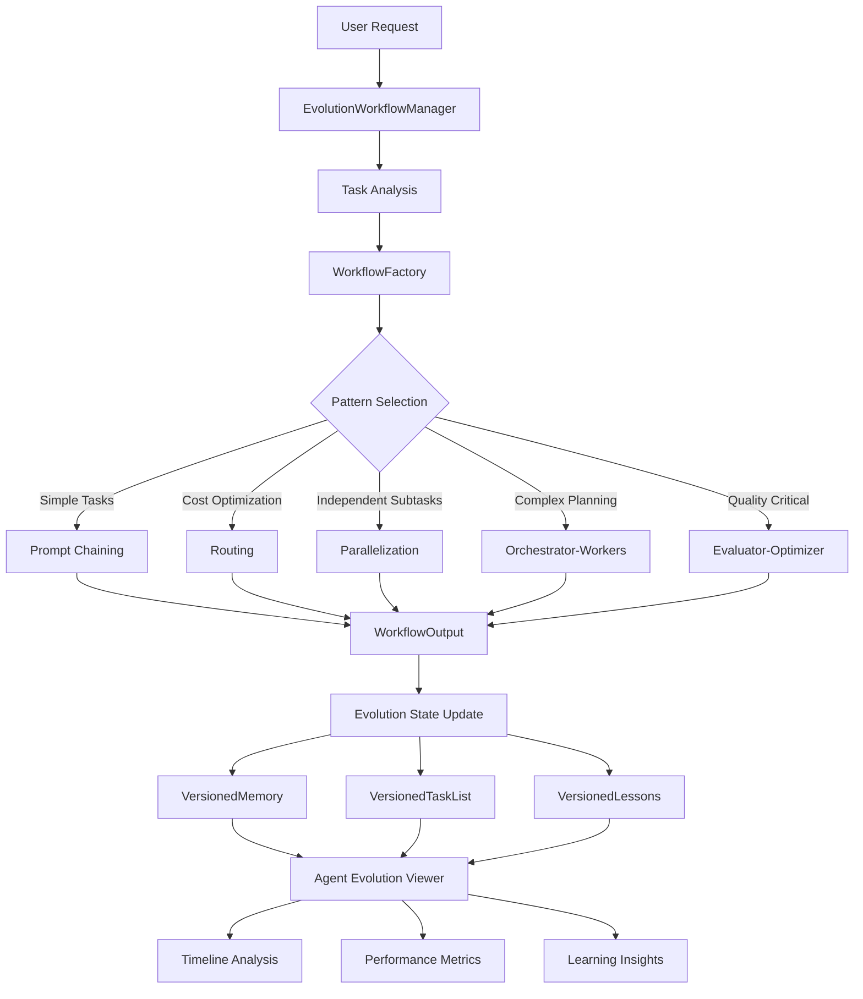

## Core Components

### 1. Agent Evolution System

The central coordinator that tracks agent development over time through three key dimensions:

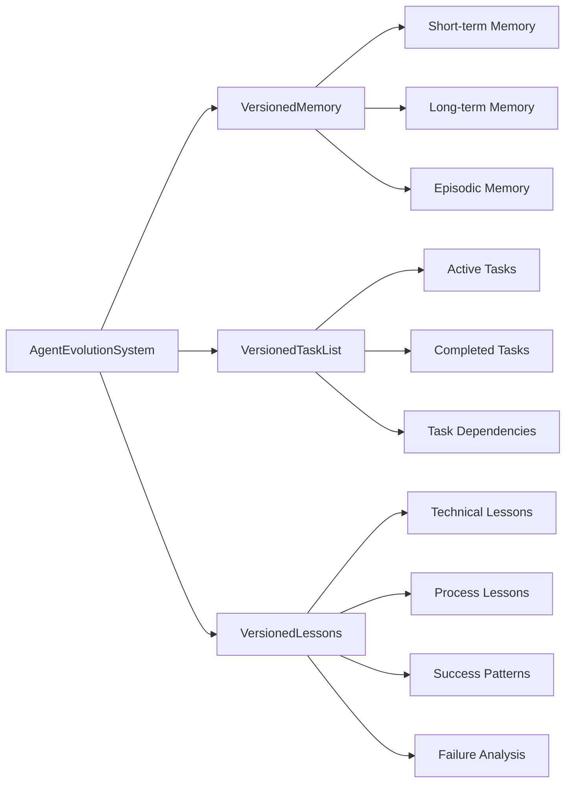

#### VersionedMemory
- **Short-term Memory**: Recent context and immediate working information
- **Long-term Memory**: Consolidated knowledge and persistent insights
- **Episodic Memory**: Specific event sequences and their outcomes
- **Time-based Snapshots**: Complete memory state at any point in time

#### VersionedTaskList
- **Task Lifecycle Tracking**: From creation through completion
- **Dependency Management**: Inter-task relationships and prerequisites
- **Progress Monitoring**: Real-time status and completion metrics
- **Performance Analysis**: Execution time and resource utilization

#### VersionedLessons
- **Success Pattern Recognition**: What strategies work best
- **Failure Analysis**: Common pitfalls and their solutions
- **Process Optimization**: Continuous improvement insights
- **Domain Knowledge**: Specialized learning by subject area

### 2. Workflow Pattern System

Five specialized patterns for different execution scenarios:

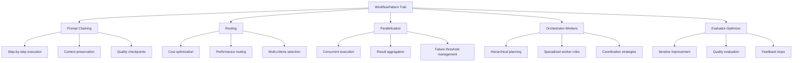

## Workflow Patterns Deep Dive

### 1. Prompt Chaining Pattern

**Purpose**: Serial execution where each step's output feeds the next input.

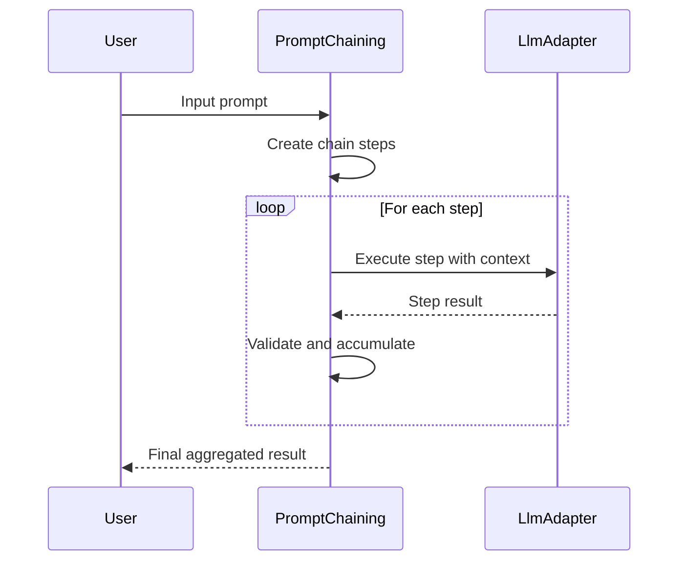

**Use Cases**:
- Complex analysis requiring step-by-step breakdown
- Tasks needing context preservation between steps
- Quality-critical workflows requiring validation at each stage

### 2. Routing Pattern

**Purpose**: Intelligent task distribution based on complexity, cost, and performance.

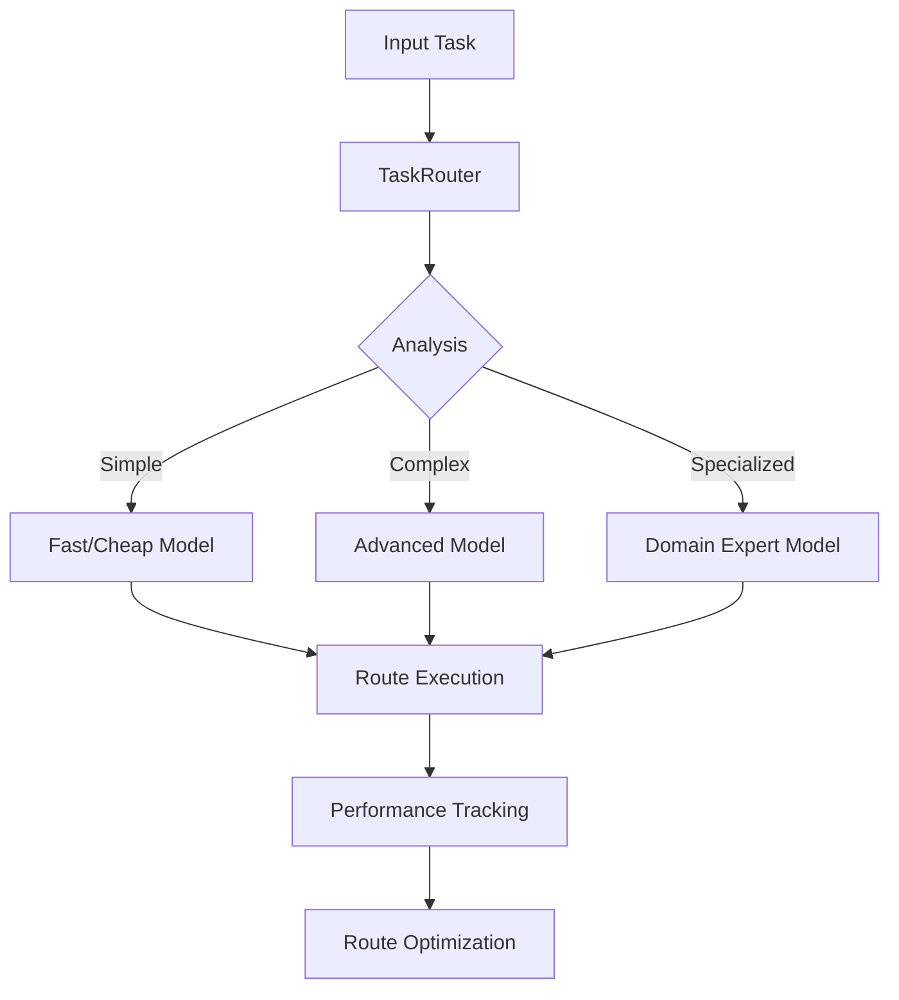

**Use Cases**:
- Cost optimization across different model tiers
- Performance optimization for varying task complexities
- Resource allocation based on current system load

### 3. Parallelization Pattern

**Purpose**: Concurrent execution with sophisticated result aggregation.

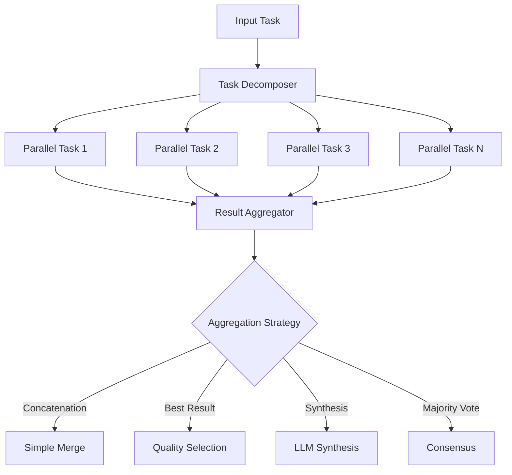

**Use Cases**:
- Independent subtasks that can run simultaneously
- Multi-perspective analysis (security, performance, readability)
- Large document processing with parallel sections

### 4. Orchestrator-Workers Pattern

**Purpose**: Hierarchical planning with specialized worker roles.

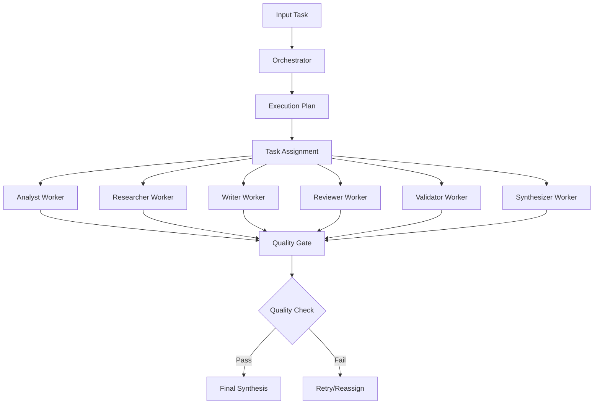

**Use Cases**:
- Complex multi-step projects requiring specialized expertise
- Tasks requiring coordination between different skill sets
- Quality-critical deliverables needing multiple review stages

### 5. Evaluator-Optimizer Pattern

**Purpose**: Iterative quality improvement through evaluation and refinement loops.

```mermaid
sequenceDiagram
    participant User
    participant EO as EvaluatorOptimizer
    participant Gen as Generator
    participant Eval as Evaluator
    participant Opt as Optimizer

    User->>EO: Input task
    EO->>Gen: Generate initial content
    Gen-->>EO: Initial result

    loop Until quality threshold or max iterations
        EO->>Eval: Evaluate current content
        Eval-->>EO: Quality assessment + feedback

        alt Quality threshold met
            EO-->>User: Final result
        else Needs improvement
            EO->>Opt: Apply optimizations
            Opt-->>EO: Improved content
        end
    end
```

**Use Cases**:
- Quality-critical outputs requiring iterative refinement
- Creative tasks benefiting from multiple improvement cycles
- Technical writing requiring accuracy and clarity optimization

## Integration Layer

### EvolutionWorkflowManager

The central integration point that connects workflow execution with evolution tracking:

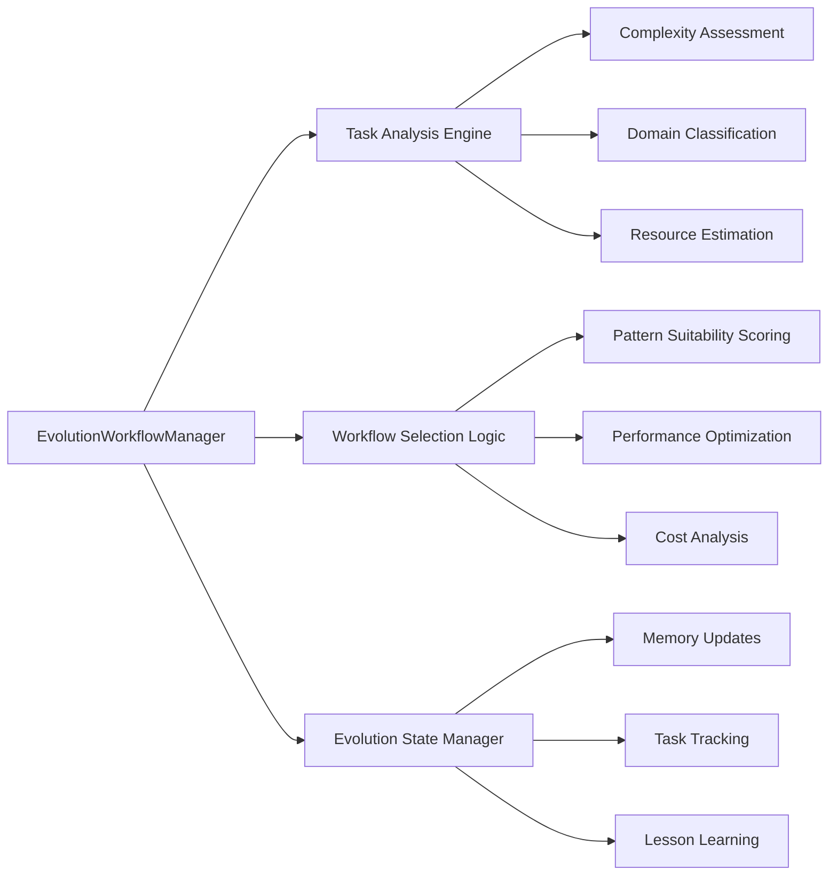

## Data Flow Architecture

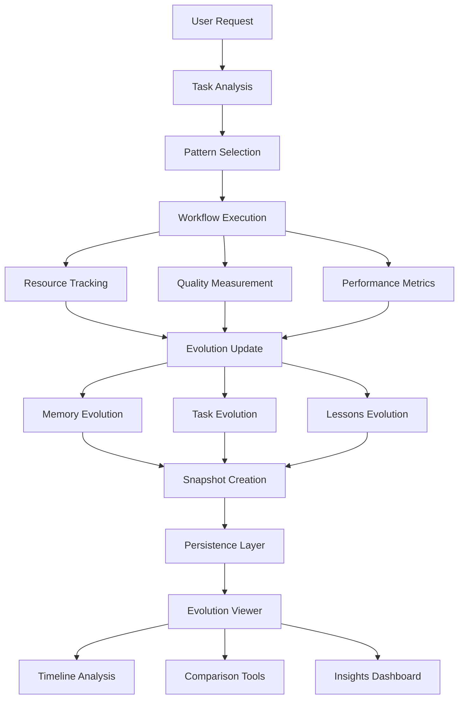

## Persistence and State Management

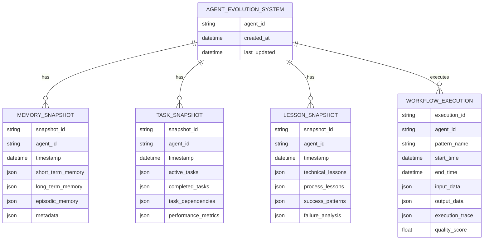

## Quality and Performance Metrics

### Quality Scoring System

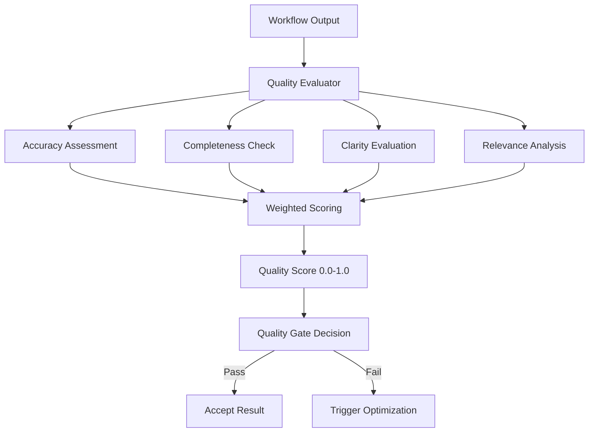

### Performance Monitoring

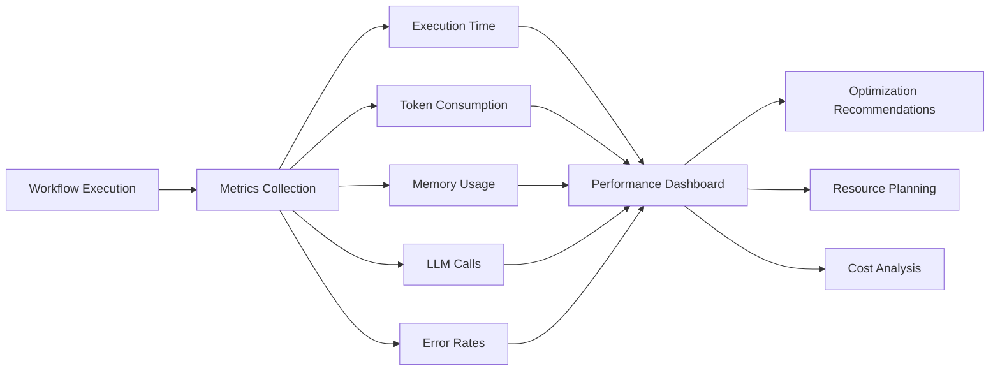

## Security and Privacy

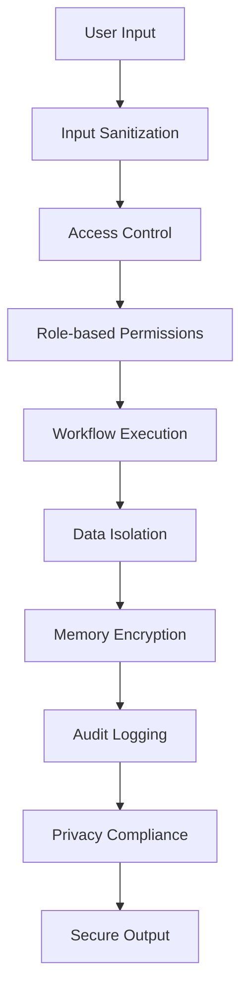

## Deployment Architecture

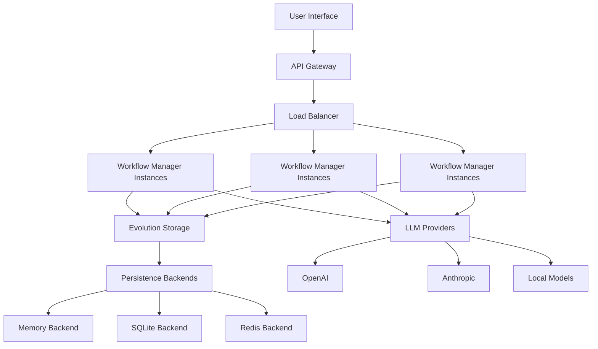

## Extension Points

### Custom Workflow Patterns

```mermaid
graph LR
    A[WorkflowPattern Trait] --> B[Custom Pattern Implementation]
    B --> C[Pattern Registration]
    C --> D[Factory Integration]
    D --> E[Automatic Selection]

    B --> F[Required Methods]
    F --> G[pattern_name()]
    F --> H[execute()]
    F --> I[is_suitable_for()]
    F --> J[estimate_execution_time()]
```

### Custom LLM Adapters

```mermaid
graph LR
    A[LlmAdapter Trait] --> B[Custom Adapter]
    B --> C[Provider Integration]
    C --> D[Adapter Factory]
    D --> E[Runtime Selection]

    B --> F[Required Methods]
    F --> G[provider_name()]
    F --> H[complete()]
    F --> I[chat_complete()]
    F --> J[list_models()]
```

## Future Enhancements

### Planned Features

1. **Distributed Execution**: Multi-node workflow execution
2. **Advanced Analytics**: ML-powered pattern recommendation
3. **Hot Code Reloading**: Dynamic pattern updates
4. **Multi-Agent Coordination**: Cross-agent collaboration patterns
5. **Real-time Monitoring**: Live dashboard and alerting

### Extensibility Roadmap

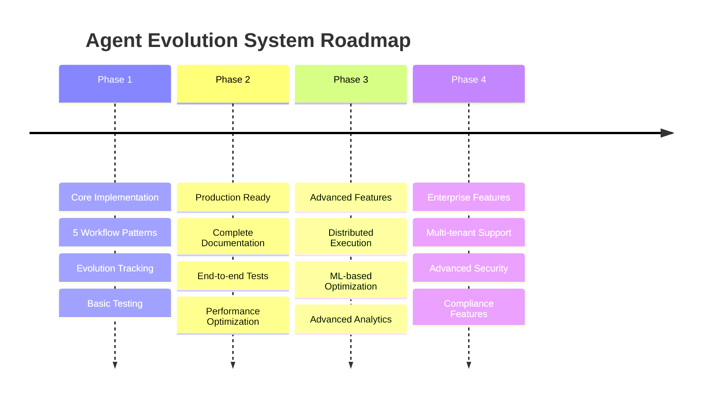

This architecture provides a solid foundation for reliable, scalable AI agent orchestration while maintaining full visibility into agent evolution and learning patterns.
