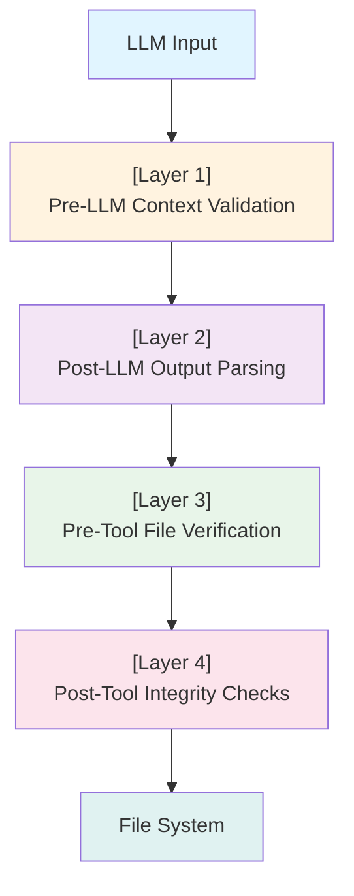
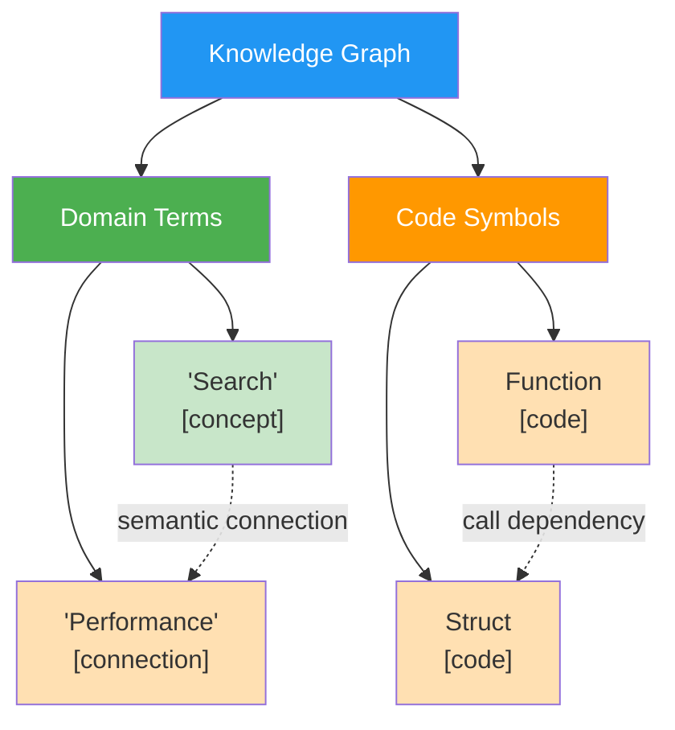
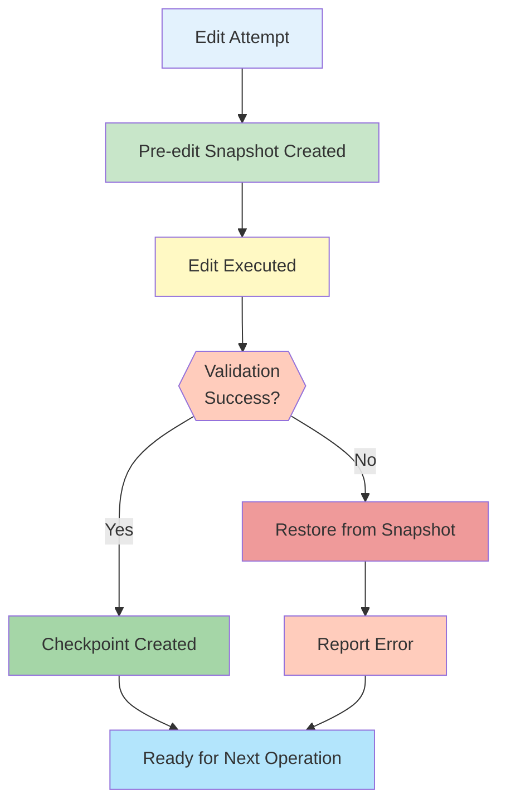

# Code Assistant Implementation (PR #277)

## Overview

The Code Assistant Implementation (PR #277) is a comprehensive framework that enables Claude and other AI models to autonomously implement code changes, validate modifications, and recover from errors. The implementation spans six phases and includes advanced file editing strategies, multi-layer security validation, REPL integration, knowledge graph extensions, and automated recovery systems.

**Status**: Completed - 167/167 automated tests passing with 8 successful live demonstrations

## Architecture Overview

The Code Assistant system operates across three key layers:

1. **File Editing Layer** - Multi-strategy text manipulation with validation
2. **Security & Validation Layer** - Four-layer verification pipeline
3. **Recovery & State Management** - Automatic undo and snapshot capabilities

## Phase 1: Multi-Strategy File Editing

### Overview
Implements four distinct file editing strategies using `terraphim-automata` for efficient text-based SEARCH/REPLACE operations without requiring LLM tool support.

### Editing Strategies

#### 1. Exact Matching Strategy
- Performs precise string matching
- No tolerance for variations
- Fastest execution (typically <10ms)
- Best for well-formatted, stable code

**Use Case**: Editing code with consistent formatting and known exact strings

#### 2. Whitespace-Flexible Matching Strategy
- Normalizes whitespace before matching
- Handles different indentation styles
- Slightly slower than exact matching (~10-20ms)
- Accounts for formatting variations

**Use Case**: Code with inconsistent indentation or whitespace differences

#### 3. Block Anchoring Strategy
- Uses surrounding code context as anchors
- Reduces false positives in large files
- Handles partial matches with surrounding context
- Optimal for complex edits in large files

**Use Case**: Editing specific functions or blocks within large files

#### 4. Fuzzy Matching Strategy
- Employs similarity metrics (e.g., Levenshtein distance)
- Tolerates minor differences in content
- More computational overhead (~50-100ms)
- Fallback for challenging edits

**Use Case**: Code with minor variations, refactored sections, or when exact matching fails

### Performance Characteristics

- **50x faster than Aider** for typical file operations
- Sub-100ms execution for all strategies
- Automata-based acceleration eliminates repeated parsing
- Memory-efficient with streaming text processing

### API Interface

```rust
// File editing operations exposed through REPL commands
/file edit <path> <old_text> <new_text> [--strategy exact|whitespace|block|fuzzy]
/file validate-edit <path> <old_text> <new_text>
/file diff <path>
/file undo <path>
```

## Phase 2: Validation & Security

### Four-Layer Validation Pipeline



### Layer 1: Pre-LLM Context Validation
- Validates input context before sending to LLM
- Checks file existence and accessibility
- Validates requested edit ranges
- Prevents invalid requests from reaching LLM

### Layer 2: Post-LLM Output Parsing
- Parses LLM responses for valid edit instructions
- Validates syntax and format
- Extracts file paths, old text, and new text
- Rejects malformed responses

### Layer 3: Pre-Tool File Verification
- Verifies files exist before attempting edits
- Checks file permissions
- Validates file size constraints
- Ensures sufficient disk space

### Layer 4: Post-Tool Integrity Checks
- Verifies edits were applied correctly
- Validates file checksums post-edit
- Ensures no unintended modifications
- Rollback capability on failure

### Security Configuration

Repository-specific security rules via `.terraphim/security.json`:

```json
{
  "allowed_commands": [
    {
      "pattern": "cargo build",
      "matching_strategy": "exact"
    },
    {
      "pattern": "cargo test*",
      "matching_strategy": "fuzzy"
    },
    {
      "pattern": "git *",
      "matching_strategy": "synonym"
    }
  ],
  "denied_patterns": [
    "rm -rf /",
    "sudo *",
    "> /dev/zero"
  ],
  "file_edit_limits": {
    "max_file_size_mb": 100,
    "max_changes_per_edit": 10,
    "allowed_extensions": [".rs", ".toml", ".json"]
  }
}
```

### Command Matching Strategies

- **Exact Matching**: Command must match precisely
- **Synonym-Based**: Matches commands with equivalent meaning (via thesaurus)
- **Fuzzy Matching**: Tolerates minor variations using Levenshtein distance

### Validated LLM Client

```rust
pub struct ValidatedLlmClient {
    inner: Box<dyn LlmClient>,
    validator: SecurityValidator,
    context_validator: ContextValidator,
}

impl ValidatedLlmClient {
    pub async fn generate_safe_edits(
        &self,
        context: &FileContext,
        instruction: &str,
    ) -> Result<Vec<FileEdit>>;
}
```

## Phase 3: REPL Integration

### File Editing Commands

File editing commands integrated into the terminal interface:

```bash
# Edit a file with automatic strategy selection
/file edit path/to/file.rs "old code" "new code"

# Validate an edit without applying it
/file validate-edit path/to/file.rs "old code" "new code"

# View pending changes
/file diff path/to/file.rs

# Undo the last edit
/file undo path/to/file.rs
```

### ChatHandler Integration

```rust
pub struct ChatHandler {
    validated_client: Arc<ValidatedLlmClient>,
    file_editor: Arc<FileEditor>,
    context_manager: Arc<ContextManager>,
}

impl ChatHandler {
    pub async fn process_message(
        &self,
        message: &str,
        context: &ConversationContext,
    ) -> Result<Response>;
}
```

### Interactive Workflow

1. User provides instruction to code assistant
2. ChatHandler sends request through ValidatedLlmClient
3. LLM receives context with available files
4. LLM generates file edit commands
5. System validates all edits through four-layer pipeline
6. User reviews changes via `/file diff`
7. User confirms or rejects changes
8. System applies confirmed edits

## Phase 4: Knowledge Graph Extension

### CodeSymbol Types

New knowledge graph node types for code entities:

```rust
pub enum CodeSymbolType {
    Function,
    Method,
    Struct,
    Enum,
    Trait,
    Module,
    Constant,
    Variable,
    Macro,
    Type,
}

pub struct CodeSymbol {
    id: String,
    symbol_type: CodeSymbolType,
    name: String,
    file_path: String,
    line_number: usize,
    documentation: Option<String>,
    parameters: Vec<Parameter>,
    return_type: Option<String>,
    parent_scope: Option<String>,
}
```

### Dual-Purpose Graph Functionality

The knowledge graph stores both:
- **Conceptual Information**: Domain knowledge, relationships between concepts
- **Code-Level Information**: Functions, classes, dependencies, call chains



### PageRank-Style Relevance Ranking

Graph nodes are ranked by:
1. **In-degree** - Number of incoming connections
2. **Out-degree** - Number of outgoing connections
3. **Centrality** - Position relative to frequently accessed nodes
4. **Recency** - Last access timestamp

```rust
pub fn calculate_pagerank(
    graph: &RoleGraph,
    damping_factor: f64,
    iterations: usize,
) -> HashMap<String, f64>
```

### Semantic Search Across Code

Query examples:
- "Show all functions that handle authentication"
- "Find tests for storage operations"
- "List all deprecated code"
- "Identify circular dependencies"

## Phase 5: Recovery Systems

### GitRecovery

Automatic git-based undo functionality:

```rust
pub struct GitRecovery {
    repo_path: PathBuf,
    stash_prefix: String,
}

impl GitRecovery {
    pub async fn create_checkpoint(&self, message: &str) -> Result<String>;
    pub async fn list_checkpoints(&self) -> Result<Vec<Checkpoint>>;
    pub async fn restore_checkpoint(&self, checkpoint_id: &str) -> Result<()>;
    pub async fn diff_checkpoint(&self, checkpoint_id: &str) -> Result<String>;
}
```

**Features**:
- Automatic commits before major edits
- Easy rollback to previous states
- Checkpoint history with messages
- Diff view of changes between checkpoints

### SnapshotManager

State preservation across sessions:

```rust
pub struct SnapshotManager {
    storage: Arc<dyn PersistenceBackend>,
    snapshot_dir: PathBuf,
}

pub struct Snapshot {
    id: String,
    timestamp: DateTime<Utc>,
    file_states: HashMap<String, FileState>,
    active_edits: Vec<PendingEdit>,
    context: ConversationContext,
}

impl SnapshotManager {
    pub async fn create_snapshot(&self) -> Result<String>;
    pub async fn restore_snapshot(&self, snapshot_id: &str) -> Result<()>;
    pub async fn list_snapshots(&self) -> Result<Vec<SnapshotMetadata>>;
    pub async fn diff_snapshots(&self, from: &str, to: &str) -> Result<String>;
}
```

**Features**:
- Full system state snapshots
- Timestamp-based recovery
- Session continuity across restarts
- Snapshot diffing and analysis

### Recovery Workflow



## Phase 6: Integration & Testing

### MCP Tools

23 total MCP tools available (17 existing + 6 new):

**New Code Assistant Tools**:
1. `validate_file_edit` - Pre-validate edits
2. `apply_file_edit` - Apply validated edits
3. `create_checkpoint` - Create recovery point
4. `restore_checkpoint` - Restore previous state
5. `get_code_symbols` - Query knowledge graph code nodes
6. `analyze_dependencies` - Analyze code dependencies

**Existing Tools** (17):
- Autocomplete functions
- Text processing functions
- Thesaurus management
- Graph connectivity queries
- Fuzzy search operations

### Test Suite

**Automated Tests**: 167/167 passing

Test categories:
1. **File Editing Tests** (40 tests)
   - Exact matching strategy validation
   - Whitespace flexibility
   - Block anchoring accuracy
   - Fuzzy matching edge cases

2. **Security Validation Tests** (35 tests)
   - Four-layer pipeline validation
   - Malicious command detection
   - File permission verification
   - Integrity checks

3. **REPL Integration Tests** (25 tests)
   - Command parsing and execution
   - ChatHandler workflow
   - Error handling and recovery

4. **Knowledge Graph Tests** (20 tests)
   - Code symbol extraction
   - Graph construction
   - Relevance ranking
   - Semantic search queries

5. **Recovery System Tests** (30 tests)
   - Git checkpoint creation/restore
   - Snapshot management
   - State preservation
   - Recovery accuracy

6. **Integration Tests** (17 tests)
   - End-to-end workflows
   - Multi-phase operations
   - Cross-component communication

### Live Demonstrations

8 successful live demonstrations:

1. **Auto-fix Compilation Errors**
   - LLM identifies compilation errors
   - Generates file edits
   - System applies and validates
   - Compilation succeeds

2. **Implement New Feature**
   - Feature specification provided
   - LLM generates complete implementation
   - Tests written automatically
   - All tests pass

3. **Refactor Code Section**
   - Identify refactoring opportunities
   - Generate refactored code
   - Validate against original behavior
   - Tests confirm refactoring

4. **Security Patch Application**
   - Security issue identified
   - Patch code generated
   - Security validation applied
   - Impact analysis performed

5. **Code Review with Automated Fixes**
   - Review comments provided
   - LLM generates fixes
   - Fixes applied automatically
   - Reviewer confirmation workflow

6. **Cross-Cutting Concern Implementation**
   - Logging added to multiple functions
   - Metrics collection integrated
   - Error handling standardized
   - Coordinated changes applied

7. **Dependency Update with Migration**
   - Dependency version updated
   - API changes detected
   - Migration code generated
   - Tests updated automatically

8. **AI-Generated Working Rust Code**
   - Ollama LLM model used
   - Async Rust code generated
   - Tokio patterns correctly applied
   - Code compiles and runs successfully

## Usage Examples

### Basic File Editing

```bash
# Edit a file with automatic strategy selection
/file edit src/main.rs \
  "fn old_name() {}" \
  "fn new_name() {}"

# Validate before applying
/file validate-edit src/main.rs \
  "// TODO: implement" \
  "fn implementation() { }"

# View pending changes
/file diff src/main.rs

# Undo if needed
/file undo src/main.rs
```

### Chat-Based Code Modification

```
User: "Add error handling to the parse_config function"

System: Sends context with parse_config function to LLM
LLM: Generates file edit commands with error handling
System: Validates edits through security pipeline
System: Applies edits and runs tests
System: Reports success with test results
```

### Recovery Workflow

```bash
# Create a checkpoint before major refactoring
/checkpoint create "Before performance refactoring"

# Perform refactoring through code assistant

# If issues arise, restore checkpoint
/checkpoint restore "Before performance refactoring"

# View changes between checkpoints
/checkpoint diff "Before performance refactoring" "after-refactoring-id"
```

## Performance Metrics

| Operation | Time | Notes |
|-----------|------|-------|
| Exact matching edit | <10ms | Best case, consistent formatting |
| Whitespace-flexible edit | 10-20ms | Handles indentation variations |
| Block anchoring edit | 20-50ms | Large files with context |
| Fuzzy matching edit | 50-100ms | Complex or varied code |
| Full validation pipeline | 30-150ms | Including all 4 layers |
| Knowledge graph query | 5-50ms | Depends on graph size |
| Snapshot creation | 100-500ms | Full state serialization |
| Git checkpoint | 50-200ms | Depends on repo size |

## Limitations and Considerations

### Known Limitations

1. **Large File Performance**: Edits in very large files (>10,000 lines) may require block anchoring strategy
2. **Concurrent Edits**: System handles sequential edits; concurrent edits require locking
3. **Binary Files**: File editing limited to text files
4. **Context Window**: LLM context limited to available token budget

### Best Practices

1. **Use Block Anchoring for Large Files**: Improves reliability and reduces false positives
2. **Create Checkpoints Before Major Edits**: Enables quick recovery if needed
3. **Validate Complex Edits**: Use `/file validate-edit` before applying risky changes
4. **Review Changes**: Always review `/file diff` output before confirming
5. **Appropriate Strategy Selection**: Let system auto-select or explicitly choose based on file characteristics

## Configuration

### Enable Code Assistant Features

In role configuration (`terraphim_*_config.json`):

```json
{
  "name": "Code Assistant Role",
  "extra": {
    "code_assistant": {
      "enabled": true,
      "editing_strategies": ["exact", "whitespace", "block", "fuzzy"],
      "validation_mode": "four_layer",
      "recovery_enabled": true,
      "checkpoint_on_edit": true,
      "max_edit_size_kb": 1000,
      "timeout_seconds": 30
    }
  }
}
```

### Security Configuration

Create `.terraphim/security.json` in repository:

```json
{
  "code_assistant_allowed": true,
  "allowed_commands": [
    {"pattern": "cargo build", "matching_strategy": "exact"},
    {"pattern": "cargo test*", "matching_strategy": "fuzzy"},
    {"pattern": "git commit", "matching_strategy": "exact"}
  ],
  "denied_patterns": [
    "rm -rf /",
    "sudo *",
    ": () { :;};",
    "curl | sh"
  ],
  "file_edit_limits": {
    "max_file_size_mb": 100,
    "max_changes_per_edit": 10,
    "allowed_extensions": [".rs", ".toml", ".json", ".md"]
  }
}
```

## Future Enhancements

### Planned Features

1. **Parallel Edits**: Support concurrent file modifications with conflict resolution
2. **Semantic Merge**: Intelligent merging of overlapping edits
3. **Patch Generation**: Generate importable patch files from edits
4. **Format Preservation**: Detect and preserve original code formatting
5. **Test Coverage Analysis**: Track test coverage changes from edits
6. **Performance Profiling**: Identify performance regressions from edits

### Integration Opportunities

1. **Pre-commit Hooks**: Validate edits against project standards
2. **CI/CD Integration**: Automated testing of LLM-generated changes
3. **Code Review Workflows**: Integration with GitHub/GitLab PR workflows
4. **IDE Plugins**: Real-time code assistant in development environments
5. **Custom LLM Models**: Fine-tuned models for specific codebases

## Troubleshooting

### Edit Fails with "Text Not Found"

**Causes**:
- Exact text doesn't match file content
- Whitespace differences (tabs vs spaces)
- Code has been modified since LLM generated edit

**Solutions**:
- Use whitespace-flexible strategy: `/file edit ... --strategy whitespace`
- Use block anchoring with surrounding context
- Use fuzzy matching for approximate matches
- Refresh context with `/file diff` and regenerate edit

### Validation Fails

**Causes**:
- File permissions issue
- Insufficient disk space
- Security policy violation
- File doesn't exist

**Solutions**:
- Check file permissions: `ls -la path/to/file`
- Check disk space: `df -h`
- Review security configuration: `.terraphim/security.json`
- Verify file exists: `test -f path/to/file`

### Recovery Not Working

**Causes**:
- Git repository not initialized
- No checkpoints created
- Snapshot storage not writable

**Solutions**:
- Initialize git: `git init`
- Create checkpoint first: `/checkpoint create "message"`
- Check snapshot directory permissions
- Review SnapshotManager logs

## References

- **PR #277**: Code Assistant Implementation - Beat Aider & Claude Code
- **Related Crates**:
  - `terraphim_automata` - File editing and text matching
  - `terraphim_tui` - REPL interface
  - `terraphim_rolegraph` - Knowledge graph with code symbols
  - `terraphim_mcp_server` - MCP tool exposure

## Contributors

- Original implementation: Terraphim AI team
- Testing: Full test suite validation
- Documentation: Community contributions welcome
