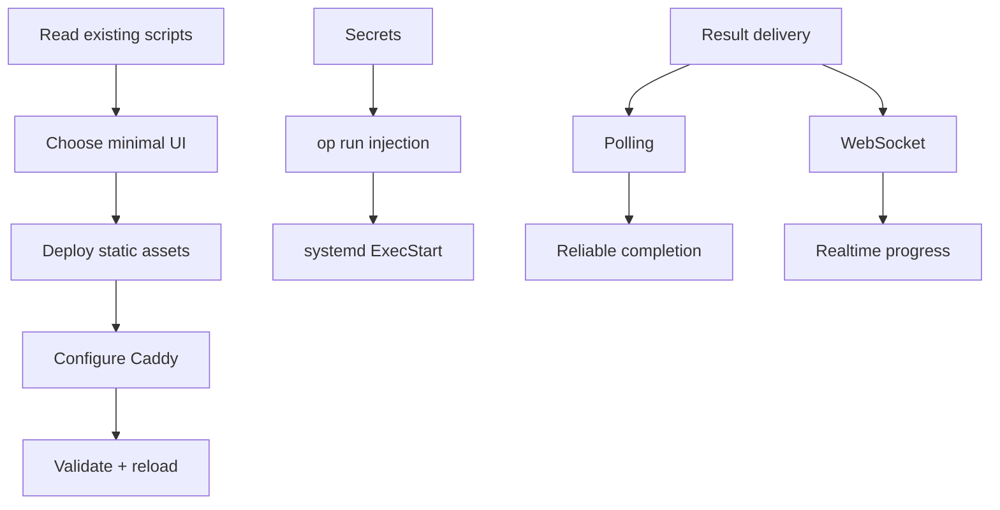

# Deployment Lessons: Vanilla JS UI + Caddy + 1Password

This case study is the mdBook version of the website post:
- `website/content/posts/deployment-lessons-vanilla-js-caddy.md`

It includes the same narrative plus additional technical appendices.

## The Problem

We needed to ship a simple UI quickly. The first instinct was to add new infrastructure (Docker, nginx, a frontend framework). That was the wrong move.

## The Turning Point

The repo already had a deployment pattern. The lesson was not about tooling. It was about reading and following the existing operational contract.

## The Pattern: Boring UI, Fast Deployment

- Vanilla JS means no build step and faster iteration.
- Caddy handles static hosting, HTTPS, and reverse proxying with minimal configuration.

## Hybrid Delivery: Polling + WebSocket

Polling provides reliability. WebSocket provides UX.

Combining both yields a system that still works when the real-time channel is flaky.

## Secrets: 1Password Runtime Injection

Operational secrets should not land in `.env` files committed to disk.

The pattern that scales is runtime injection via `op run`.

## Appendix A: Deployment Flow (Mermaid)

## Appendix B: Primary Sources

- Source notes: `lessons-learned.md`

## References

- Website case study: `website/content/posts/deployment-lessons-vanilla-js-caddy.md`
