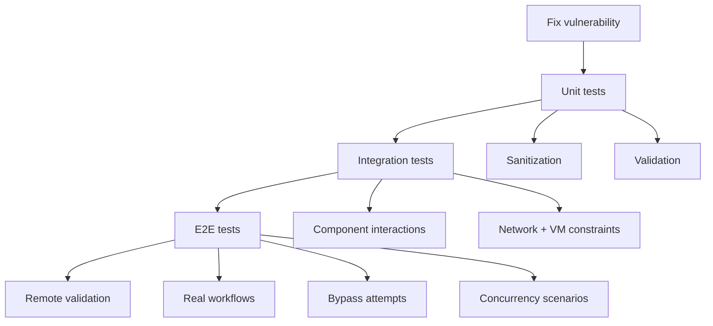

# Security Testing Lessons Learned

This case study is the mdBook version of the website post:
- https://terraphim.ai/posts/security-testing-lessons-learned/

It includes the same narrative plus additional technical appendices.

## The Context

We had a set of security issues that could not be treated as one-off bug fixes. The goal was to end with confidence: evidence that fixes hold under regression, bypass attempts, and concurrency.

## The Core Workflow: Fix -> Tests -> Remote Validation

Our repeatable pattern:

1. Implement the fix.
2. Add unit tests for the affected primitives.
3. Add integration and end-to-end tests for real workflows.
4. Validate in a production-like environment.

This turns security work into an engineering process with measurable results.

## What We Shipped

- Multi-layer coverage: unit + integration + end-to-end
- Bypass and edge-case coverage (including Unicode tricks)
- Concurrency scenarios to catch thread-safety issues

## Lessons That Stuck

### 1. Name tests like you are fighting scanners

Some security scanners flag long identifiers and certain keyword patterns.

The practical rule we adopted: keep test names concise and avoid suspicious long tokens.

### 2. Empirical tests prove architecture

Unit tests prove code compiles.

Empirical tests prove assumptions about how the system behaves under realistic conditions.

### 3. Concurrency testing is security testing

If the code is security-critical, it must be safe under concurrent access patterns.

## Appendix A: Security Testing Coverage Map (Mermaid)

## Appendix B: Primary Sources

- Source notes: `lessons-learned-security-testing.md`
- Existing compiled security patterns:
  - `docs/src/history/lessons-learned/security-patterns.md`
  - `docs/src/history/lessons-learned/comprehensive-lessons.md`

## References

- Website case study: https://terraphim.ai/posts/security-testing-lessons-learned/
