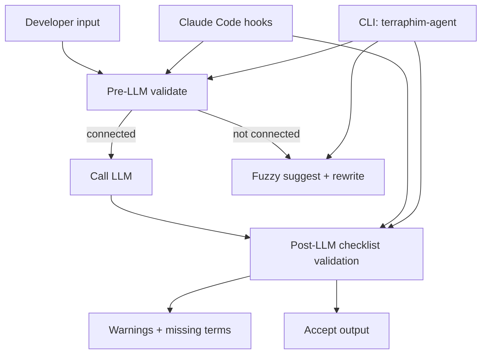

# Case Study: Knowledge Graph Validation Workflows for Pre/Post-LLM

This case study is the mdBook version of the website post:
- https://terraphim.ai/posts/kg-validation-workflows-case-study/

It includes the same narrative plus additional technical appendices.

## Why This Existed

Terraphim already had powerful primitives (connectivity checks, fuzzy matching, role-aware graphs). The missing piece was an opinionated workflow and a stable interface (CLI + hooks) that made those primitives usable.

## The Approach

- Pre-LLM: validate semantic coherence before spending tokens
- Post-LLM: validate outputs against domain checklists
- Developer UX: unify everything behind the `terraphim-agent` CLI and Claude Code hooks

## The Results

- MCP connectivity tool wired to real RoleGraph logic
- New CLI commands (`validate`, `suggest`, unified `hook` handler)
- Skills + hook scripts that standardize the workflow

## Appendix A: Workflow Overview (Mermaid)

## Appendix B: Primary Sources

- `docs/sessions/research-underutilized-features.md`
- `docs/sessions/design-underutilized-features.md`
- `docs/sessions/implementation-summary.md`
- `docs/sessions/session-20251228-201509.md`
