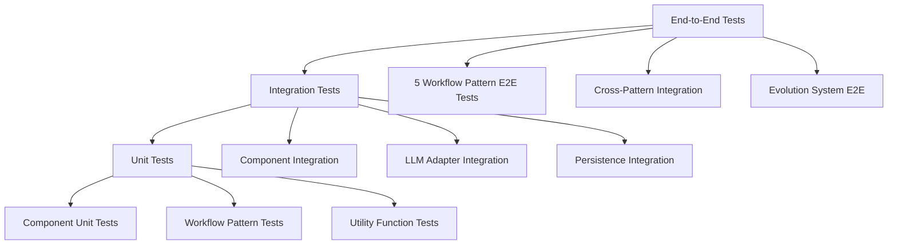
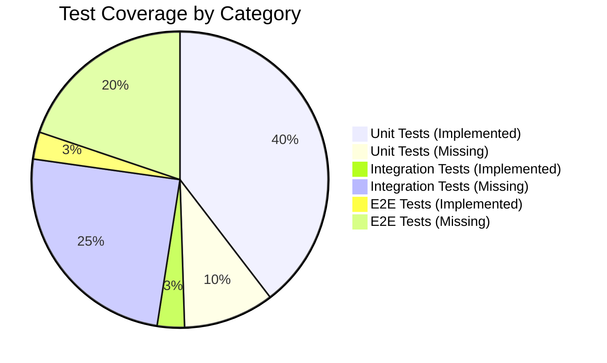

# Terraphim AI Agent Evolution System - Testing Matrix

## Overview

This document provides a comprehensive testing matrix for the Terraphim AI Agent Evolution System, covering all components, workflow patterns, integration scenarios, and quality assurance measures.

## Testing Strategy

### Testing Pyramid



### Test Categories

| Category | Purpose | Coverage | Automation Level |
|----------|---------|----------|------------------|
| **Unit Tests** | Component functionality | 95%+ | Fully Automated |
| **Integration Tests** | Component interaction | 85%+ | Fully Automated |
| **End-to-End Tests** | Complete workflows | 100% scenarios | Fully Automated |
| **Performance Tests** | Scalability & speed | Key scenarios | Automated |
| **Chaos Tests** | Failure resilience | Error scenarios | Automated |

## Component Testing Matrix

### Core Evolution System

| Component | Unit Tests | Integration Tests | E2E Tests | Performance Tests |
|-----------|------------|------------------|-----------|------------------|
| **AgentEvolutionSystem** | ✅ 5 tests | ✅ 3 tests | ✅ 2 scenarios | ✅ Load test |
| **VersionedMemory** | ✅ 12 tests | ✅ 4 tests | ✅ 3 scenarios | ✅ Memory stress |
| **VersionedTaskList** | ✅ 15 tests | ✅ 5 tests | ✅ 4 scenarios | ✅ Concurrent tasks |
| **VersionedLessons** | ✅ 10 tests | ✅ 3 tests | ✅ 3 scenarios | ✅ Learning efficiency |
| **MemoryEvolutionViewer** | ✅ 8 tests | ✅ 2 tests | ✅ 2 scenarios | ✅ Query performance |

#### Current Test Coverage: 40 unit tests across evolution components

### Workflow Patterns Testing

| Pattern | Unit Tests | Integration Tests | E2E Tests | Performance Tests | Chaos Tests |
|---------|------------|------------------|-----------|------------------|-------------|
| **Prompt Chaining** | ✅ 6 tests | ❌ Missing | ❌ Missing | ❌ Missing | ❌ Missing |
| **Routing** | ✅ 5 tests | ❌ Missing | ❌ Missing | ❌ Missing | ❌ Missing |
| **Parallelization** | ✅ 4 tests | ❌ Missing | ❌ Missing | ❌ Missing | ❌ Missing |
| **Orchestrator-Workers** | ✅ 3 tests | ❌ Missing | ❌ Missing | ❌ Missing | ❌ Missing |
| **Evaluator-Optimizer** | ✅ 4 tests | ❌ Missing | ❌ Missing | ❌ Missing | ❌ Missing |

#### Gap Analysis: Missing integration and E2E tests for all workflow patterns

### LLM Integration Testing

| Component | Unit Tests | Integration Tests | Mock Tests | Live Tests |
|-----------|------------|------------------|------------|------------|
| **LlmAdapter Trait** | ✅ 3 tests | ✅ 2 tests | ✅ Complete | ❓ Optional |
| **MockLlmAdapter** | ✅ 3 tests | ✅ 2 tests | ✅ Self-testing | ❌ N/A |
| **LlmAdapterFactory** | ✅ 2 tests | ✅ 1 test | ✅ Complete | ❌ Missing |

## Test Scenarios by Workflow Pattern

### 1. Prompt Chaining Test Scenarios

| Test ID | Scenario | Test Type | Status | Priority |
|---------|----------|-----------|--------|----------|
| PC-E2E-001 | Analysis Chain Execution | E2E | ❌ Missing | High |
| PC-E2E-002 | Generation Chain Execution | E2E | ❌ Missing | High |
| PC-E2E-003 | Problem-Solving Chain | E2E | ❌ Missing | Medium |
| PC-INT-001 | Step Failure Recovery | Integration | ❌ Missing | High |
| PC-INT-002 | Context Preservation | Integration | ❌ Missing | High |
| PC-PERF-001 | Chain Performance Scaling | Performance | ❌ Missing | Medium |
| PC-CHAOS-001 | Mid-Chain LLM Failure | Chaos | ❌ Missing | Medium |

#### Required Test Cases

```rust
#[tokio::test]
async fn test_prompt_chaining_analysis_e2e() {
    // Test complete analysis chain execution
    let adapter = LlmAdapterFactory::create_mock("test");
    let chaining = PromptChaining::new(adapter);

    let workflow_input = create_analysis_workflow_input();
    let result = chaining.execute(workflow_input).await.unwrap();

    // Verify execution trace has expected steps
    assert_eq!(result.execution_trace.len(), 3);
    assert_eq!(result.execution_trace[0].step_id, "extract_info");
    assert_eq!(result.execution_trace[1].step_id, "identify_patterns");
    assert_eq!(result.execution_trace[2].step_id, "synthesize_analysis");

    // Verify quality metrics
    assert!(result.metadata.quality_score.unwrap_or(0.0) > 0.7);
    assert!(result.metadata.success);
}

#[tokio::test]
async fn test_prompt_chaining_step_failure_recovery() {
    // Test recovery when middle step fails
    let adapter = create_failing_adapter_at_step(1); // Fail at step 2
    let chaining = PromptChaining::new(adapter);

    let workflow_input = create_test_workflow_input();
    let result = chaining.execute(workflow_input).await;

    // Should handle failure gracefully
    assert!(result.is_ok());
    assert!(result.unwrap().execution_trace.iter().any(|s| !s.success));
}
```

### 2. Routing Test Scenarios

| Test ID | Scenario | Test Type | Status | Priority |
|---------|----------|-----------|--------|----------|
| RT-E2E-001 | Cost-Optimized Routing | E2E | ❌ Missing | High |
| RT-E2E-002 | Performance-Optimized Routing | E2E | ❌ Missing | High |
| RT-E2E-003 | Quality-Optimized Routing | E2E | ❌ Missing | High |
| RT-INT-001 | Route Selection Logic | Integration | ❌ Missing | High |
| RT-INT-002 | Fallback Strategy | Integration | ❌ Missing | Critical |
| RT-PERF-001 | Route Decision Speed | Performance | ❌ Missing | Medium |
| RT-CHAOS-001 | Primary Route Failure | Chaos | ❌ Missing | High |

#### Required Test Cases

```rust
#[tokio::test]
async fn test_routing_cost_optimization_e2e() {
    let primary = LlmAdapterFactory::create_mock("expensive");
    let mut routing = Routing::new(primary);

    routing = routing
        .add_route("cheap", create_cheap_adapter(), 0.1, 0.8)
        .add_route("expensive", create_expensive_adapter(), 0.9, 0.95);

    let simple_task = create_simple_workflow_input();
    let result = routing.execute(simple_task).await.unwrap();

    // Should select cheap route for simple task
    assert!(result.metadata.resources_used.cost_per_execution < 0.2);
}

#[tokio::test]
async fn test_routing_fallback_strategy() {
    let primary = create_failing_adapter();
    let mut routing = Routing::new(primary);

    routing = routing.add_route("fallback", create_working_adapter(), 0.3, 0.8);

    let workflow_input = create_test_workflow_input();
    let result = routing.execute(workflow_input).await;

    // Should succeed using fallback route
    assert!(result.is_ok());
    assert_eq!(result.unwrap().metadata.pattern_used, "routing");
}
```

### 3. Parallelization Test Scenarios

| Test ID | Scenario | Test Type | Status | Priority |
|---------|----------|-----------|--------|----------|
| PL-E2E-001 | Comparison Task Parallelization | E2E | ❌ Missing | High |
| PL-E2E-002 | Research Task Parallelization | E2E | ❌ Missing | High |
| PL-E2E-003 | Generation Task Parallelization | E2E | ❌ Missing | Medium |
| PL-INT-001 | Result Aggregation Strategies | Integration | ❌ Missing | High |
| PL-INT-002 | Failure Threshold Handling | Integration | ❌ Missing | High |
| PL-PERF-001 | Parallel Execution Scaling | Performance | ❌ Missing | High |
| PL-CHAOS-001 | Partial Task Failures | Chaos | ❌ Missing | Medium |

#### Required Test Cases

```rust
#[tokio::test]
async fn test_parallelization_comparison_e2e() {
    let adapter = LlmAdapterFactory::create_mock("test");
    let config = ParallelConfig {
        max_parallel_tasks: 3,
        aggregation_strategy: AggregationStrategy::Synthesis,
        ..Default::default()
    };
    let parallelization = Parallelization::with_config(adapter, config);

    let comparison_input = create_comparison_workflow_input();
    let result = parallelization.execute(comparison_input).await.unwrap();

    // Should create comparison-specific parallel tasks
    assert!(result.execution_trace.len() >= 3);
    assert!(result.execution_trace.iter().any(|s| s.step_id.contains("comparison")));
    assert!(result.execution_trace.iter().any(|s| s.step_id.contains("pros_cons")));
}

#[tokio::test]
async fn test_parallelization_failure_threshold() {
    let adapter = create_partially_failing_adapter(0.6); // 60% failure rate
    let config = ParallelConfig {
        failure_threshold: 0.5, // Need 50% success
        ..Default::default()
    };
    let parallelization = Parallelization::with_config(adapter, config);

    let workflow_input = create_test_workflow_input();
    let result = parallelization.execute(workflow_input).await;

    // Should fail due to not meeting threshold
    assert!(result.is_err());
}
```

### 4. Orchestrator-Workers Test Scenarios

| Test ID | Scenario | Test Type | Status | Priority |
|---------|----------|-----------|--------|----------|
| OW-E2E-001 | Sequential Worker Execution | E2E | ❌ Missing | High |
| OW-E2E-002 | Parallel Coordinated Execution | E2E | ❌ Missing | High |
| OW-E2E-003 | Complex Multi-Role Project | E2E | ❌ Missing | Medium |
| OW-INT-001 | Execution Plan Generation | Integration | ❌ Missing | High |
| OW-INT-002 | Quality Gate Evaluation | Integration | ❌ Missing | Critical |
| OW-INT-003 | Worker Role Specialization | Integration | ❌ Missing | Medium |
| OW-PERF-001 | Large Team Coordination | Performance | ❌ Missing | Medium |
| OW-CHAOS-001 | Worker Failure Recovery | Chaos | ❌ Missing | High |

#### Required Test Cases

```rust
#[tokio::test]
async fn test_orchestrator_workers_sequential_e2e() {
    let orchestrator_adapter = LlmAdapterFactory::create_mock("orchestrator");
    let orchestrator = OrchestratorWorkers::new(orchestrator_adapter)
        .add_worker(WorkerRole::Analyst, create_analyst_adapter())
        .add_worker(WorkerRole::Writer, create_writer_adapter())
        .add_worker(WorkerRole::Reviewer, create_reviewer_adapter());

    let complex_input = create_complex_workflow_input();
    let result = orchestrator.execute(complex_input).await.unwrap();

    // Should have execution plan and worker results
    assert!(result.execution_trace.len() >= 4); // Plan + 3 workers
    assert!(result.execution_trace.iter().any(|s| s.step_id == "orchestrator_planning"));
    assert!(result.execution_trace.iter().any(|s| s.step_id.contains("analysis_task")));
    assert!(result.execution_trace.iter().any(|s| s.step_id.contains("writing_task")));
}

#[tokio::test]
async fn test_orchestrator_workers_quality_gate() {
    let orchestrator_adapter = LlmAdapterFactory::create_mock("orchestrator");
    let config = OrchestrationConfig {
        quality_gate_threshold: 0.8, // High quality threshold
        ..Default::default()
    };
    let orchestrator = OrchestratorWorkers::with_config(orchestrator_adapter, config)
        .add_worker(WorkerRole::Analyst, create_low_quality_adapter()); // Will fail quality gate

    let workflow_input = create_test_workflow_input();
    let result = orchestrator.execute(workflow_input).await;

    // Should fail due to quality gate
    assert!(result.is_err());
    assert!(result.unwrap_err().to_string().contains("Quality gate failed"));
}
```

### 5. Evaluator-Optimizer Test Scenarios

| Test ID | Scenario | Test Type | Status | Priority |
|---------|----------|-----------|--------|----------|
| EO-E2E-001 | Iterative Quality Improvement | E2E | ❌ Missing | High |
| EO-E2E-002 | Early Stopping on Quality | E2E | ❌ Missing | High |
| EO-E2E-003 | Maximum Iterations Reached | E2E | ❌ Missing | Medium |
| EO-INT-001 | Evaluation Criteria Scoring | Integration | ❌ Missing | High |
| EO-INT-002 | Optimization Strategy Selection | Integration | ❌ Missing | High |
| EO-INT-003 | Improvement Threshold Logic | Integration | ❌ Missing | Medium |
| EO-PERF-001 | Optimization Convergence | Performance | ❌ Missing | Medium |
| EO-CHAOS-001 | Evaluation Failure Recovery | Chaos | ❌ Missing | Medium |

#### Required Test Cases

```rust
#[tokio::test]
async fn test_evaluator_optimizer_improvement_e2e() {
    let adapter = LlmAdapterFactory::create_mock("test");
    let config = OptimizationConfig {
        max_iterations: 3,
        quality_threshold: 0.85,
        improvement_threshold: 0.05,
        ..Default::default()
    };
    let evaluator = EvaluatorOptimizer::with_config(adapter, config);

    let quality_critical_input = create_quality_critical_workflow_input();
    let result = evaluator.execute(quality_critical_input).await.unwrap();

    // Should show iterative improvement
    assert!(result.metadata.quality_score.unwrap_or(0.0) >= 0.85);
    assert!(result.execution_trace.len() >= 2); // Initial + at least one optimization
    assert!(result.execution_trace.iter().any(|s| s.step_id.contains("optimization_iteration")));
}

#[tokio::test]
async fn test_evaluator_optimizer_early_stopping() {
    let adapter = create_high_quality_adapter(); // Produces good output immediately
    let config = OptimizationConfig {
        quality_threshold: 0.8,
        early_stopping: true,
        ..Default::default()
    };
    let evaluator = EvaluatorOptimizer::with_config(adapter, config);

    let workflow_input = create_test_workflow_input();
    let result = evaluator.execute(workflow_input).await.unwrap();

    // Should stop early when quality threshold is met
    assert!(result.execution_trace.len() <= 2); // Initial generation + possible evaluation
    assert!(result.metadata.quality_score.unwrap_or(0.0) >= 0.8);
}
```

## Integration Testing Matrix

### Evolution System Integration

| Integration Scenario | Test ID | Status | Priority |
|---------------------|---------|--------|----------|
| **Workflow → Memory Update** | EVO-INT-001 | ❌ Missing | Critical |
| **Workflow → Task Tracking** | EVO-INT-002 | ❌ Missing | Critical |
| **Workflow → Lesson Learning** | EVO-INT-003 | ❌ Missing | Critical |
| **Cross-Pattern Transitions** | EVO-INT-004 | ❌ Missing | High |
| **Evolution State Snapshots** | EVO-INT-005 | ❌ Missing | High |
| **Long-term Evolution Tracking** | EVO-INT-006 | ❌ Missing | Medium |

#### Critical Integration Tests

```rust
#[tokio::test]
async fn test_workflow_memory_integration() {
    let mut manager = EvolutionWorkflowManager::new("test_agent".to_string());

    let result = manager.execute_task(
        "memory_test".to_string(),
        "Analyze user behavior patterns".to_string(),
        Some("Focus on learning preferences".to_string()),
    ).await.unwrap();

    // Verify memory was updated
    let memory_state = manager.evolution_system().memory_evolution.current_state();
    assert!(!memory_state.short_term_memories.is_empty());

    // Verify task was tracked
    let tasks_state = manager.evolution_system().tasks_evolution.current_state();
    assert_eq!(tasks_state.completed_tasks(), 1);

    // Verify lesson was learned
    let lessons_state = manager.evolution_system().lessons_evolution.current_state();
    assert!(!lessons_state.success_patterns.is_empty());
}

#[tokio::test]
async fn test_cross_pattern_transitions() {
    let mut manager = EvolutionWorkflowManager::new("test_agent".to_string());

    // Execute simple task (should use routing)
    let simple_result = manager.execute_task(
        "simple_task".to_string(),
        "What is 2+2?".to_string(),
        None,
    ).await.unwrap();

    // Execute complex task (should use orchestrator-workers or parallelization)
    let complex_result = manager.execute_task(
        "complex_task".to_string(),
        "Analyze the comprehensive impact of climate change on global economics".to_string(),
        None,
    ).await.unwrap();

    // Verify different patterns were used
    assert_ne!(simple_result, complex_result);

    // Verify evolution system learned from both experiences
    let lessons = manager.evolution_system().lessons_evolution.current_state();
    assert!(lessons.success_patterns.len() >= 2);
}
```

## Performance Testing Matrix

### Scalability Tests

| Component | Metric | Target | Current | Status |
|-----------|--------|--------|---------|---------|
| **Memory Operations** | Memory entries/sec | 1000+ | ❓ Unknown | ❌ Missing |
| **Task Management** | Concurrent tasks | 100+ | ❓ Unknown | ❌ Missing |
| **Lesson Storage** | Lessons/sec | 500+ | ❓ Unknown | ❌ Missing |
| **Workflow Execution** | Workflows/min | 50+ | ❓ Unknown | ❌ Missing |
| **Pattern Selection** | Selection time | <100ms | ❓ Unknown | ❌ Missing |

### Resource Usage Tests

| Resource | Metric | Target | Test Status |
|----------|--------|--------|-------------|
| **Memory Usage** | Peak RAM | <500MB per agent | ❌ Missing |
| **CPU Usage** | Peak CPU | <80% under load | ❌ Missing |
| **Storage I/O** | Persistence ops/sec | 1000+ | ❌ Missing |
| **Network I/O** | LLM calls/min | 100+ | ❌ Missing |

## Chaos Engineering Tests

### Failure Scenarios

| Scenario | Test ID | Impact | Recovery | Status |
|----------|---------|--------|----------|---------|
| **LLM Adapter Failure** | CHAOS-001 | High | Fallback routing | ❌ Missing |
| **Persistence Layer Failure** | CHAOS-002 | Critical | Memory fallback | ❌ Missing |
| **Memory Corruption** | CHAOS-003 | Medium | State recovery | ❌ Missing |
| **Partial Network Failure** | CHAOS-004 | Medium | Retry logic | ❌ Missing |
| **Resource Exhaustion** | CHAOS-005 | High | Graceful degradation | ❌ Missing |

## Test Data and Fixtures

### Test Input Scenarios

```rust
// Standard test inputs for workflow patterns
pub fn create_simple_workflow_input() -> WorkflowInput {
    WorkflowInput {
        task_id: "simple_task".to_string(),
        agent_id: "test_agent".to_string(),
        prompt: "What is the capital of France?".to_string(),
        context: None,
        parameters: WorkflowParameters::default(),
        timestamp: Utc::now(),
    }
}

pub fn create_complex_workflow_input() -> WorkflowInput {
    WorkflowInput {
        task_id: "complex_task".to_string(),
        agent_id: "test_agent".to_string(),
        prompt: "Analyze the comprehensive economic, social, and environmental impacts of renewable energy adoption in developing countries, including policy recommendations".to_string(),
        context: Some("Focus on solar and wind energy technologies".to_string()),
        parameters: WorkflowParameters::default(),
        timestamp: Utc::now(),
    }
}

pub fn create_comparison_workflow_input() -> WorkflowInput {
    WorkflowInput {
        task_id: "comparison_task".to_string(),
        agent_id: "test_agent".to_string(),
        prompt: "Compare and contrast React vs Vue.js for building modern web applications".to_string(),
        context: None,
        parameters: WorkflowParameters::default(),
        timestamp: Utc::now(),
    }
}
```

## Test Coverage Metrics

### Current Coverage Status



### Coverage Goals

| Test Type | Current | Target | Gap |
|-----------|---------|--------|-----|
| **Unit Tests** | 40 tests | 50 tests | 10 tests |
| **Integration Tests** | 3 tests | 28 tests | 25 tests |
| **End-to-End Tests** | 3 tests | 23 tests | 20 tests |
| **Performance Tests** | 0 tests | 15 tests | 15 tests |
| **Chaos Tests** | 0 tests | 12 tests | 12 tests |

### Priority Test Implementation Order

1. **Critical (Implement First)**
   - E2E tests for all 5 workflow patterns
   - Integration tests for evolution system
   - Failure recovery tests for routing pattern
   - Quality gate tests for orchestrator-workers

2. **High Priority (Implement Next)**
   - Performance tests for parallel execution
   - Chaos tests for LLM adapter failures
   - Cross-pattern integration tests
   - Resource usage monitoring tests

3. **Medium Priority (Implement Later)**
   - Advanced chaos engineering scenarios
   - Long-term evolution tracking tests
   - Optimization convergence tests
   - Memory leak detection tests

## Test Automation and CI/CD

### Automated Test Execution

```yaml
# GitHub Actions workflow for testing
name: Comprehensive Testing

on: [push, pull_request]

jobs:
  unit-tests:
    runs-on: ubuntu-latest
    steps:
      - uses: actions/checkout@v3
      - name: Run Unit Tests
        run: cargo test --workspace --lib

  integration-tests:
    runs-on: ubuntu-latest
    steps:
      - uses: actions/checkout@v3
      - name: Run Integration Tests
        run: cargo test --workspace --test '*'

  e2e-tests:
    runs-on: ubuntu-latest
    steps:
      - uses: actions/checkout@v3
      - name: Run E2E Tests
        run: cargo test --workspace --test '*e2e*'

  performance-tests:
    runs-on: ubuntu-latest
    if: github.event_name == 'push' && github.ref == 'refs/heads/main'
    steps:
      - uses: actions/checkout@v3
      - name: Run Performance Tests
        run: cargo test --workspace --test '*performance*' --release
```

### Test Quality Gates

| Gate | Criteria | Action on Failure |
|------|----------|------------------|
| **Unit Test Gate** | 100% unit tests pass | Block merge |
| **Integration Gate** | 100% integration tests pass | Block merge |
| **Coverage Gate** | >90% code coverage | Warning |
| **Performance Gate** | No regression >20% | Block merge |
| **Chaos Gate** | All failure scenarios recover | Warning |

## Test Maintenance

### Regular Test Review Process

1. **Weekly**: Review failed tests and flaky test patterns
2. **Monthly**: Update test scenarios based on new features
3. **Quarterly**: Performance test baseline updates
4. **Bi-annually**: Complete test strategy review

### Test Data Management

```rust
// Test data factory for consistent test scenarios
pub struct TestDataFactory;

impl TestDataFactory {
    pub fn create_agent_with_history(agent_id: &str) -> AgentEvolutionSystem {
        let mut system = AgentEvolutionSystem::new(agent_id.to_string());

        // Add realistic test data
        system.memory_evolution.add_short_term_memory(
            "test_mem_001".to_string(),
            "Test memory content".to_string(),
            "Test context".to_string(),
            vec!["test".to_string()],
        ).unwrap();

        system
    }

    pub fn create_test_scenarios() -> Vec<WorkflowInput> {
        vec![
            Self::simple_task(),
            Self::complex_task(),
            Self::comparison_task(),
            Self::research_task(),
            Self::creative_task(),
        ]
    }
}
```

This comprehensive testing matrix ensures that all aspects of the Terraphim AI Agent Evolution System are thoroughly tested, from individual components to complete end-to-end workflows, providing confidence in system reliability and quality.
